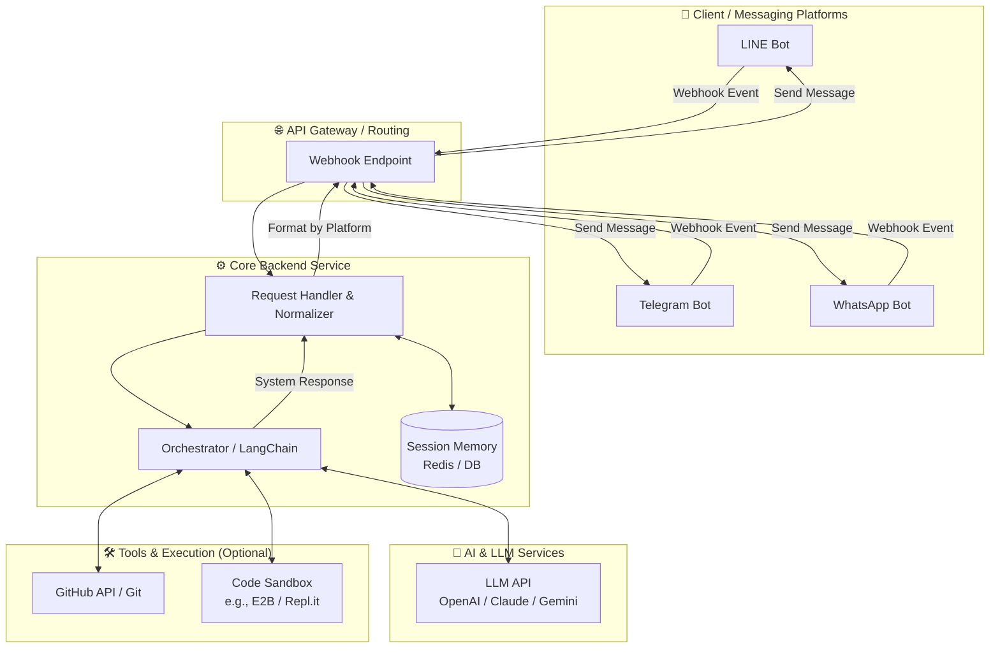

# Akasa — Project Analysis

## 🎯 Vision

สร้าง **AI Coding Assistant Chatbot** ที่ทำงานผ่าน Messaging Platform (Line, Telegram, WhatsApp) เพื่อช่วยเขียนโค้ดเวลาไม่ได้อยู่หน้าคอม

### Use Cases
- ถาม syntax, debug โค้ด, ขอ code snippet ผ่าน chat
- Review โค้ดจาก GitHub ผ่าน messaging app
- วางแผน architecture, เขียน pseudocode ระหว่างเดินทาง

---

## 🏗️ Architecture Overview

```
┌─────────────┐     ┌──────────────┐     ┌─────────────┐
│  Messaging   │────▶│   Backend    │────▶│  LLM API    │
│  Platform    │◀────│   Server     │◀────│ (OpenRouter) │
│  (Line/TG)   │     │              │     │              │
└─────────────┘     └──────────────┘     └─────────────┘
```

---

## 🛠️ Tech Stack Options

### LLM Provider

| Provider | ข้อดี | ข้อเสีย | ค่าใช้จ่าย |
|----------|-------|---------|-----------|
| **OpenRouter** ✅ | รวม API หลายโมเดล, มีโมเดลฟรี | ต้องเลือกโมเดลเอง | **ฟรี** (โมเดลฟรี) → ตามราคาโมเดล |
| OpenAI | คุณภาพสูง, ecosystem ใหญ่ | ราคาสูง | $2-60/1M tokens |
| Google Gemini | ราคาถูก, มี free tier | API อาจเปลี่ยนบ่อย | ฟรี (15 RPM) → $0.075/1M |
| Anthropic Claude | เก่งเรื่อง code | ราคาสูง, ไม่มี free tier | $3-75/1M tokens |

**เลือก**: OpenRouter (โมเดลฟรีก่อน ช่วง Local Dev / MVP)

### Messaging Platform

| Platform | Bot API | ข้อจำกัด | ค่าใช้จ่าย |
|----------|---------|---------|-----------|
| **Line** | Messaging API | 500 msg/เดือน (free) | ฟรี → ₿1,500/เดือน |
| **Telegram** ✅ | Bot API | ไม่จำกัด | **ฟรี** |
| WhatsApp | Business API | ต้องผ่าน Meta review | $0.005-0.08/msg |

**แนะนำเริ่มจาก**: Telegram (ฟรี, ไม่จำกัด, API ง่าย)

### Backend

| Option | ข้อดี | ข้อเสีย |
|--------|-------|---------|
| **Python + FastAPI** ✅ | เร็ว, async, ecosystem AI ดี | - |
| Node.js + Express | JS ecosystem | Library AI น้อยกว่า |
| Go | Performance สูง | Boilerplate เยอะ |

---

## 💰 Cost Analysis (MVP Stage)

| รายการ | ค่าใช้จ่าย |
|--------|-----------|
| LLM (OpenRouter free models) | **$0** |
| Telegram Bot | **$0** |
| Server (local dev) | **$0** |
| **รวม MVP** | **$0/เดือน** |

### Scale Stage (ประมาณการ)

| รายการ | ค่าใช้จ่าย/เดือน |
|--------|----------------|
| LLM (GPT-4o mini via OpenRouter) | ~$5-20 |
| Server (Railway/Fly.io) | $0-5 |
| Domain (optional) | $1 |
| **รวม** | **~$6-26/เดือน** |

---

## 🔭 Future Directions: Remote Dev Workspace (v0.7.0+)

เพื่อก้าวข้ามขีดจำกัดของแชทบอทสู่การเป็น "Remote Orchestrator", Akasa จะมุ่งเน้นสี่ด้านหลัก:
1.  **Mobile-Native Verification**: ระบบดึง Screenshot จาก Emulator/Simulator เพื่อการทำ Manual QA ผ่านแชท
2.  **CLI Agentic Workflow**: ให้ LLM สามารถเรียกใช้ `gh`, `vercel`, `render` และ `maestro` เพื่อทำงานแทนผู้ใช้
3.  **Laptop-to-Mobile Bridge**: ระบบ Notification แบบ Proactive เพื่อให้งานที่รันนานๆ บนคอมพิวเตอร์สามารถส่งผลลัพธ์หาผู้ใช้ได้ทันที
4.  **Multi-Platform Notification Hub**: พัฒนา FastAPI เป็น Notification Gateway ที่รองรับความปลอดภัยระดับ API Key

## 🛠️ Tech Stack Expansion
-   **Service**: เพิ่ม `GithubService`, `DeployService`, `MobileService`
-   **Security**: จัดการ `X-Akasa-API-Key` ใน Middleware ของ FastAPI
-   **Async**: ใช้ `BackgroundTasks` ของ FastAPI ร่วมกับ Redis เพื่อจัดลำดับงานที่รันนานๆ

## 📋 Roadmap (Updated v0.7.0)

### Phase 1: Foundation (MVP) 🎯
- [ ] สมัคร OpenRouter + ได้ API key
- [ ] ทดสอบเรียก LLM ผ่าน OpenRouter API (free model)
- [ ] สร้าง Backend (Python + FastAPI)
- [ ] สร้าง Telegram Bot + เชื่อม webhook
- [ ] ส่งข้อความ → LLM ตอบ → ส่งกลับ chat
- [ ] Deploy MVP (local/Railway)

### Phase 2: Core Features
- [ ] Conversation history (context memory)
- [ ] Code formatting ใน chat (syntax highlight)
- [ ] System prompt สำหรับ coding assistant
- [ ] Rate limiting + error handling

### Phase 3: Advanced
- [ ] เชื่อม GitHub API (review PR, ดู code)
- [ ] เพิ่ม Line Bot
- [ ] Multi-model selection (เลือกโมเดลผ่าน chat command)
- [ ] Image/file support (ส่งรูป code มาให้อ่าน)

### Phase 4: Polish
- [ ] Analytics dashboard
- [ ] User management
- [ ] WhatsApp integration
- [ ] Custom instructions per user

---

## 🔑 Key Decisions

1. **OpenRouter first** — ใช้โมเดลฟรีช่วง dev, เปลี่ยนโมเดลได้ง่ายผ่าน API เดียว
2. **Telegram first** — ฟรี, ไม่จำกัด, API ง่ายที่สุด, เหมาะสำหรับ MVP
3. **Python + FastAPI** — async performance ดี, ecosystem AI/ML แข็งแกร่ง
4. **เริ่มจาก $0** — ไม่ต้องลงทุนจนกว่าจะพร้อม scale



## 📦 ส่วนประกอบหลัก (Core Components)

### 1. Messaging API Gateway (ด่านหน้าเชื่อมต่อแอปแชท)
**หน้าที่:** รับ Webhook จากแพลตฟอร์มต่างๆ และจับรูปแบบข้อความให้เป็นมาตรฐานเดียวกัน (Normalize) ก่อนส่งให้ Core Backend
**แพลตฟอร์ม:**
- **LINE:** ใช้ LINE Messaging API
- **Telegram:** ใช้ Telegram Bot API
- **WhatsApp:** ใช้ WhatsApp Cloud API (หรือ Twilio)

*เทคนิค:* ควรออกแบบระบบให้รองรับ "ข้อความประเภทต่างๆ" (Text, Image/Code Snippet, Voice Message เป็น Text ผ่าน Whisper)

### 2. Core Backend Service (ระบบจัดการตรรกะหลัก)
**Technology Stack แนะนำ:** Python (FastAPI) หรือ Node.js (NestJS / Express) เนื่องจากมี Library ด้าน AI รองรับเยอะ
**Session Management (ความจำของบอท):**
- จำเป็นต้องจำว่าคุยอะไรไปบ้าง (Context) แยกตาม User ID / Chat ID
- ใช้ Redis หรือ MongoDB เพื่อเก็บ Chat History (ย้อนหลัง X ข้อความ หรือสรุป Context เก็บไว้)

### 3. LLM Orchestrator (สมองกลของบอท)
**Framework แนะนำ:** LangChain หรือ LlamaIndex (หากต้องการให้บอทอ่านเอกสาร/โค้ดเบสของเราด้วย)
**LLM Provider แนะนำ:**
- **Claude 3.5 Sonnet:** เก่งเรื่องเขียนโค้ดมากที่สุดในปัจจุบัน
- **GPT-4o:** วิเคราะห์ฉับไว ใช้งานครอบคลุม
- **Gemini 1.5 Pro:** Context window ใหญ่มาก (เหมาะสำหรับโยน Error log ยาวๆ หรือโค้ดทั้งไฟล์เข้าไป)

**System Prompt:** ควรกำหนด System Prompt ให้ชัดเจน เช่น `"You are an expert software engineer assistant. Provide concise, accurate code snippets and explanations suitable for reading on a mobile device."`

### 4. Tools & Actions (การเชื่อมต่อระบบอื่น - Optional แนะนำให้มี)
เพื่อให้บอทไม่ได้แค่แชทโต้ตอบ แต่สามารถทำงานแทนเราได้:
- **GitHub/GitLab Integration:** ให้บอทสามารถอ่านโค้ดใน Repo (RAG) หรือสร้าง Pull Request ย่อยๆ ให้เราได้เลย
- **Code Execution (Sandbox):** เชื่อมต่อกับบริการอย่าง e2b.dev หรือ Piston เพื่อให้บอทรันโค้ดและส่งผลลัพธ์ (Output/Error) กลับมาให้เราดูในแชทได้ทันที

---

## 🚀 ขั้นตอนการจัดทำ (Implementation Roadmap)

### Phase 1: Chatbot โง่ + LLM ฉลาด (MVP)
- สร้าง FastAPI server รับ Webhook
- ต่อ API เข้ากับ Telegram (เพราะทำง่ายสุด เทสต์ง่ายสุด)
- ส่งข้อความแชทตรงเข้า OpenAI / Anthropic API แล้วตอบกลับ

### Phase 2: ความจำ และหลายแพลตฟอร์ม
- เพิ่ม Redis เข้ามาเก็บ Context (Mem0) เพื่อให้บอทจำสิ่งที่เราพูดก่อนหน้าได้
- เพิ่ม LINE และ WhatsApp เข้ามาในระบบ โดยแปลง payload ขาเข้าให้เป็น Format กลาง

### Phase 3: ติดอาวุธ (RAG & Tools)
- ทำ Agentic Workflow ให้บอทเรียกใช้เครื่องมือได้ เช่น ฟังก์ชันดึงโค้ดจาก GitHub ของเรามาดู หรือเสิร์ช Google เพื่อหา Document ล่าสุด

---

## 💡 ทริคสำหรับการใช้งานบนมือถือ (Mobile UX for Coding)
- หน้าจอมือถือเล็ก ควรสั่งให้ LLM **ตอบสั้นๆ** หรือแบ่งตอบทีละไฟล์
- ให้ LLM โฟกัสเฉพาะบรรทัดที่แก้ (**Diff format**) แทนการพ่นโค้ดมาใหม่ให้ทั้งหมด
- อาจจะเพิ่มฟีเจอร์ **Voice Note** คือเรากดอัดเสียงสั่งงานเขียนโค้ด ให้เซิร์ฟเวอร์นำไปถอดความผ่าน Whisper API แล้วค่อยส่งเข้าโมเดลเขียนโค้ด (สะดวกมากเวลาเดินเล่นข้างนอก)

---

## 🛠️ รายละเอียด Tech Stack เชิงลึก

### 1. ภาษาและเฟรมเวิร์กฝั่งเซิร์ฟเวอร์ (Backend Framework)
ทำหน้าที่รับ Webhook จาก LINE/Telegram และเป็นตัวกลางประมวลผลโลจิก

- 🐍 **Python** (แนะนำที่สุดสำหรับ AI/LLM)
  - **FastAPI:** เร็ว ทันสมัย รองรับ Asynchronous ดีเยี่ยม (เหมาะกับงาน Webhook ที่ต้องรอ LLM ประมวลผลนานๆ) จัดการ Type Hint ได้ดี
  - **Flask / Django:** เหมาะถ้าทีมคุ้นเคยอยู่แล้ว แต่ FastAPI ภาษีดีกว่าในยุค AI
- 🟢 **Node.js / TypeScript** (เหมาะถ้าถนัด JS ecosystem)
  - **Express.js:** เรียบง่าย ชุมชนใหญ่ หาไลบรารีง่าย
  - **NestJS:** โครงสร้างชัดเจนแบบ Enterprise เหมาะถ้าโปรเจกต์จะใหญ่ขึ้น
  - **Hono / Elysia:** เร็วจัด รันบน Edge environment ได้ (เช่น Cloudflare Workers)
- 🐹 **Go (Golang)** (เน้น Performance สูงสุด)
  - **Fiber / Gin:** กินทรัพยากรน้อยมาก รองรับคนทักแชทพร้อมกันปริมาณมหาศาลได้ดี แต่ไลบรารีฝั่ง AI อาจจะไม่เยอะเท่า Python

### 2. เฟรมเวิร์กจัดการ AI (LLM Orchestration)
ทำหน้าที่เชื่อมต่อและจัดการ Prompt, History, RAG, Tools ให้เป็นระเบียบ

- **LangChain / LangChain.js:** ได้รับความนิยมสูงสุด มี Tools และ Integration ให้เลือกใช้เยอะมาก (อัปเดตไวสุด)
- **LlamaIndex:** โดดเด่นมากลักษณ์ถ้าบอทนี้ต้องไปอ่านเอกสารหรือ Codebase องค์กร (RAG)
- **Vercel AI SDK** (สำหรับฝั่ง JS): ใช้งานง่ายมาก เชื่อมต่อ LLM หลายๆ ค่ายได้ด้วยโค้ดชุดเดียวกันแบบ seamless
- **ไม่ใช้เฟรมเวิร์ก (Native API Calls):** ถ้างานไม่ซับซ้อนมาก การยิง HTTP Request ตรงๆ ไปหา OpenAI/Anthropic SDK เลยก็เป็นตัวเลือกที่ดี เพราะจะไม่ปวดหัวกับ Abstraction ของเฟรมเวิร์ก

### 3. ฐานข้อมูลและหน่วยความจำ (Database & Memory)
จำเป็นมากเพื่อให้บอท "จำ" บทสนทนาเก่าและ Context การเขียนโค้ดได้

- **Short-term Memory** (จำการคุยชั่วคราวฉับไว):
  - **Redis:** ยืนหนึ่งเรื่องความเร็ว เก็บ Session หรือประวัติแชทล่าสุด
- **Long-term Memory & User Data** (เก็บข้อมูลถาวร):
  - **PostgreSQL:** ฐานข้อมูลหลักที่เสถียร (และใช้ Extension `pgvector` เพื่อทำ Vector Search ในตัวได้เลย)
  - **MongoDB:** NoSQL จัดการ schema แบบไดนามิกได้ง่าย ยืดหยุ่นเวลาเก็บ Log การแชท
- **Vector Database** (สำหรับค้นหา Code/Docs ที่บอทควรเรียนรู้):
  - **Pinecone / Qdrant / Weaviate / ChromaDB:** ใช้เก็บ Code snippets หรือสรุปการทำงานของระบบเพื่อทำ RAG (Retrieval-Augmented Generation)

### 4. ผู้ให้บริการโมเดลภาษา (LLM Providers)
- **Anthropic (Claude 3.5 Sonnet):** 🥇 ปัจจุบันได้รับเสียงโหวตว่าเป็น โมเดลที่เขียนโค้ดเก่งที่สุด เข้าใจ Context โค้ดที่ซับซ้อนได้ดีมาก
- **OpenAI (GPT-4o / o1):** ฉลาดรอบด้าน เร็ว และมี Tools/Function calling ที่เสถียรที่สุด
- **Google (Gemini 1.5 Pro):** โดดเด่นที่ Context Window กว้างถึง 2 ล้านโทเคน! เหมาะมากถ้าคุณอยากโยนโค้ดทั้งไฟล์ โยน Error log ยาวเป็นกิโลไปให้มันช่วยดู
- **Local/Open Source (Ollama / vLLM):** เช่น Llama 3, DeepSeek Coder, Qwen รันเองฟรี แต่ต้องมี GPU Server แรงๆ เป็นของตัวเอง

### 5. สถานที่ฝากเซิร์ฟเวอร์ (Hosting & Deployment)
- **PaaS (ง่ายสุด จบในตัวรันตลอดเวลา):**
  - **Render, Railway, Fly.io, Heroku:** เชื่อม GitHub แล้ว Deploy ลาก่อน ใช้งานง่าย เหมาะกับบอท Webhook ทั่วไป
- **Serverless / Edge (จ่ายตามการใช้งานจริง):**
  - **Vercel, AWS Lambda, Cloudflare Workers:** สเกลง่ายมาก แต่ต้องระวังเรื่อง "Cold Start" (Webhook ตอบสนองช้าในครั้งแรก) และ Timeout (LLM มักจะประมวลผลนานกว่าที่ Serverless limit ไว้ เช่น เกิน 10-30 วิ)
- **IaaS (คุมทุกอย่างเอง):**
  - **DigitalOcean Droplets, AWS EC2:** เช่า VPS เพื่อรัน Docker ของคุณเอง ถูกและคุมเวลาได้ตามใจ

---

## 💡 แนะนำสูตร Tech Stack ตามรูปแบบการใช้งาน

### สูตรที่ 1: "The AI Standard" (อัปเดตไวล่าสุด สร้างเสร็จเร็ว)
- **Backend:** FastAPI (Python)
- **AI Framework:** LangChain
- **Database:** PostgreSQL + Redis
- **LLM:** Claude 3.5 Sonnet (หลัก) + OpenAI Whisper (สำหรับเปลี่ยนเสียงพูดเป็นข้อความ)
- **Host:** Railway หรือ Render

### สูตรที่ 2: "The JS/TS Native" (ถ้าคุณเป็น Frontend/Node Developer)
- **Backend:** Hono หรือ Express.js (TypeScript)
- **AI Framework:** Vercel AI SDK
- **Database:** Supabase (PostgreSQL + VectorStore) + Redis (Upstash)
- **LLM:** GPT-4o
- **Host:** Vercel หรือ Fly.io

---

## 💸 การวิเคราะห์ค่าใช้จ่ายเชิงลึก (Cost Analysis)

สำหรับการสร้าง AI Coding Assistant Chatbot ส่วนใหญ่จะขึ้นอยู่กับ "ปริมาณการใช้งาน" (Pay-as-you-go) โดยเฉพาะค่า API ของ LLM ซึ่งกินสัดส่วนเยอะที่สุด

### 1. แพลตฟอร์มแชท (Messaging APIs) 💬
การรับส่งข้อความกับตัวผู้ใช้
- **Telegram Bot API:** 🟢 **ฟรี 100%** ไม่มีจำกัดจำนวนข้อความ (แนะนำที่สุดสำหรับ Personal Use)
- **LINE Messaging API:** 🟢 **ฟรี (มีเงื่อนไข)**
  - Reply Message (บอทตอบกลับหลังจากเราทักไป): ฟรีและไม่จำกัด
  - Push Message (บอททักหาเราก่อน เช่น แจ้งเตือนว่ารันโค้ดเสร็จแล้ว): ฟรี 200 ข้อความ/เดือน (แพ็กเกจเบื้องต้น) หากเกินต้องซื้อแพ็กเกจ (เริ่มต้นประมาณ 1,200 บาท/เดือน)
- **WhatsApp Cloud API:** 🟡 **ฟรีโควตาเริ่มต้น**
  - ฟรี 1,000 บทสนทนาแรกของทุกเดือน (Service conversations) หากเกินจะคิดเงินต่อบทสนทนา (ประมาณ $0.01 - $0.03 ต่อบทสนทนา)

### 2. สมองกล AI (LLM Providers) 🧠
คิดเงินตามจำนวนโทเคน (Tokens) ที่เราส่งไป (Input) และที่ AI ตอบกลับมา (Output) [1,000 Tokens ≈ 750 คำ]

- **Anthropic (Claude 3.5 Sonnet)** 🌟 *แนะนำเรื่องโค้ด*: 🟡 ปานกลาง
  - Input: ~$3.00 ต่อ 1 ล้าน Tokens
  - Output: ~$15.00 ต่อ 1 ล้าน Tokens
  - คาดการณ์: ถ้าใช้งานเขียนโค้ดวันละ 20-30 คำถามที่ต้องส่ง Context เยอะๆ อาจตกเดือนละ $5 - $10
- **OpenAI (GPT-4o)**: 🟡 ปานกลาง ค่อนไปทางสูง
  - Input: ~$5.00 ต่อ 1 ล้าน Tokens
  - Output: ~$15.00 ต่อ 1 ล้าน Tokens
- **Google (Gemini 1.5 Pro)**: 🟢 คุ้มค่าสุดสำหรับ Context ยาวๆ
  - Input: ~$1.25 ต่อ 1 ล้าน Tokens (หากส่งเกิน 128k tokens จะแพงขึ้นอักเท่าตัว)
  - Output: ~$5.00 ต่อ 1 ล้าน Tokens
  - *(Note: สมัครผ่าน Google AI Studio มักจะมี Free Tier ให้ใช้ฟรีในวงจำกัดที่เพียงพอต่อคนเดียว)*
- **ฟรี (Local Models เช่น Ollama)**: 🟢 ฟรี แต่คุณต้องมีคอมพิวเตอร์ที่รัน GPU แรงๆ เปิดทิ้งไว้ที่บ้าน (กินค่าไฟแทน)

### 3. ฝั่งเซิร์ฟเวอร์รันโค้ด (Hosting & Compute) ⚙️
ที่อยู่ของ Backend System (FastAPI / Node.js)

- **Serverless** (Vercel, Cloudflare, AWS Lambda): 🟢 **ฟรี (สำหรับใช้งานส่วนตัว)**
  - มี Free Tier ให้เยอะมาก มักจะไม่เสียเงินเลย แต่ข้อเสียคือมี Timeout (เช่น ฟังก์ชันรันได้แค่ 10-60 วินาที) ซึ่งถ้ารอ AI คิดนานๆ อาจจะ Error Timeout ได้
- **PaaS** (Render, Railway, Fly.io): 🟡 **~$5 - $10 / เดือน**
  - Free Tier มักจะทำให้เซิร์ฟเวอร์ "หลับ" (Sleep) ถ้าไม่มีคนทักไป 15 นาที ทำให้เวลาทักไปครั้งแรกจะตอบช้ามาก (Cold start)
  - แนะนำให้จ่ายแพ็กเกจเล็กสุด (Hobby Plan) ประมาณเดือนละ $5 เพื่อให้มันรันตลอด 24 ชม.
- **VPS / IaaS** (DigitalOcean, Linode, AWS EC2): 🟡 **~$4 - $6 / เดือน**
  - เช่าเซิร์ฟเวอร์เปล่าแล้วลง Docker เอง คุ้มค่าและควบคุมได้ทั้งหมด ไม่หลับแน่นอน

### 4. ฐานข้อมูลและหน่วยความจำ (Database & Memory) 💾
เก็บ Session, แจ้งเตือน และประวัติแชท

- **Redis** (Upstash หรือ Redis Cloud): 🟢 **ฟรี**
  - มี Free Tier โควตา 10,000 Request/วัน หรือพื้นที่ 30MB ซึ่งเกินพอสำหรับการทำ Short-term memory ของคนเดียว
- **PostgreSQL / MongoDB** (Supabase, Neon.tech, MongoDB Atlas): 🟢 **ฟรี**
  - บริการ Cloud Database เหล่านี้มี Free Tier ให้พื้นที่ประมาณ 500MB - 1GB ซึ่งถ้าเก็บแค่ประวัติแชทที่เป็น Text ก็ใช้ได้นานเป็นปีโดยไม่เสียเงิน
- **Vector Database** (Pinecone, Qdrant Cloud): 🟢 **ฟรี**
  - Free Tier มักจะรองรับการเก็บ Vector ได้หลักแสนถึงหลักล้าน Records เพียงพอสำหรับการสอนให้บอทรู้จัก Codebase ของเรา 1-2 โปรเจกต์

---

## 💰 สรุปภาพรวมแบบจัดเซ็ต (สำหรับ Personal Use 1 คน)

### 📉 เซ็ต "สายฟรี & ประหยัดสุด" (Free/Low Budget)
- **Chat:** Telegram (ฟรี)
- **LLM:** Gemini 1.5 Pro ผ่าน Google AI Studio (ใช้ Free Tier) หรือใช้ Claude 3.5 แบบเซฟๆ
- **Host:** ขุดคอม/Raspberry Pi เก่าๆ ที่บ้านมารัน (เสียแค่ค่าไฟ) หรือใช้ Vercel/Cloudflare แบบ Serverless (ฟรี แต่ต้องเขียนโค้ดจัดการ Timeout ให้เก่งๆ)
- **DB:** Supabase + Upstash (ฟรี)
- **ค่าใช้จ่ายรวม:** **$0 - $2 ต่อเดือน** (เสียแค่ค่า API LLM นิดหน่อย)

### 📈 เซ็ต "นักพัฒนาตัวจริง เน้นเสถียร" (Developer Standard) - แนะนำ
- **Chat:** LINE (ใช้ไม่เกิน 200 Push/เดือน) หรือ Telegram
- **LLM:** Claude 3.5 Sonnet (ฉลาดที่สุด ให้โค้ดแม่น จ่ายตามที่เรียกใช้)
- **Host:** Railway หรือ VPS (เช่าเดือนละ $5 ให้มันตื่นตลอดเวลา ไม่หงุดหงิดตอนทัก)
- **DB:** Neon.tech (Postgres) + Upstash (Redis) - ใช้ Free Tier
- **ค่าใช้จ่ายรวม:** ตกลงประมาณ **$10 - $15 ต่อเดือน** (ค่า Host $5 + ค่า LLM $5-$10)

> **💡 ข้อเสนอแนะ:** ถ้าคุณจะสร้างแชทบอทไว้ใช้เอง (Personal Assistant) แนะนำให้ใช้ **Telegram + VPS $5 + Claude 3.5 API + Redis Free Tier** ครับ เพราะจะเสถียรที่สุดและได้โมเดลที่ดีที่สุดในงบที่ไม่บานปลาย