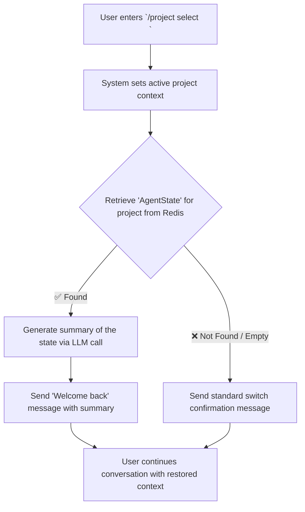

# Analysis Template

> 📋 Template สำหรับการวิเคราะห์ก่อนเริ่มพัฒนา Feature

---

## 📌 Feature Information

| รายการ | รายละเอียด |
|--------|-----------|
| **Feature Name** | Project-Specific Memory & Context Restoration |
| **Issue URL** | [#38](https://github.com/oatrice/Luma/issues/38) |
| **Date** | March 8, 2026 |
| **Analyst** | Luma AI (Senior Technical Analyst) |
| **Priority** | 🔴 High |
| **Status** | 📝 Draft |

---

## 1. Requirement Analysis

### 1.1 Problem Statement

> อธิบายปัญหาที่ต้องการแก้ไข

```
Currently, when a user switches between projects, the assistant only retains the raw chat history. It has no memory of the specific *task* or *working context* (e.g., which file was being edited, what the last objective was). This forces the user to manually re-establish context after switching back to a project, leading to a disjointed and inefficient workflow. The system needs to intelligently remember and restore the active working state for each project.
```

### 1.2 User Stories

| # | As a | I want to | So that |
|---|------|-----------|---------|
| 1 | Developer | have the assistant remember my specific task within each project | I can seamlessly resume my work without re-explaining the context after switching projects. |
| 2 | Developer | be greeted with a summary of my last session when I switch back to a project | I can quickly regain my bearings and understand what the last active task was. |
| 3 | System | persist a detailed "Agent State" for each project | I can accurately restore the working context and provide a continuous experience for the user. |

### 1.3 Acceptance Criteria

- [ ] **AC1:** Upon switching to a project (e.g., via `/project select <name>`), the bot must respond with a welcome-back message summarizing the last known state (e.g., "Welcome back to Luma. We were last debugging `redis_service.py`...").
- [ ] **AC2:** A structured agent state (containing at least `current_file` and `task_summary`) must be persisted to a Redis hash or key whenever a significant action occurs.
- [ ] **AC3:** The persisted agent state for Project A must remain intact and retrievable even after conducting a long, unrelated conversation in Project B.

---

## 2. Feature Analysis

### 2.1 User Flow



### 2.2 Screen/Page Requirements

| หน้าจอ | Actions | Components |
|--------|---------|------------|
| Chat Interface | - User sends `/project select ...`<br>- System sends context summary message | - Message Display Area |

### 2.3 Input/Output Specification

#### Inputs

| Field | Type | Required | Validation |
|-------|------|----------|------------|
| `project_name` | string | ✅ | Must be a valid, existing project alias for the user. |

#### Outputs

| Field | Type | Description |
|-------|------|-------------|
| `summaryMessage` | string | A context-aware welcome message that summarizes the last known state of the project. This is only sent if a previous state exists. |

---

## 3. Impact Analysis

### 3.1 Affected Components

| Component | Impact Level | Description |
|-----------|--------------|-------------|
| **`luma_core/state_manager.py`** | 🔴 High | Will be significantly modified to save, load, and manage a structured `AgentState` object per project, in addition to the existing chat history. New methods for updating this state will be required. |
| **`luma_core/gemini_cli.py`** | 🔴 High | The `/project select` command handler must be updated to trigger the context restoration workflow (load state, call summarizer, send message). |
| **`luma_core/state.py`** | 🔴 High | A new dataclass, `AgentState`, must be defined. It will model the structure of the persistent context (e.g., `current_file: str`, `current_task: str`, `last_modified: datetime`). |
| **`luma_core/context_summarizer.py`** | 🟡 Medium | A new module or function will be created to orchestrate the summarization. It will take an `AgentState` object, format it into a prompt, and call the LLM to get a human-readable summary. |
| **`luma_core/actions.py`** | 🟡 Medium | Core actions (e.g., `edit_file`, `run_test`) must be updated to report their status back to the `StateManager` so the `AgentState` can be kept up-to-date. |

### 3.2 Breaking Changes

- [ ] **BC1:** No user-facing breaking changes are expected. The Redis data model will be extended with new keys, but it will not break the existing chat history functionality.

### 3.3 Backward Compatibility Plan

```
The system must be designed to be resilient. When switching to a project, if the new `AgentState` key does not exist in Redis (either because it's an old project from before this feature or a brand new one), the context restoration and summary step will be gracefully skipped. The bot will simply send the standard "Switched to project..." message.
```

---

## 4. Feasibility Analysis

### 4.1 Technical Feasibility

| คำถาม | คำตอบ | หมายเหตุ |
|-------|-------|----------|
| เทคโนโลยีรองรับหรือไม่? | ✅ | The required technologies (Redis for storage, LLM for summarization) are already integrated into the project. |
| ทีมมี Skills เพียงพอหรือไม่? | ✅ | The work involves Python and architectural refactoring, which aligns with existing team skills. |
| Infrastructure รองรับหรือไม่? | ✅ | No changes to the infrastructure are needed. The additional load on Redis and the LLM provider is expected to be minimal. |

### 4.2 Time Feasibility

| ประเด็น | รายละเอียด |
|--------|-----------|
| **Estimated Effort** | 5-8 person-days |
| **Deadline** | N/A |
| **Buffer Time** | 2 days |
| **Feasible?** | ✅ | The effort is manageable and builds upon the existing multi-project foundation. |

### 4.3 Budget Feasibility

| รายการ | ค่าใช้จ่าย | หมายเหตุ |
|--------|-----------|----------|
| Development Hours | Internal Cost | Allocated from the main project budget. |
| LLM API Calls | Minimal Increase | A small cost increase due to one extra API call per project switch. |
| **Total** | Internal Cost | |

---

## 5. Security Analysis

### 5.1 Sensitive Data

| ข้อมูล | Sensitivity Level | Protection Method |
|--------|------------------|-------------------|
| `AgentState` Object | 🟡 Sensitive | The state object may contain file paths, task descriptions, and code snippets. It will be stored in Redis with the same TTL and access controls as the chat history. |

### 5.2 Attack Vectors

| Vector | Risk Level | Mitigation |
|--------|-----------|------------|
| Data Leakage | 🟢 Low | As state is strictly namespaced by `chat_id` and `project_name` in Redis, the risk of data leaking between users or projects is minimal and equivalent to the existing risk for chat history. |

### 5.3 Authentication & Authorization

```
No changes are required. The feature relies on the existing session authentication and project authorization mechanisms.
```

---

## 6. Performance & Scalability Analysis

### 6.1 Performance Targets

| Metric | Target | Current |
|--------|--------|---------|
| Context Switch Latency | < 3 seconds | < 500ms |
| Memory per Project (Redis) | < 5 KB | < 1 KB |

### 6.2 Scalability Plan

| Scenario | Expected Users | Scaling Strategy |
|----------|---------------|------------------|
| Normal | 1-10 projects/user | The Redis HASH or STRING per project is highly efficient. No issues expected. |
| Peak | 50+ projects/user | Redis memory usage will increase linearly. This is acceptable. The main bottleneck will be the latency of the LLM call, which is a fixed cost per switch and doesn't degrade with more projects. |

---

## 7. Gap Analysis

| ด้าน | As-Is (ปัจจุบัน) | To-Be (ต้องการ) | Gap |
|------|-----------------|-----------------|-----|
| State Persistence | Persists only `chat_history` and `current_project_id`. | Persists a detailed `AgentState` object (working file, task, etc.) for each project. | An `AgentState` data model and the logic to save/load it to/from Redis are missing. |
| Context Restoration | User must manually state their context after switching. | The bot proactively summarizes the last known context upon switching. | A summarization workflow (triggered on project switch) that uses an LLM is needed. |

---

## 8. Risk Analysis

| Risk | Probability | Impact | Score | Mitigation Plan |
|------|-------------|--------|-------|-----------------|
| LLM Latency | 🟡 Medium | 🟡 Medium | 4 | The additional LLM call on every project switch could feel slow. Mitigate by using a fast, small model for the summarization task and optimizing the prompt. |
| Inaccurate Summaries | 🟡 Medium | 🟡 Medium | 4 | The LLM might generate a confusing or unhelpful summary. Mitigate by designing a very structured prompt for the summarizer, providing clear key-value pairs from the `AgentState`. |
| State Deserialization Failure | 🟢 Low | 🔴 High | 3 | If the `AgentState` model changes in the future, loading an old state from Redis could cause a crash. Mitigate by implementing versioning within the state object and using robust error handling (try/except) during the loading process. |

> **Risk Score:** Probability × Impact (High=3, Medium=2, Low=1)

---

## 9. Summary & Recommendations

### 9.1 Analysis Summary

| หมวด | Status | Key Findings |
|------|--------|--------------|
| Requirement | ✅ Clear | Need to persist and restore detailed working context per project. |
| Feature | ✅ Defined | A "welcome back" summary flow triggered by `/project select` is the proposed solution. |
| Impact | 🔴 High | Requires significant changes to state management and the introduction of a new summarization workflow. |
| Feasibility | ✅ Feasible | Technically straightforward, building on existing patterns. |
| Security | ✅ Acceptable | No new significant security risks are introduced. |
| Performance | ⚠️ Needs Review | The latency of the project switch will increase due to an LLM call. This must be monitored. |
| Risk | ⚠️ Some Risks | Key risks are the latency and quality of the summary message. |

### 9.2 Recommendations

1.  **Define a Versioned State Object**: Immediately define a clear, versioned dataclass for `AgentState` in `luma_core/state.py`. This will mitigate future deserialization risks.
2.  **Isolate Summarization Logic**: Create a dedicated function or class (e.g., `summarize_context`) that is solely responsible for generating the summary. This will make it easier to test and optimize the prompt.
3.  **Update Actions to Report State**: Refactor key functions in `luma_core/actions.py` to call a new method like `state_manager.update_active_project_state()` after they complete, ensuring the agent's state is always current.

### 9.3 Next Steps

- [ ] Obtain approval for the implementation plan.
- [ ] Create technical sub-tasks for each affected component.
- [ ] Develop and test the `AgentState` data model and its persistence in Redis.
- [ ] Prototype and refine the LLM prompt for context summarization.

---

## 📎 Appendix

### Related Documents

- [Link to PRD]
- [Link to Design Docs]
- [Link to API Specs]

### Sign-off

| Role | Name | Date | Signature |
|------|------|------|-----------|
| Analyst | Luma AI | March 8, 2026 | ✅ |
| Tech Lead | [Name] | [Date] | ⬜ |
| PM | [Name] | [Date] | ⬜ |