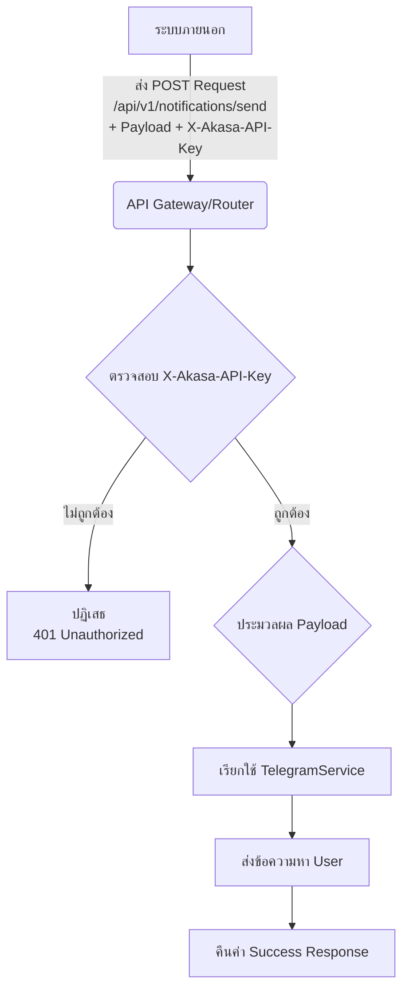

# Analysis Template

> 📋 Template สำหรับการวิเคราะห์ก่อนเริ่มพัฒนา Feature

---

## 📌 Feature Information

| รายการ | รายละเอียด |
|---|-----------|
| **Feature Name** | Implement Secure Proactive Notification Endpoint |
| **Issue URL** | [#29](https://github.com/example/repo/issues/29) |
| **Date** | 9 มีนาคม 2569 |
| **Analyst** | Luma AI (Senior Technical Analyst) |
| **Priority** | 🔴 High |
| **Status** | 📝 Draft |

---

## 1. Requirement Analysis

### 1.1 Problem Statement

> อธิบายปัญหาที่ต้องการแก้ไข

ปัจจุบันยังไม่มี Endpoint ที่ปลอดภัยสำหรับรับการแจ้งเตือน (Notification) จากระบบภายนอก เช่น Gemini CLI ทำให้การส่งข้อมูลแจ้งเตือนไปยังผู้ใช้ทำได้ไม่สะดวกและอาจไม่ปลอดภัย

```
ระบบภายนอกต้องการกลไกที่เชื่อถือได้และปลอดภัยในการส่งข้อความแจ้งเตือนไปยังผู้ใช้ผ่านระบบ
```

### 1.2 User Stories

| # | As a | I want to | So that |
|---|---|-----------|---------|
| 1 | ระบบภายนอก (เช่น Gemini CLI) | ส่ง Payload ข้อความพร้อมข้อมูลเพิ่มเติม (user_id, priority, metadata) | ผู้ใช้จะได้รับการแจ้งเตือนที่เกี่ยวข้องทันท่วงที |
| 2 | ผู้ดูแลระบบ/นักพัฒนา | กำหนดและตรวจสอบ API Key เพื่อยืนยันตัวตนและสิทธิ์ในการส่ง Notification | ป้องกันการเข้าถึงโดยไม่ได้รับอนุญาตและรักษาความปลอดภัยของระบบ |
| 3 | ผู้ใช้ | ได้รับการแจ้งเตือนที่สำคัญอย่างรวดเร็ว | สามารถดำเนินการตามข้อมูลที่ได้รับอย่างทันท่วงที |

### 1.3 Acceptance Criteria

- [x] Endpoint `POST /api/v1/notifications/send` ถูกสร้างขึ้นและทำงานได้
- [x] Endpoint ยอมรับ Payload รูปแบบ `{"user_id": "str", "message": "str", "priority": "high" | "normal", "metadata": "dict"}`
- [x] Request ที่ไม่มี Header `X-Akasa-API-Key` ที่ถูกต้องจะถูกปฏิเสธด้วย HTTP Status 401
- [x] Request ที่มี Header `X-Akasa-API-Key` ที่ไม่ถูกต้องจะถูกปฏิเสธ
- [x] Request ที่ถูกต้องจะเรียกใช้ `TelegramService` เพื่อส่งข้อความไปยัง `user_id` ทันที
- [x] `priority` (high/normal) และ `metadata` จะถูกส่งต่อไปยัง `TelegramService`
- [x] Endpoint จะคืนค่า Response ที่บ่งบอกความสำเร็จ (เช่น 200 OK หรือ 202 Accepted) หลังจากประมวลผลคำขอ

---

## 2. Feature Analysis

### 2.1 User Flow



### 2.2 Screen/Page Requirements

หน้าจอ (Screen/Page) ไม่เกี่ยวข้องกับ Feature นี้ เนื่องจากเป็น API Endpoint

| หน้าจอ | Actions | Components |
|--------|---------|------------|
| N/A | N/A | N/A |

### 2.3 Input/Output Specification

#### Inputs

| Field | Type | Required | Validation |
|---|---|---|---|
| **Header: X-Akasa-API-Key** | string | ✅ | ต้องตรงกับ Key ที่เก็บใน Environment/Redis |
| **Body (JSON)** | object | ✅ | - |
| `user_id` | string | ✅ | - |
| `message` | string | ✅ | - |
| `priority` | "high" \| "normal" | ✅ | Enum validation |
| `metadata` | dict | ❌ | - |

#### Outputs

| Field | Type | Description |
|---|---|---|
| **Status Code** | integer | 200 OK / 202 Accepted (สำเร็จ), 401 Unauthorized (Key ผิด), 400 Bad Request (Payload ผิด), 500 Internal Server Error (ข้อผิดพลาดภายใน) |
| **Body (Success)** | object | `{"status": "success", "message": "Notification queued successfully"}` (หรือข้อความที่คล้ายกัน) |
| **Body (Error)** | object | `{"status": "error", "message": "Reason for error"}` |

---

## 3. Impact Analysis

### 3.1 Affected Components

| Component | Impact Level | Description |
|---|---|---|
| `app/routers/notifications.py` | 🔴 High | มีการสร้าง Endpoint ใหม่ทั้งหมด |
| `TelegramService` | 🔴 High | จะถูกเรียกใช้งานเพื่อส่งข้อความ, ต้องมีความทนทานต่อข้อผิดพลาด |
| Authentication/Authorization Layer | 🔴 High | ต้องมีการเพิ่ม Logic การตรวจสอบ `X-Akasa-API-Key` |
| Environment/Redis | 🟡 Medium | ต้องมีการจัดเก็บและดึงค่า `X-Akasa-API-Key` |
| External Systems (e.g., Gemini CLI) | 🟡 Medium | ระบบที่เรียกใช้ Endpoint นี้ต้องปรับเปลี่ยนให้ส่ง Header `X-Akasa-API-Key` |

### 3.2 Breaking Changes

- [x] **BC1:** การเพิ่ม Header `X-Akasa-API-Key` เป็นข้อกำหนดใหม่สำหรับ Endpoint นี้ ซึ่งอาจส่งผลกระทบต่อ Client ที่เรียกใช้ Endpoint ใหม่นี้หากไม่ implement Header ดังกล่าว

### 3.3 Backward Compatibility Plan

```
การเปลี่ยนแปลงนี้เป็นการเพิ่ม Endpoint ใหม่ จึงไม่มีผลกระทบต่อฟังก์ชันการทำงานเดิมของระบบ
Client ที่ต้องการใช้ Endpoint ใหม่นี้จะต้อง implement การส่ง Header 'X-Akasa-API-Key' ด้วยตนเอง
```

---

## 4. Feasibility Analysis

### 4.1 Technical Feasibility

| คำถาม | คำตอบ | หมายเหตุ |
|---|---|---|
| เทคโนโลยีรองรับหรือไม่? | ✅ | FastAPI, Python, Telegram API เป็นเทคโนโลยีที่รองรับและใช้งานได้ดี |
| ทีมมี Skills เพียงพอหรือไม่? | ✅ | ทีมมีความคุ้นเคยกับการพัฒนา API และการทำงานกับ Service ภายนอก |
| Infrastructure รองรับหรือไม่? | ✅ | การจัดเก็บ API Key ใน Environment/Redis เป็นเรื่องปกติและจัดการได้ |

### 4.2 Time Feasibility

| ประเด็น | รายละเอียด |
|--------|-----------|
| **Estimated Effort** | 2 วัน |
| **Deadline** | TBD |
| **Buffer Time** | 1 วัน |
| **Feasible?** | ✅ |

### 4.3 Budget Feasibility

| รายการ | ค่าใช้จ่าย | หมายเหตุ |
|--------|-----------|----------|
| **Total** | - | ไม่น่ามีค่าใช้จ่ายเพิ่มเติม นอกเหนือจากเวลาของนักพัฒนา |

---

## 5. Security Analysis

### 5.1 Sensitive Data

| ข้อมูล | Sensitivity Level | Protection Method |
|--------|------------------|-------------------|
| `X-Akasa-API-Key` | 🔴 Critical | จัดเก็บอย่างปลอดภัย (เช่น Environment Variable, Redis ที่มีการเข้ารหัส), ใช้ HTTPS, กำหนดอายุ Key และการ Rotate |
| `user_id` | 🟡 Sensitive | จำกัดสิทธิ์การเข้าถึง, ป้องกันการเปิดเผยข้อมูลส่วนบุคคล (PII) |
| `message` | 🟡 Sensitive | ขึ้นอยู่กับเนื้อหา, อาจต้องมีการเข้ารหัสหากเป็นข้อมูลลับ |

### 5.2 Attack Vectors

| Vector | Risk Level | Mitigation |
|--------|-----------|------------|
| การเข้าถึงโดยไม่ได้รับอนุญาต (API Key Leak/Guessing) | 🔴 High | การจัดการ Key ที่ปลอดภัย, การจำกัด Rate Limit ต่อ Key, การหมุนเวียน Key, การใช้ HTTPS |
| การส่ง Payload ที่ไม่ถูกต้อง/เป็นอันตราย | 🟡 Medium | การตรวจสอบ Payload ด้วย Pydantic Model อย่างเข้มงวด, การ Sanitize Input |
| การโจมตีแบบ Denial of Service (DoS) | 🟡 Medium | การจำกัด Rate Limit โดยรวมที่ระดับ Application หรือ Load Balancer |

### 5.3 Authentication & Authorization

```
- **Authentication:** ใช้ API Key (`X-Akasa-API-Key` header) เพื่อยืนยันตัวตนของผู้เรียกใช้ Endpoint
- **Authorization:** API Key ที่ถูกต้องจะให้อำนาจในการส่ง Notification โดยตรง หากต้องการระดับการอนุญาตที่ละเอียดขึ้น อาจต้องพิจารณาการกำหนดสิทธิ์ตาม Key นั้นๆ ในอนาคต
```

---

## 6. Performance & Scalability Analysis

### 6.1 Performance Targets

| Metric | Target | Current |
|--------|--------|---------|
| Response Time | < 200ms | N/A |
| Throughput | 1000 req/s | N/A |
| Error Rate | < 0.1% | N/A |

### 6.2 Scalability Plan

| Scenario | Expected Users | Scaling Strategy |
|----------|---------------|------------------|
| Normal | [X] users | Scale API instances horizontally behind a load balancer |
| Peak | [X] users | Auto-scaling based on traffic load |
| Growth (1yr) | [X] users | Monitor `TelegramService` performance; implement queuing if it becomes a bottleneck. |

---

## 7. Gap Analysis

| ด้าน | As-Is (ปัจจุบัน) | To-Be (ต้องการ) | Gap |
|------|-----------------|-----------------|-----|
| กลไกการส่ง Notification ที่ปลอดภัย | อาจไม่มี หรือมีแบบ Ad-hoc | Endpoint `/api/v1/notifications/send` ที่ปลอดภัยและรวมศูนย์ | การสร้าง Endpoint ใหม่และกลไกการตรวจสอบความปลอดภัย |
| การกระจาย Notification แบบรวมศูนย์ | Notification อาจถูกส่งโดยตรงจากหลาย Service | Notification จากภายนอกทั้งหมดต้องผ่าน Endpoint นี้ | การปรับปรุงระบบภายนอกให้เรียกใช้ Endpoint ใหม่ และการกำหนดมาตรฐาน |

---

## 8. Risk Analysis

| Risk | Probability | Impact | Score | Mitigation Plan |
|------|-------------|--------|-------|-----------------|
| API Key รั่วไหล/ถูกขโมย | 🟡 Medium | 🔴 High | 6 | จัดเก็บ API Key อย่างปลอดภัย, ใช้ HTTPS, กำหนดนโยบายการหมุนเวียน Key, การจำกัด Rate Limit |
| `TelegramService` ไม่พร้อมใช้งาน/ถูกจำกัด | 🟡 Medium | 🔴 High | 6 | Implement Retry Mechanism, Dead-letter queue, Monitoring |
| Payload ไม่ถูกต้อง/เป็นอันตราย นำไปสู่ Error | 🟢 Low | 🟡 Medium | 2 | ใช้ Pydantic Model สำหรับ Validation, Sanitize Input |

> **Risk Score:** Probability × Impact (High=3, Medium=2, Low=1)

---

## 9. Summary & Recommendations

### 9.1 Analysis Summary

| หมวด | Status | Key Findings |
|------|--------|--------------|
| Requirement | ✅ Clear | ความต้องการในการสร้าง Endpoint สำหรับส่ง Notification ที่ปลอดภัยนั้นชัดเจน |
| Feature | ✅ Defined | รายละเอียดของ Endpoint, Payload, Security, และ Logic ถูกกำหนดไว้แล้ว |
| Impact | ⚠️ Medium | มีผลกระทบต่อ Router, Service, และ Client ที่เรียกใช้ |
| Feasibility | ✅ Feasible | สามารถดำเนินการได้ด้วยเทคโนโลยีและทักษะที่มี |
| Security | ⚠️ Needs Review | การจัดการ API Key เป็นเรื่องสำคัญมาก และต้องการการดูแลเป็นพิเศษ |
| Performance | ✅ Acceptable | เป้าหมาย Performance ที่ตั้งไว้มีความสมเหตุสมผล |
| Risk | ⚠️ Some Risks | มีความเสี่ยงที่ต้องพิจารณา โดยเฉพาะเรื่องความปลอดภัยของ API Key และความพร้อมใช้งานของ Service ภายนอก |

### 9.2 Recommendations

1.  **Implement Robust API Key Management:** กำหนดนโยบายและกลไกการจัดการ API Key ที่เข้มงวด เช่น การจัดเก็บที่ปลอดภัย, การจำกัดสิทธิ์ตาม Key, และการกำหนดอายุ/การหมุนเวียน Key
2.  **Design Resilient `TelegramService` Integration:** ตรวจสอบให้แน่ใจว่าการเรียกใช้ `TelegramService` มีการจัดการข้อผิดพลาดและ Retry Mechanism ที่เหมาะสม เพื่อรองรับกรณีที่ Service ภายนอกไม่พร้อมใช้งาน
3.  **Utilize Pydantic for Strict Validation:** ใช้ Pydantic Model ใน FastAPI เพื่อทำการตรวจสอบ Payload ที่รับเข้ามาอย่างเข้มงวด ป้องกันข้อมูลที่ผิดพลาดหรือเป็นอันตราย

### 9.3 Next Steps

- [ ] กำหนดรูปแบบการจัดเก็บ `X-Akasa-API-Key` (Environment Variable หรือ Redis)
- [ ] Implement Endpoint `POST /api/v1/notifications/send` ใน `app/routers/notifications.py`
- [ ] Implement Logic การตรวจสอบ `X-Akasa-API-Key`
- [ ] Integrate `TelegramService` เข้ากับการทำงานของ Endpoint

---

## 📎 Appendix

### Related Documents

- [Link to PRD] | N/A
- [Link to Design Docs] | N/A
- [Link to API Specs] | N/A

### Sign-off

| Role | Name | Date | Signature |
|---|---|---|-----------|
| Analyst | Luma AI | 9 มีนาคม 2569 | ✅ |
| Tech Lead | [Name] | ⬜ | ⬜ |
| PM | [Name] | ⬜ | ⬜ |