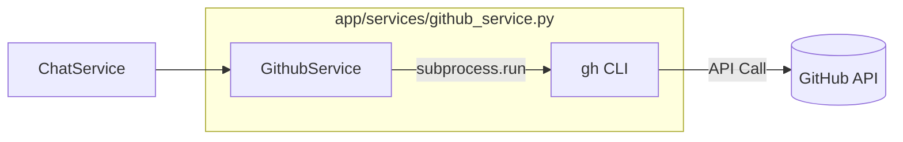

# Feature Specification: GitHub CLI Wrapper Service

> 📋 Feature Specification สำหรับ GitHubService Integration

---

## 📌 Feature Overview

| รายการ | รายละเอียด |
|--------|-----------|
| **Feature Name** | [Service] GithubService: Subprocess Wrapper for GH CLI |
| **Version** | v1.0.0 |
| **Created Date** | 2026-03-09 |
| **Last Updated** | 2026-03-09 |
| **Author** | Gemini CLI |
| **Status** | 📝 Draft |

---

## 1. Executive Summary

สร้าง Service สำหรับครอบ (Wrap) คำสั่งของ GitHub CLI (`gh`) เพื่อให้ Akasa Chatbot สามารถจัดการ GitHub Issues และตรวจสอบสถานะ Repository ได้โดยตรงผ่านการแชท โดยใช้ `subprocess` ในการเรียกใช้งานคำสั่ง และจัดการความปลอดภัยผ่าน Environment Variables

### Scope & Phasing

> [!IMPORTANT]
> **Service Scope Policy:**
> - **Backend**: พัฒนา `GithubService` ให้รองรับคำสั่งพื้นฐาน (Issue List, Create, PR Status) พร้อม Unit Tests และ Error Handling ที่รัดกุม
> - **Integration**: เชื่อมต่อกับ `ChatService` เพื่อรับคำสั่งจากผู้ใช้ในเฟสถัดไป

---

## 2. Problem Statement

### 2.1 Current Pain Points

1. **Context Switching**: นักพัฒนาต้องสลับหน้าจอไปมาระหว่างแอปแชทและ GitHub UI/CLI เพื่อจัดการงานพื้นฐาน
2. **Lack of Automation**: บอทยังไม่สามารถดำเนินการใดๆ บน GitHub ได้ ทำให้จำกัดความสามารถในการเป็น "Coding Assistant"
3. **Complex API Integration**: การใช้ GitHub REST API โดยตรงอาจมีความซับซ้อนในการจัดการ Auth และ Payload เมื่อเทียบกับการใช้ `gh cli` ที่มี Abstraction มาให้แล้ว

---

## 3. Goals & Success Criteria

### 3.1 Goals

| # | Goal | Measurable? |
|---|------|-------------|
| G1 | พัฒนา `GithubService` ที่เรียกใช้ `gh cli` ได้สำเร็จ | ✅ |
| G2 | รองรับคำสั่งพื้นฐาน: `issue list`, `issue create`, `pr status` | ✅ |
| G3 | จัดการ GitHub PAT ได้อย่างปลอดภัยผ่าน Env Var | ✅ |

### 3.2 Success Criteria (KPIs)

| KPI | Target | Measurement Method |
|-----|--------|-------------------|
| Unit Test Coverage | > 90% | Pytest coverage report |
| CLI Error Handling | 100% caught | ตรวจสอบผ่านการทดสอบ Scenario ที่คำสั่งล้มเหลว |

---

## 4. User Stories & Requirements

### 4.1 User Stories

#### Epic: GitHub Management via Chat

##### Story 1: ดูรายการ Issues
```
As a Developer
I want to list GitHub issues via chat
So that I can quickly check the remaining tasks
```
**Acceptance Criteria:**
- [ ] เมื่อเรียก `list_issues` ระบบต้องคืนค่ารายการ Issue ในรูปแบบ List of Dict
- [ ] ต้องรองรับการระบุ Repository ในรูปแบบ `owner/repo`
- [ ] หาก Repository ไม่มีอยู่จริง ต้องคืนค่า Error Message ที่ชัดเจน

##### Story 2: สร้าง Issue ใหม่
```
As a Developer
I want to create a GitHub issue from the chatbot
So that I can log bugs or ideas instantly
```
**Acceptance Criteria:**
- [ ] เมื่อเรียก `create_issue` ระบบต้องส่งคำสั่งไปยัง GitHub และคืนค่า URL ของ Issue ใหม่
- [ ] ต้องมีการดักจับ Error กรณีที่ Token ไม่ถูกต้อง หรือไม่มีสิทธิ์เข้าถึง Repository

### 4.2 Functional Requirements

| ID | Requirement | Priority | MoSCoW |
|----|-------------|----------|--------|
| FR-001 | เรียกใช้ `gh issue list --json` และ Parse JSON output | 🔴 High | Must Have |
| FR-002 | เรียกใช้ `gh issue create` พร้อมระบุ Title และ Body | 🔴 High | Must Have |
| FR-003 | เรียกใช้ `gh pr status --json` เพื่อดูสถานะ PR ปัจจุบัน | 🟡 Medium | Should Have |
| FR-004 | จัดการ `GITHUB_TOKEN` ผ่าน `app/config.py` | 🔴 High | Must Have |

### 4.3 Non-Functional Requirements

| ID | Category | Requirement |
|----|----------|-------------|
| NFR-001 | Security | ห้าม Hardcode Token และห้ามพิมพ์ Token ลงใน Logs |
| NFR-002 | Reliability | ต้องดักจับ `CalledProcessError` และแจ้งเตือนเมื่อ `gh` cli ไม่ได้ติดตั้งในระบบ |

---

## 5. Specification by Example (SBE)

### Scenario 1: ดึงรายการ Issues สำเร็จ (Happy Path)

**Given** บอทมี `GITHUB_TOKEN` ที่ถูกต้อง และ Repository `oatrice/Akasa` มี Issues อยู่
**When** เรียกใช้ฟังก์ชัน `list_issues("oatrice/Akasa")`
**Then** ระบบต้องรันคำสั่ง `gh issue list --repo oatrice/Akasa --json number,title,state`
**And** คืนค่าเป็นข้อมูล JSON ที่ parse แล้ว

| Input (repo) | Mock CLI Output | Expected Return Value |
|--------------|-----------------|-----------------------|
| `oatrice/Akasa` | `[{"number":1,"title":"Setup","state":"OPEN"}]` | `[{"number": 1, "title": "Setup", "state": "OPEN"}]` |

### Scenario 2: การจัดการข้อผิดพลาดเมื่อ Token ไม่ถูกต้อง

**Given** `GITHUB_TOKEN` ใน Environment ไม่ถูกต้อง
**When** เรียกใช้ฟังก์ชัน `create_issue`
**Then** ระบบต้องตรวจจับว่า `gh` คืนค่า Exit Code ที่ไม่เป็นศูนย์
**And** Raise `GitHubServiceError` พร้อมข้อความแจ้งเตือนเรื่อง Authentication

| Action | Error From CLI | Expected Outcome |
|--------|----------------|------------------|
| Create Issue | `GraphQL: Your token has not been granted...` | Raise `GitHubServiceError("Authentication failed...")` |

---

## 6. Technical Design

### 6.1 System Architecture



---

## 7. Task Breakdown

### 7.1 Development Tasks

| # | Task | Type | Estimate | Assignee | Status |
|---|------|------|----------|----------|--------|
| 1 | เพิ่ม `GITHUB_TOKEN` ใน `app/config.py` | Backend | 0.5h | Gemini | ⬜ Not Started |
| 2 | พัฒนา `GithubService` และฟังก์ชัน Wrapper | Backend | 4h | Gemini | ⬜ Not Started |
| 3 | เขียน Unit Tests โดยใช้ Mock `subprocess.run` | Testing | 2h | Gemini | ⬜ Not Started |

---

## 8. Testing Strategy

### 8.1 Test Scope

| Test Type | Scope | Tool |
|-----------|-------|------|
| Unit Tests | `github_service.py` (Mocking Subprocess) | Pytest |
| Manual Tests | รันจริงบน Local Dev ที่ลง `gh cli` ไว้ | CLI |

---

## 9. Definition of Done (DoD)

- [ ] ✅ พัฒนา `GithubService` เสร็จสิ้นตาม Spec
- [ ] 🧪 Unit Test Coverage ≥ 90%
- [ ] 🧪 ทดสอบ Error Handling กรณี CLI ล้มเหลว
- [ ] 👀 ผ่านการ Code Review
- [ ] 🔒 มั่นใจว่าไม่มีความลับรั่วไหลใน Logs