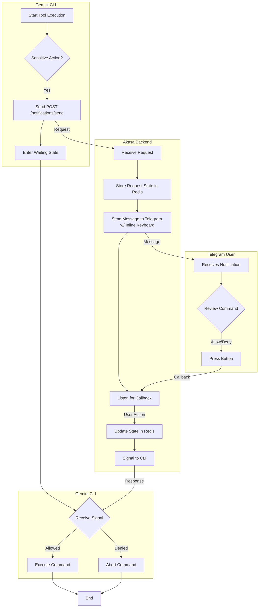

# Analysis Template

> 📋 Template สำหรับการวิเคราะห์ก่อนเริ่มพัฒนา Feature

---

## 📌 Feature Information

| รายการ | รายละเอียด |
|--------|-----------|
| **Feature Name** | [Feature] Remote Action Confirmation via Akasa Bot (Telegram Integration) |
| **Issue URL** | [#49](https://github.com/oatrice/Akasa/issues/49) |
| **Date** | 2026-03-10 |
| **Analyst** | Luma AI (Senior Technical Analyst) |
| **Priority** | 🔴 High |
| **Status** | 📝 Draft |

---

## 1. Requirement Analysis

### 1.1 Problem Statement

> อธิบายปัญหาที่ต้องการแก้ไข

```
นักพัฒนาที่ใช้ Gemini CLI สำหรับงานที่รันเป็นเวลานาน (Long-running task) หรือรันบนเซิร์ฟเวอร์ระยะไกล ไม่สามารถโต้ตอบเพื่อยืนยันการดำเนินการที่ละเอียดอ่อน (เช่น การรัน Shell Command) ได้อย่างทันท่วงที ทำให้เกิดความล่าช้าในกระบวนการทำงานและอาจเกิดความเสี่ยงด้านความปลอดภัยหากต้องเปิด Terminal ทิ้งไว้เพื่อรอการยืนยัน
```

### 1.2 User Stories

| # | As a | I want to | So that |
|---|------|-----------|---------|
| 1 | นักพัฒนาที่ใช้ Gemini CLI ทำงานแบบ Long-running task หรือรันบน Server | ได้รับการแจ้งเตือนบน Telegram เมื่อ CLI ต้องการรันคำสั่งที่ต้องขออนุญาต | ฉันสามารถควบคุมความปลอดภัยของระบบและอนุมัติการทำงานได้จากทุกที่ ทุกเวลา โดยไม่ต้องเฝ้าหน้าจอ Terminal |

### 1.3 Acceptance Criteria

- [ ] **AC1:** Gemini CLI สามารถกำหนดค่า "Remote Confirmation" mode และเมื่อเปิดใช้งาน จะส่งคำขอการยืนยัน (Action Request) ไปยัง Akasa backend ได้สำเร็จเมื่อเจอ Sensitive Tool
- [ ] **AC2:** Akasa backend สามารถรับคำขอและส่งข้อความแจ้งเตือนไปยังผู้ใช้ผ่าน Telegram พร้อมรายละเอียดคำสั่งที่ครบถ้วนและปุ่ม Inline Keyboard (`✅ Allow Once`, `🛡️ Allow Session`, `❌ Deny`)
- [ ] **AC3:** เมื่อผู้ใช้กดปุ่ม `Allow Once` หรือ `Allow Session` ใน Telegram คำสั่งใน Gemini CLI จะถูกดำเนินการต่อทันที
- [ ] **AC4:** เมื่อผู้ใช้กด `Deny` ใน Telegram, Gemini CLI จะยกเลิกการทำงานของคำสั่งนั้นและแสดงข้อความว่าการดำเนินการถูกปฏิเสธโดยผู้ใช้

---

## 2. Feature Analysis

### 2.1 User Flow



### 2.2 Screen/Page Requirements

| หน้าจอ | Actions | Components |
|--------|---------|------------|
| Telegram Chat | - ดูรายละเอียดคำสั่งที่ต้องการยืนยัน<br>- อนุมัติการรันครั้งเดียว<br>- อนุมัติการรันตลอด Session<br>- ปฏิเสธการรัน | - ข้อความแสดงรายละเอียดคำสั่ง (Command, working directory, etc.)<br>- Inline Keyboard: `✅ Allow Once`, `🛡️ Allow Session`, `❌ Deny` |

### 2.3 Input/Output Specification

#### Inputs

**Endpoint: `POST /api/v1/notifications/send` (from Gemini CLI to Akasa)**

| Field | Type | Required | Validation |
|-------|------|----------|------------|
| `request_id` | string (UUID) | ✅ | Must be a unique identifier for the request |
| `chat_id` | string | ✅ | Telegram Chat ID to send notification to |
| `command_details` | object | ✅ | JSON object containing the command, arguments, cwd, etc. |
| `callback_url`| string | ❌ | Optional: Webhook URL for Akasa to call back to (if not using long-polling) |

**Telegram Callback (from Telegram to Akasa)**

| Field | Type | Required | Validation |
|-------|------|----------|------------|
| `callback_data` | string | ✅ | Contains `request_id` and the chosen action (e.g., `allow_once:uuid...`) |

#### Outputs

**Akasa Response to CLI (Long-polling or Webhook)**

| Field | Type | Description |
|-------|------|-------------|
| `request_id` | string | The same UUID from the initial request |
| `status` | string | The result of the user's action: `ALLOWED`, `DENIED` |
| `session_permission` | boolean | `true` if user chose 'Allow Session', otherwise `false` |

---

## 3. Impact Analysis

### 3.1 Affected Components

| Component | Impact Level | Description |
|-----------|--------------|-------------|
| **Gemini CLI** | 🔴 High | ต้องเพิ่ม Logic ในการจัดการ "Remote Confirmation" mode, การส่ง request, และการรอผลลัพธ์ (Long-polling/Webhook listener) |
| **`app/routers/notifications.py`** | 🔴 High | ต้องสร้าง Endpoint ใหม่ หรือปรับปรุง `/api/v1/notifications/send` เพื่อรองรับคำขอประเภทใหม่นี้ |
| **`app/services/telegram_service.py`** | 🔴 High | ต้องเพิ่มความสามารถในการสร้างและส่งข้อความที่มี Inline Keyboard และจัดการ Callback Query จากปุ่มกด |
| **`app/services/redis_service.py`** | 🟡 Medium | ต้องออกแบบ Schema และเพิ่ม Logic สำหรับการจัดเก็บ, อัปเดต, และดึงข้อมูลสถานะของแต่ละ `request_id` |
| **`app/models`** | 🟡 Medium | อาจต้องสร้าง Pydantic model ใหม่สำหรับ `ActionRequest` และ `ActionResponse` |
| **`app/services/chat_service.py`** | 🟢 Low | อาจมีการเปลี่ยนแปลงเล็กน้อยเพื่อประสานงานกับ state ใหม่ |

### 3.2 Breaking Changes

- [ ] **BC1:** การเปลี่ยนแปลง Endpoint `/api/v1/notifications/send` อาจกระทบกับผู้ใช้เดิม หากไม่มีการทำ Versioning หรือเพิ่ม Endpoint ใหม่แยกต่างหาก (สมมติฐาน: จะสร้าง Endpoint ใหม่ `POST /api/v1/actions/request` เพื่อความชัดเจนและไม่กระทบของเดิม)

### 3.3 Backward Compatibility Plan

```
- **CLI:** การเปลี่ยนแปลงนี้จะเป็น Opt-in feature (เปิดผ่าน Config) ดังนั้น CLI เวอร์ชั่นเก่าจะไม่ได้รับผลกระทบ
- **Backend:** หากสร้าง Endpoint ใหม่สำหรับฟีเจอร์นี้โดยเฉพาะ จะไม่มีผลกระทบต่อ Endpoint เดิมที่ใช้งานอยู่
```

---

## 4. Feasibility Analysis

### 4.1 Technical Feasibility

| คำถาม | คำตอบ | หมายเหตุ |
|-------|-------|----------|
| เทคโนโลยีรองรับหรือไม่? | ✅ | FastAPI, Redis, และ `python-telegram-bot` รองรับฟังก์ชันทั้งหมดที่ต้องการ (HTTP requests, long-polling, inline keyboards) |
| ทีมมี Skills เพียงพอหรือไม่? | ✅ | ทีมมีความคุ้นเคยกับ Python, FastAPI, และ Redis ซึ่งเป็นเทคโนโลยีหลักของโปรเจกต์ |
| Infrastructure รองรับหรือไม่? | ✅ | Infrastructure ปัจจุบันที่รัน Akasa สามารถรองรับภาระงานที่เพิ่มขึ้นเล็กน้อยจากฟีเจอร์นี้ได้ |

### 4.2 Time Feasibility

| ประเด็น | รายละเอียด |
|--------|-----------|
| **Estimated Effort** | 5-8 development days |
| **Deadline** | N/A |
| **Buffer Time** | 2 days |
| **Feasible?** | ✅ | สามารถทำได้ภายในกรอบเวลาที่เหมาะสม |

### 4.3 Budget Feasibility

| รายการ | ค่าใช้จ่าย | หมายเหตุ |
|--------|-----------|----------|
| Development Time | [ขึ้นอยู่กับอัตรา] | เป็นค่าใช้จ่ายหลัก |
| Infrastructure | 0 | คาดว่าไม่มีค่าใช้จ่ายเพิ่มเติมด้าน Infrastructure |
| **Total** | [ขึ้นอยู่กับอัตรา] | |

---

## 5. Security Analysis

### 5.1 Sensitive Data

| ข้อมูล | Sensitivity Level | Protection Method |
|--------|------------------|-------------------|
| Shell Command | 🔴 Critical | แสดงผลบน Telegram ใน Chat ที่ปลอดภัย (Private/Group ที่กำหนด), ส่งผ่าน HTTPS, ไม่เก็บ Log เกินความจำเป็น |
| `request_id` | 🟡 Sensitive | ใช้ UUID v4 เพื่อให้ไม่สามารถคาดเดาได้, ตรวจสอบความเป็นเจ้าของผ่าน `chat_id` |
| API Key (for Akasa) | 🔴 Critical | ต้องใช้ API Key ที่ปลอดภัยในการเรียก Endpoint จาก Gemini CLI |

### 5.2 Attack Vectors

| Vector | Risk Level | Mitigation |
|--------|-----------|------------|
| Unauthorized API Call | 🔴 High | ใช้ API Key Authentication ที่แข็งแกร่งสำหรับ Endpoint ที่รับคำขอจาก CLI |
| `request_id` Hijacking | 🟡 Medium | ตรวจสอบว่า `chat_id` ที่กด Callback มา ตรงกับ `chat_id` ที่ผูกกับ `request_id` ใน Redis |
| Man-in-the-Middle (CLI <-> Akasa) | 🟡 Medium | บังคับใช้การสื่อสารผ่าน HTTPS เท่านั้น |
| Malicious User in Telegram Group | 🟡 Medium | ควรมีระบบ Admin/Owner check หรือจำกัดให้ `chat_id` เป็น Private Chat ของผู้ใช้เท่านั้น |

### 5.3 Authentication & Authorization

```
- **CLI to Akasa:** การเรียก API ไปยัง Akasa Backend ต้องมีการยืนยันตัวตนผ่าน Header `X-API-Key` หรือ Bearer Token ที่ปลอดภัย
- **Telegram to Akasa:** Callback จาก Telegram ควรถูกตรวจสอบว่ามาจาก IP Address ของ Telegram จริงๆ (ถ้าเป็นไปได้)
- **User Authorization:** การอนุญาตให้ดำเนินการควรผูกกับ `user_id` ของ Telegram เพื่อให้แน่ใจว่าผู้ที่กดปุ่มคือเจ้าของที่แท้จริง
```

---

## 6. Performance & Scalability Analysis

### 6.1 Performance Targets

| Metric | Target | Current |
|--------|--------|---------|
| Response Time (API) | < 300ms | N/A |
| Notification Latency | < 2s | N/A |
| CLI `wait` timeout | 5 minutes | N/A |
| Error Rate | < 0.1% | N/A |

### 6.2 Scalability Plan

| Scenario | Expected Users | Scaling Strategy |
|----------|---------------|------------------|
| Normal | ~10 concurrent requests | Redis สามารถจัดการ State ได้สบาย, FastAPI worker 1-2 ตัวเพียงพอ |
| Peak | ~50 concurrent requests | เพิ่ม FastAPI worker และตรวจสอบ Redis connection pool |
| Growth (1yr) | ~200 concurrent requests | อาจพิจารณาใช้ Redis Cluster และ Load Balancer สำหรับ FastAPI |

---

## 7. Gap Analysis

| ด้าน | As-Is (ปัจจุบัน) | To-Be (ต้องการ) | Gap |
|------|-----------------|-----------------|-----|
| Confirmation Flow | การยืนยันเกิดขึ้นใน Terminal ที่รัน CLI เท่านั้น | สามารถยืนยันจากระยะไกลผ่าน Telegram ได้ | ต้องสร้างกลไกการสื่อสารระหว่าง CLI-Backend-Telegram ทั้งหมด |
| State Management | State อยู่ใน Memory ของ CLI process เท่านั้น | State การยืนยันถูกจัดการแบบกระจายศูนย์ที่ Redis | ต้องพัฒนาระบบการจัดการ State ใน Redis และ Logic การ Sync กับ CLI |
| Notification | ไม่มีระบบแจ้งเตือนภายนอก | มีการแจ้งเตือนไปยัง Telegram | ต้อง Integrate กับ Telegram Bot API และสร้าง Notification Service |

---

## 8. Risk Analysis

| Risk | Probability | Impact | Score | Mitigation Plan |
|------|-------------|--------|-------|-----------------|
| Security Flaw in Auth | 🟡 Medium | 🔴 High | 6 | ทำ Security Review และ Penetration Test สำหรับ Flow การยืนยันทั้งหมด, บังคับใช้ API Key ที่แข็งแกร่ง |
| State Mismatch/Race Condition | 🟡 Medium | 🟡 Medium | 4 | ใช้ Atomic operations ของ Redis (เช่น `SETNX`, `WATCH`) ในการจัดการ State เพื่อป้องกันการเขียนทับกัน |
| Network Latency/Failure | 🟢 Low | 🟡 Medium | 2 | Implement Retry logic และ Timeout ที่เหมาะสมในฝั่ง CLI, มี Fallback เป็นการยืนยันแบบ Local หากไม่สามารถติดต่อ Backend ได้ |

> **Risk Score:** Probability × Impact (High=3, Medium=2, Low=1)

---

## 9. Summary & Recommendations

### 9.1 Analysis Summary

| หมวด | Status | Key Findings |
|------|--------|--------------|
| Requirement | ✅ Clear | ความต้องการชัดเจนและแก้ปัญหาที่สำคัญของผู้ใช้ |
| Feature | ✅ Defined | User flow และส่วนประกอบต่างๆ ถูกกำหนดไว้ค่อนข้างครบถ้วน |
| Impact | 🟡 Medium | กระทบหลายส่วนของระบบ แต่ส่วนใหญ่เป็นการเพิ่มของใหม่ ไม่ได้แก้ไขของเดิมที่ซับซ้อน |
| Feasibility | ✅ Feasible | สามารถพัฒนาได้ด้วยเทคโนโลยีและทักษะที่ทีมมีอยู่ |
| Security | ⚠️ Needs Review | เป็นฟีเจอร์ที่เกี่ยวข้องกับความปลอดภัยสูง ต้องให้ความสำคัญกับการยืนยันตัวตนและการเข้ารหัสเป็นพิเศษ |
| Performance | ✅ Acceptable | ไม่น่าจะส่งผลกระทบต่อประสิทธิภาพโดยรวมของระบบอย่างมีนัยสำคัญ |
| Risk | 🟡 Medium | มีความเสี่ยงด้านความปลอดภัยและ State Management ที่ต้องจัดการอย่างรอบคอบ |

### 9.2 Recommendations

1. **Proceed with Development:** อนุมัติให้ดำเนินการพัฒนาฟีเจอร์นี้ เนื่องจากมีประโยชน์สูงและมีความเป็นไปได้ทางเทคนิค
2. **Prioritize Security:** จัดลำดับความสำคัญสูงสุดให้กับการออกแบบและทดสอบด้านความปลอดภัย โดยเฉพาะการ Authentication ระหว่าง CLI-Backend และ Authorization ของผู้ใช้ใน Telegram
3. **Develop a Clear API Contract:** สร้างนิยามของ API Request/Response ระหว่าง CLI และ Backend ให้ชัดเจนตั้งแต่แรกเพื่อลดปัญหาในการ integrate
4. **Use a New Endpoint:** แนะนำให้สร้าง Endpoint ใหม่ (เช่น `POST /api/v1/actions/request`) เพื่อหลีกเลี่ยง Breaking Changes และเพื่อความชัดเจน

### 9.3 Next Steps

- [ ] สร้าง Technical Specification Document ที่ลงรายละเอียด API contract และ Redis schema
- [ ] พัฒนา Backend Logic (API Endpoint, Redis Service, Telegram Service)
- [ ] พัฒนาส่วนของ Gemini CLI เพื่อรองรับ Remote Confirmation mode
- [ ] เขียน Unit Test และ Integration Test ครอบคลุมทุกส่วนของ Flow

---

## 📎 Appendix

### Related Documents

- [Link to PRD]
- [Link to Design Docs]
- [Link to API Specs]

### Sign-off

| Role | Name | Date | Signature |
|------|------|------|-----------|
| Analyst | Luma AI | 2026-03-10 | ✅ |
| Tech Lead | [Name] | [Date] | ⬜ |
| PM | [Name] | [Date] | ⬜ |