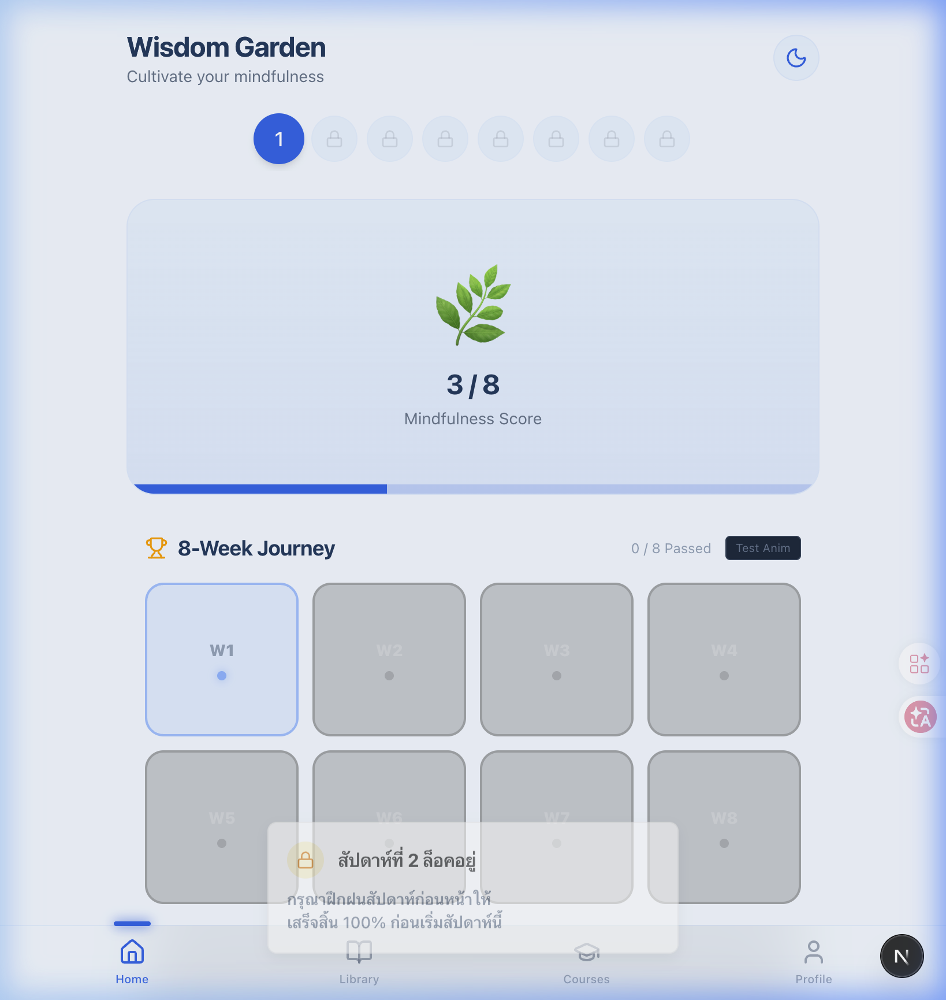
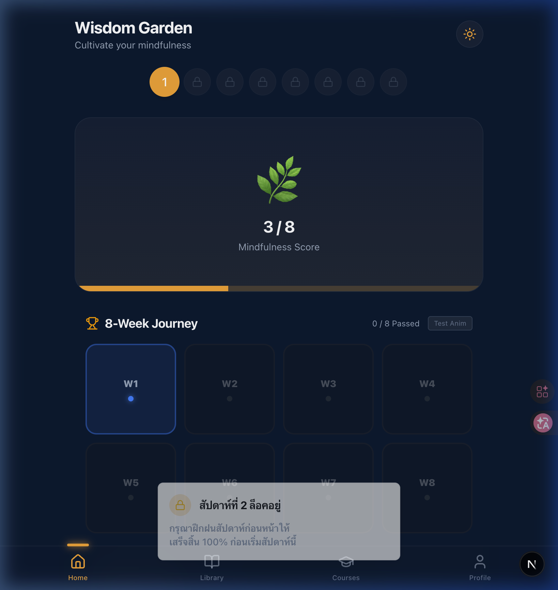

# Walkthrough: Lock UI สำหรับ Wisdom Garden

## สิ่งที่ทำ

### 1. Admin Sidebar Nav Link
เพิ่ม "Practice Config" ใน Settings section

render_diffs(file:///Users/oatrice/Software-projects/The%20Middle%20Way%20-Metadata/Platforms/Web/app/admin/layout.tsx)

### 2. Unit Tests (TDD) — Admin Practice Config Handler

| Test | Status |
|------|--------|
| `TestGetAdminPracticeConfig_Success` | ✅ PASS |
| `TestPutAdminPracticeConfig_Success` | ✅ PASS |
| `TestPutAdminPracticeConfig_InvalidMode` | ✅ PASS |

### 3. Lock UI — Frontend

#### [WeekSelector.tsx](file:///Users/oatrice/Software-projects/The%20Middle%20Way%20-Metadata/Platforms/Web/components/features/wisdom-garden/WeekSelector.tsx)
- รับ `weekStatuses` prop จาก 8-week progress API
- Locked weeks → 🔒 icon + disabled + opacity
- Passed weeks → ✅ checkmark + สีเขียว

### Fix: Backend Panic (`Index Out of Range`)
- **Fix:** Discovered a 500 error in `/api/v1/wisdom-garden/progress/8-weeks` when `practice_repo.go` accessed `stats[len(stats)-1]` while the array was empty.
- **Resolution:** Added a check `len(stats) > 0` before accessing the array element to prevent panics during progression lock checks.

### Feature: Home Dashboard Lock UI (`app/page.tsx`)
- **Problem:** The Wisdom Garden home page (dashboard) lacked the lock interface.
- **Implementation:**
  - Sent `weekStatuses={eightWeekProgress?.weeks}` down to `AppHeader`.
  - Added the exact `isLocked` logic as in the Practice Room.
  - Replaced the "Weekly Check-in Summary" top section with a "Week Locked" banner (🔒) if the current week hasn't been unlocked.
  - Set `readOnly={!user || isLocked}` on the `PracticeChecklist` underneath.
- **Update:** Removed `disabled={isLocked}` from `WeekSelector.tsx` so users can click on locked weeks to see the "Unlock Date" banner information.
#### [weekly-practices/page.tsx](file:///Users/oatrice/Software-projects/The%20Middle%20Way%20-Metadata/Platforms/Web/app/weekly-practices/page.tsx)
- ใช้ `eightWeekProgress` จาก hook (มีอยู่แล้ว แค่ไม่ถูกใช้)
- แสดง **Lock Banner** พร้อม lockReason + unlockDate
- ส่ง `readOnly={true}` ให้ PracticeChecklist เมื่อ locked
- Toast warning เมื่อ user พยายาม toggle item ใน locked week

#### [AppHeader.tsx](file:///Users/oatrice/Software-projects/The%20Middle%20Way%20-Metadata/Platforms/Web/components/features/wisdom-garden/AppHeader.tsx)
- ส่งผ่าน `weekStatuses` ไปยัง WeekSelector

## Browser Verification ✅

### 1. Lock UI Notification (Toast - High Contrast)
เมื่อคลิกสัปดาห์ที่โดนล็อคจาก `WeekSelector` ระบบจะแสดงผลในรูปแบบ Toast ที่กลางหน้าจอด้านล่าง โดยได้ปรับสไตล์ สีพื้นหลัง และตัวอักษรให้มี Contrast ที่ชัดเจนขึ้นทั้งใน Light Mode และ Dark Mode

**Light Mode:**


**Dark Mode:**


### 2. Lock UI Placeholder (Dashboard & Practice Room)
เมื่อ Selected Week ปัจจุบันยังคงโดนล็อคอยู่ หน้าจอจะแสดง Placeholder รูป 🔒 พร้อมข้อความแจ้งเตือน "เนื้อหาสัปดาห์ที่ X ยังถูกล็อคอยู่" และซ่อนตาราง Checklist ทั้งหมดออกเพื่อให้ดูสบายตา


## Test Results
```
ok  github.com/oatrice/TheMiddleWay-Backend/internal/handler     0.569s
ok  github.com/oatrice/TheMiddleWay-Backend/internal/middleware   (cached)
ok  github.com/oatrice/TheMiddleWay-Backend/internal/repository   (cached)
ok  github.com/oatrice/TheMiddleWay-Backend/internal/service      (cached)
```
