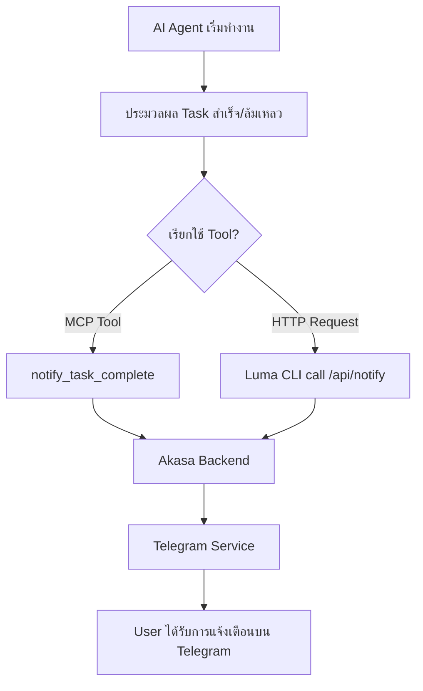

# Analysis Template

> 📋 Template สำหรับการวิเคราะห์ก่อนเริ่มพัฒนา Feature

---

## 📌 Feature Information

| รายการ | รายละเอียด |
|--------|-----------|
| **Feature Name** | [Feature] Task Completion Notification for AI Assistants |
| **Issue URL** | [#61](https://github.com/oatrice/Akasa/issues/61) |
| **Date** | 13 มีนาคม 2026 |
| **Analyst** | Luma AI (Senior Technical Analyst) |
| **Priority** | 🟡 Medium |
| **Status** | 📝 Draft |

---

## 1. Requirement Analysis

### 1.1 Problem Statement

ปัจจุบัน AI assistants เช่น Antigravity IDE หรือ Gemini CLI ทำงานแบบเงียบๆ (Silent) เมื่อทำงานเสร็จสิ้น ผู้ใช้จะไม่ทราบผลลัพธ์หรือสถานะหากไม่ได้เฝ้าหน้าจอ Terminal ทำให้เสียเวลาในการสลับหน้าจอมาตรวจสอบ หรือพลาดการดำเนินการในขั้นตอนถัดไป (Context Switching Overhead)

### 1.2 User Stories

| # | As a | I want to | So that |
|---|------|-----------|---------|
| 1 | Developer | ได้รับการแจ้งเตือนผ่าน Telegram เมื่อ AI ทำงานเสร็จ | ฉันสามารถไปทำงานอย่างอื่นได้โดยไม่ต้องเฝ้า Terminal และกลับมาตรวจสอบผลลัพธ์ได้ทันที |
| 2 | AI Agent | มีเครื่องมือ (Tool) สำหรับส่งสัญญาณว่างานเสร็จสิ้นแล้ว | ฉันสามารถแจ้งผลสรุปการทำงานให้ผู้ใช้ทราบผ่านช่องทางอื่นนอกเหนือจาก Console |

### 1.3 Acceptance Criteria

- [ ] **AC1:** มี MCP Tool ชื่อ `notify_task_complete` ใน `akasa_mcp_server.py`
- [ ] **AC2:** AI Agent สามารถเรียกใช้ Tool ดังกล่าวพร้อมส่งชื่อ Task และสถานะได้
- [ ] **AC3:** ระบบ Akasa Backend มี Endpoint (เช่น `/api/v1/notifications/task-complete`) รองรับการรับข้อมูลแจ้งเตือน
- [ ] **AC4:** ผู้ใช้ได้รับข้อความแจ้งเตือนผ่าน Telegram Bot พร้อมรายละเอียดสรุปงาน
- [ ] **AC5:** การส่งแจ้งเตือนต้องมีความปลอดภัย (Secure) และไม่ถูก Abuse ได้ง่าย

---

## 2. Feature Analysis

### 2.1 User Flow

### 2.2 Screen/Page Requirements

*ฟีเจอร์นี้เน้นไปที่ระบบหลังบ้านและการแจ้งเตือน ไม่มีการปรับปรุง UI หลัก*

| หน้าจอ | Actions | Components |
|--------|---------|------------|
| Telegram Chat | รับข้อความสรุป | Message Bubbles (Formatted Markdown) |

### 2.3 Input/Output Specification

#### Inputs (MCP Tool / API)

| Field | Type | Required | Validation |
|-------|------|----------|------------|
| `task_name` | string | ✅ | ชื่อของงานที่ทำเสร็จ |
| `status` | string | ✅ | success, failure, or partial |
| `message` | string | ❌ | รายละเอียดสรุปงาน (Summary) |
| `project_id` | string | ❌ | อ้างอิงโปรเจกต์ที่เกี่ยวข้อง |

#### Outputs

| Field | Type | Description |
|-------|------|-------------|
| `delivered` | boolean | ยืนยันว่าการส่งแจ้งเตือนสำเร็จ |
| `timestamp` | string (ISO) | เวลาที่ส่งแจ้งเตือน |

---

## 3. Impact Analysis

### 3.1 Affected Components

| Component | Impact Level | Description |
|-----------|--------------|-------------|
| `akasa_mcp_server.py` | 🔴 High | ต้องเพิ่ม Tool definition และ logic การเรียก API |
| `app/routers/notifications.py` | 🔴 High | ต้องเพิ่ม Endpoint ใหม่เพื่อรับข้อมูลจาก MCP/CLI |
| `app/services/telegram_service.py` | 🟡 Medium | อาจต้องเพิ่ม Template ข้อความสำหรับการแจ้งเตือน Task โดยเฉพาะ |
| Luma CLI | 🟢 Low | (Optional) การเพิ่ม Hook ใน Workflow ขั้นตอนสุดท้าย |

### 3.2 Breaking Changes

- [ ] **BC1:** ไม่มี (เป็นการเพิ่มฟังก์ชันใหม่ ไม่กระทบของเดิม)

### 3.3 Backward Compatibility Plan

ระบบยังคงทำงานได้ปกติแม้ไม่มีการแจ้งเตือน (Graceful Degradation) หาก Akasa Backend ปิดอยู่ MCP Tool ควรแจ้ง Error กลับไปยัง AI Agent แต่ไม่ควรทำให้ Workflow หลักหยุดชะงัก

---

## 4. Feasibility Analysis

### 4.1 Technical Feasibility

| คำถาม | คำตอบ | หมายเหตุ |
|-------|-------|----------|
| เทคโนโลยีรองรับหรือไม่? | ✅ | มีโครงสร้าง Telegram Service และ Fast API อยู่แล้ว |
| ทีมมี Skills เพียงพอหรือไม่? | ✅ | มีความเชี่ยวชาญด้าน Python/FastAPI และ MCP |
| Infrastructure รองรับหรือไม่? | ✅ | ใช้ระบบเดิมที่มีอยู่ได้ทันที |

### 4.2 Time Feasibility

| ประเด็น | รายละเอียด |
|--------|-----------|
| **Estimated Effort** | 1-2 days |
| **Deadline** | - |
| **Buffer Time** | 0.5 days |
| **Feasible?** | ✅ |

### 4.3 Budget Feasibility

| รายการ | ค่าใช้จ่าย | หมายเหตุ |
|--------|-----------|----------|
| Telegram API | ฟรี | ใช้ Bot API เดิม |
| **Total** | 0 | |

---

## 5. Security Analysis

### 5.1 Sensitive Data

| ข้อมูล | Sensitivity Level | Protection Method |
|--------|------------------|-------------------|
| API Key / Secret | 🔴 Critical | ใช้ `.env` และการตรวจสอบ Header ใน API |
| Chat ID | 🟡 Sensitive | เก็บใน Server-side config |

### 5.2 Attack Vectors

| Vector | Risk Level | Mitigation |
|--------|-----------|------------|
| API Spamming | 🟡 Medium | Implement API Key Validation หรือ Rate Limiting |
| Message Injection | 🟢 Low | Sanitize input ก่อนส่งเข้า Telegram Markdown |

### 5.3 Authentication & Authorization

ใช้ **X-API-Key** ใน Request Header สำหรับการเรียกจาก Luma CLI หรือ MCP เพื่อป้องกันการส่งแจ้งเตือนปลอมจากภายนอก

---

## 6. Performance & Scalability Analysis

### 6.1 Performance Targets

| Metric | Target | Current |
|--------|--------|---------|
| API Response Time | < 100ms | N/A |
| Telegram Delivery | < 2s | N/A |

### 6.2 Scalability Plan

เป็นการใช้งานภายใน (Self-hosted/Individual) ไม่จำเป็นต้องมี Scaling Strategy ที่ซับซ้อน แต่ควรใช้ Background Task (FastAPI `BackgroundTasks`) เพื่อไม่ให้ API รอนานเกินไปในการส่ง Telegram

---

## 7. Gap Analysis

| ด้าน | As-Is (ปัจจุบัน) | To-Be (ต้องการ) | Gap |
|------|-----------------|-----------------|-----|
| Notification | ทำงานเงียบๆ | แจ้งเตือนผ่าน Telegram | ขาด Endpoint และ MCP Tool |
| User Feedback | ต้องเช็ค Terminal เอง | รับสรุปงานได้จากมือถือ | ขาด Logic การสรุปข้อความ (Summarization) |

---

## 8. Risk Analysis

| Risk | Probability | Impact | Score | Mitigation Plan |
|------|-------------|--------|-------|-----------------|
| Telegram Bot ถูกบล็อก/ล่ม | 🟢 Low | 🟡 Medium | 2 | แจ้งเตือนใน Terminal log ว่าส่ง Notification ไม่สำเร็จ |
| AI Agent ลืมเรียกใช้ Tool | 🟡 Medium | 🟡 Medium | 4 | ระบุใน System Prompt ให้ "ต้องเรียกใช้ Tool นี้ทุกครั้งที่งานจบ" |

---

## 9. Summary & Recommendations

### 9.1 Analysis Summary

| หมวด | Status | Key Findings |
|------|--------|--------------|
| Requirement | ✅ Clear | ความต้องการชัดเจน แก้ปัญหา Silent Finish |
| Feature | ✅ Defined | ออกแบบให้ใช้ได้ทั้ง MCP และ HTTP API |
| Impact | 🟡 Medium | กระทบ Backend และ MCP Server |
| Feasibility | ✅ Feasible | ทำได้ง่ายด้วยโครงสร้างปัจจุบัน |
| Security | ✅ Acceptable | ต้องการ API Key พื้นฐาน |

### 9.2 Recommendations

1. **สร้าง Template ข้อความ:** ควรมี Template สำหรับ Telegram ที่สวยงาม เช่น มี Emoji ✅ สำหรับความสำเร็จ และ ❌ สำหรับความผิดพลาด
2. **System Prompt Update:** ต้องอัปเดตคำสั่งสำหรับ AI Assistants (Gemini/Antigravity) ให้รู้จักการใช้ Tool นี้เมื่อจบงาน
3. **Async Processing:** ใช้ `BackgroundTasks` ใน FastAPI เพื่อให้ API ตอบกลับ MCP ทันทีโดยไม่ต้องรอ Telegram ส่งเสร็จ

### 9.3 Next Steps

- [ ] ออกแบบ API Schema สำหรับ Notification
- [ ] พัฒนา Endpoint ใหม่ใน `app/routers/notifications.py`
- [ ] เพิ่ม Tool ใน `scripts/akasa_mcp_server.py`
- [ ] ทดสอบส่งแจ้งเตือนจาก Terminal และ AI Agent

---

## 📎 Appendix

### Related Documents

- [Akasa Telegram Service Docs](app/services/telegram_service.py)
- [MCP Server Specification](scripts/akasa_mcp_server.py)

### Sign-off

| Role | Name | Date | Signature |
|------|------|------|-----------|
| Analyst | Luma AI | 13/03/2026 | ✅ |
| Tech Lead | - | - | ⬜ |
| PM | - | - | ⬜ |