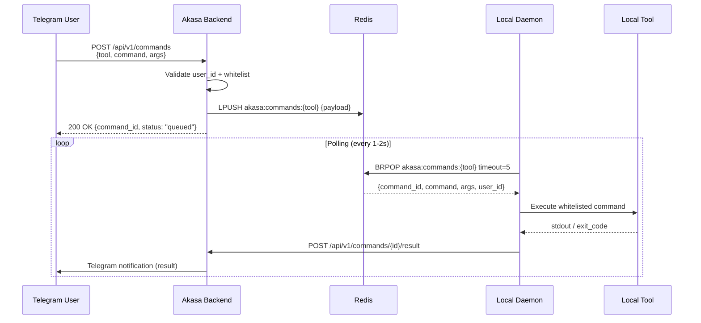

# Spec: Telegram → Local Tools Command Queue (Bidirectional Control)

> 📐 Technical specification สำหรับ Feature #66

---

## 📌 Feature Information

| รายการ | รายละเอียด |
|--------|-----------|
| **Feature Name** | Telegram → Local Tools Command Queue (Bidirectional Control) |
| **Issue URL** | [#66](https://github.com/oatrice/Akasa/issues/66) |
| **Phase** | Phase 4 — Orchestration & Build |
| **Priority** | 🟡 Medium |
| **Status** | 📝 Spec Draft |

---

## 1. Overview

ปัจจุบัน Akasa รองรับการสื่อสาร **ทิศทางเดียว** — AI Assistant ส่ง notification / ขอ approval ผ่าน Telegram แต่ยังไม่สามารถทำสิ่งตรงข้ามได้ คือ user ไม่สามารถสั่งงาน local tools โดยตรงจาก Telegram

Feature นี้ปิด gap นั้น โดยเปิดใช้ **Bidirectional Control**:

```
Telegram User → Akasa Backend → Redis Queue → Local Tool Daemon → Execute → Notify back
```

---

## 2. Goals & Non-Goals

### ✅ Goals
- ให้ user ส่งคำสั่งจาก Telegram เพื่อ execute ใน local tools
- รองรับ tools: Luma CLI, Gemini CLI, Antigravity/Zed IDE extension
- ใช้ Redis List เป็น queue (poll-based, safe)
- มี command whitelist — ป้องกัน arbitrary execution
- ส่งผลลัพธ์กลับ user ผ่าน Telegram notification

### ❌ Non-Goals
- ไม่รองรับ arbitrary shell execution
- ไม่รองรับ multi-user command routing (ใน v1)
- ไม่เปิด WebSocket port จาก local daemon สู่ internet
- ไม่รองรับ persistent sessions ระหว่าง tools

---

## 3. Architecture

### 3.1 High-Level Flow



### 3.2 Redis Schema

```
Key:   akasa:commands:{tool_name}         (Redis List — FIFO queue)
Value: JSON payload per command

Key:   akasa:command_status:{command_id}  (Redis Hash — status tracking)
TTL:   300 seconds (5 minutes) default
```

### 3.3 Command Payload Schema

```json
{
  "command_id": "cmd_abc123",
  "tool": "gemini",
  "command": "run_task",
  "args": {
    "task": "summarize_pr",
    "pr_number": 66
  },
  "user_id": 123456789,
  "queued_at": "2025-01-01T00:00:00Z",
  "ttl_seconds": 300
}
```

### 3.4 Command Status Schema

```json
{
  "command_id": "cmd_abc123",
  "status": "queued | picked_up | running | success | failed | expired",
  "tool": "gemini",
  "picked_up_at": null,
  "completed_at": null,
  "result": null,
  "error": null
}
```

---

## 4. API Specification

### 4.1 Enqueue Command

```
POST /api/v1/commands
```

**Request Headers:**
```
Authorization: Bearer {AKASA_API_KEY}
Content-Type: application/json
```

**Request Body:**
```json
{
  "tool": "gemini",
  "command": "run_task",
  "args": {
    "task": "summarize_pr",
    "pr_number": 66
  },
  "ttl_seconds": 300
}
```

**Response 200:**
```json
{
  "command_id": "cmd_abc123",
  "status": "queued",
  "tool": "gemini",
  "queued_at": "2025-01-01T00:00:00Z",
  "expires_at": "2025-01-01T00:05:00Z"
}
```

**Response 400 (invalid command):**
```json
{
  "error": "command_not_whitelisted",
  "message": "Command 'run_task' is not in the whitelist for tool 'gemini'",
  "allowed_commands": ["summarize_pr", "run_task", "check_status"]
}
```

**Response 403 (unauthorized user):**
```json
{
  "error": "unauthorized_user",
  "message": "User ID 999 is not authorized to queue commands"
}
```

---

### 4.2 Get Command Status

```
GET /api/v1/commands/{command_id}
```

**Response 200:**
```json
{
  "command_id": "cmd_abc123",
  "status": "success",
  "tool": "gemini",
  "result": "PR #66 summary: ...",
  "queued_at": "2025-01-01T00:00:00Z",
  "completed_at": "2025-01-01T00:00:15Z"
}
```

---

### 4.3 Report Command Result (Internal — Daemon → Backend)

```
POST /api/v1/commands/{command_id}/result
```

**Request Body:**
```json
{
  "status": "success",
  "output": "Task completed successfully.\n...",
  "exit_code": 0,
  "duration_seconds": 12.4
}
```

**Response 200:**
```json
{
  "command_id": "cmd_abc123",
  "status": "success",
  "notification_sent": true
}
```

---

## 5. Command Whitelist Config

Whitelist ถูก define ใน config file (`config/command_whitelist.yaml`) และ loaded เมื่อ startup:

```yaml
tools:
  gemini:
    allowed_commands:
      - name: run_task
        description: "Run a Gemini CLI task"
        allowed_args: [task, pr_number, branch]
      - name: check_status
        description: "Check Gemini CLI status"
        allowed_args: []

  luma:
    allowed_commands:
      - name: update_issue
        description: "Update a Luma issue status"
        allowed_args: [issue_id, status, comment]
      - name: list_issues
        description: "List open Luma issues"
        allowed_args: [project, state]

  zed:
    allowed_commands:
      - name: open_file
        description: "Open a file in Zed IDE"
        allowed_args: [path]
      - name: run_task
        description: "Run a Zed task"
        allowed_args: [task_name]
```

---

## 6. Local Tool Daemon

### 6.1 Daemon Script: `scripts/local_tool_daemon.py`

```
Responsibilities:
- Poll Redis queue for pending commands (BRPOP with timeout)
- Validate command is still within TTL
- Execute whitelisted command via subprocess
- Report result back to Akasa backend
- Log all activity to local log file
```

### 6.2 Startup

```bash
# Start daemon for specific tool
python scripts/local_tool_daemon.py --tool gemini

# Start daemon for all registered tools (runs multiple threads)
python scripts/local_tool_daemon.py --all
```

### 6.3 Configuration (Environment Variables)

| Variable | Description | Default |
|----------|-------------|---------|
| `AKASA_API_URL` | Akasa backend URL | `http://localhost:8000` |
| `AKASA_API_KEY` | Internal API key for result reporting | required |
| `AKASA_DAEMON_TOOL` | Tool name this daemon handles | required (or use `--tool`) |
| `AKASA_POLL_INTERVAL` | Seconds between polls | `2` |
| `AKASA_DAEMON_LOG_FILE` | Log file path | `logs/daemon_{tool}.log` |

---

## 7. Telegram Integration

### 7.1 New Bot Command

```
/queue {tool} {command} [{args_json}]
```

**Examples:**
```
/queue gemini run_task {"task": "summarize_pr", "pr_number": 66}
/queue luma list_issues {"state": "open"}
/queue zed open_file {"path": "app/main.py"}
```

### 7.2 Telegram Response Flow

1. User sends `/queue gemini run_task ...`
2. Bot replies: `⏳ Command queued! ID: cmd_abc123`
3. Daemon picks up + executes (within seconds)
4. Bot sends result: `✅ Gemini task complete:\n{output}`

---

## 8. New Files & Components

| File | Purpose |
|------|---------|
| `app/services/command_queue_service.py` | Enqueue, dequeue, status management in Redis |
| `app/api/v1/commands.py` | FastAPI router for /api/v1/commands |
| `app/models/command.py` | Pydantic models for command payload & status |
| `scripts/local_tool_daemon.py` | Local polling daemon |
| `config/command_whitelist.yaml` | Allowed commands per tool |
| `tests/test_command_queue_service.py` | Unit tests for queue service |
| `tests/test_commands_api.py` | Integration tests for API endpoints |
| `tests/test_local_tool_daemon.py` | Unit tests for daemon logic |

---

## 9. Security

| Concern | Control |
|---------|---------|
| Unauthorized queuing | `user_id` validated against `AKASA_ALLOWED_USER_IDS` env var |
| Arbitrary commands | Strict whitelist — unknown commands rejected with 400 |
| Stale queue | TTL (default 5 min) auto-expires unexecuted commands |
| Secret exposure | Daemon never stores tokens; uses pre-configured env vars |
| Internal endpoint abuse | `/commands/{id}/result` requires `AKASA_DAEMON_SECRET` header |

---

## 10. Testing Requirements

| Test Type | Coverage |
|-----------|---------|
| Unit | Command queue service (enqueue, dequeue, expire, status update) |
| Unit | Whitelist validation logic |
| Unit | Daemon: poll loop, TTL check, result reporting |
| Integration | POST /api/v1/commands → Redis → GET status |
| Integration | Full flow: queue → daemon picks up → result → Telegram notification |
| Security | Unauthorized user_id rejected |
| Security | Non-whitelisted command rejected |

---

## 11. Acceptance Criteria

| # | Criteria | Test |
|---|----------|------|
| AC1 | POST /api/v1/commands enqueues to Redis with TTL | ✅ Unit + Integration |
| AC2 | Only whitelisted commands accepted; others return 400 | ✅ Unit |
| AC3 | Only authorized user_id can queue commands | ✅ Unit |
| AC4 | Daemon polls Redis, executes command, reports result | ✅ Unit + Integration |
| AC5 | Commands expired after TTL not executed | ✅ Unit |
| AC6 | Telegram notification sent on completion (success + failure) | ✅ Integration |
| AC7 | GET /api/v1/commands/{id} returns current status | ✅ Integration |

---

## 12. Future Considerations

- **Redis Pub/Sub upgrade** — replace poll-based with push-based for real-time (<100ms latency)
- **Multi-user routing** — queue per `user_id` + `tool` for multi-developer teams
- **Web Dashboard** — queue monitor UI (integrates with #28)
- **Scheduled commands** — queue with `execute_at` timestamp
- **Command chaining** — execute a sequence of commands across tools

---

*Spec version: 1.0 — 2025*