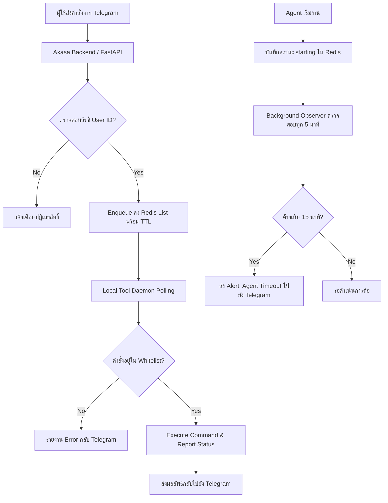

# Analysis Template

> 📋 Template สำหรับการวิเคราะห์ก่อนเริ่มพัฒนา Feature

---

## 📌 Feature Information

| รายการ | รายละเอียด |
|--------|-----------|
| **Feature Name** | [Feature] Telegram → Local Tools Command Queue (Bidirectional Control) & feat: AI Agent Timeout Observer |
| **Issue URL** | [#66-67](https://github.com/owner/repo/issues/66) |
| **Date** | 14 มีนาคม 2026 |
| **Analyst** | Luma AI (Senior Technical Analyst) |
| **Priority** | 🔴 High |
| **Status** | 📝 Draft |

---

## 1. Requirement Analysis

### 1.1 Problem Statement

```
ปัจจุบันระบบ Akasa รองรับเพียงการแจ้งเตือนทางเดียว (One-way notifications) จาก AI Assistant ไปยังผู้ใช้ผ่าน Telegram เท่านั้น ผู้ใช้ไม่สามารถสั่งการกลับไปยังเครื่อง Local จาก Telegram ได้ นอกจากนี้ยังมีปัญหาเมื่อ AI Agent (เช่นใน Zed IDE) หยุดทำงานกะทันหันหรือเซิร์ฟเวอร์ล่ม ระบบจะไม่มีการแจ้งเตือนว่างานค้างหรือล้มเหลว ทำให้เกิดช่องว่างในการควบคุมและการติดตามสถานะแบบ Real-time
```

### 1.2 User Stories

| # | As a | I want to | So that |
|---|------|-----------|---------|
| 1 | Developer | สั่งรัน Gemini CLI หรือ Luma ผ่าน Telegram | สามารถทำงานจากระยะไกลได้โดยไม่ต้องอยู่ที่หน้าจอคอมพิวเตอร์ |
| 2 | Developer | ได้รับการแจ้งเตือนเมื่อ Agent ค้างเกินเวลาที่กำหนด | รับรู้ปัญหาและแก้ไขได้ทันทีเมื่อระบบ AI ล่มหรือทำงานผิดปกติ |
| 3 | System Admin | จำกัดคำสั่งที่รันได้ผ่าน Whitelist | มั่นใจได้ว่าระบบปลอดภัยจากการรันคำสั่งที่เป็นอันตราย (Arbitrary Command) |

### 1.3 Acceptance Criteria

- [ ] **AC1:** มีคำสั่ง Telegram ใหม่สำหรับการส่ง Command เข้าสู่ Redis Queue (TTL 5 นาที)
- [ ] **AC2:** มี Local Tool Daemon (Python) ที่คอย Polling คำสั่งจาก Redis และรันคำสั่งที่ผ่านการตรวจสอบ Whitelist เท่านั้น
- [ ] **AC3:** ผลลัพธ์การรันคำสั่ง (Success/Fail) ต้องถูกส่งกลับไปยัง Telegram ผ่าน notification endpoint เดิม
- [ ] **AC4:** ระบบต้องบันทึกสถานะ `starting` ลงใน Redis เมื่อ Agent เริ่มทำงาน
- [ ] **AC5:** มี Background Task ตรวจสอบ Task ที่ค้างในสถานะ `starting` เกิน 15 นาที และส่ง Telegram Alert หากพบ Timeout

---

## 2. Feature Analysis

### 2.1 User Flow



### 2.2 Screen/Page Requirements

| หน้าจอ | Actions | Components |
|--------|---------|------------|
| Telegram Bot | ส่งคำสั่ง, รับผลการรัน, รับแจ้งเตือน Timeout | Telegram API Interface |
| Akasa Admin (Optional) | ตรวจสอบคำสั่งที่อยู่ใน Queue | Redis GUI หรือ Dashboard ง่ายๆ |

### 2.3 Input/Output Specification

#### Inputs (Command Queue)

| Field | Type | Required | Validation |
|-------|------|----------|------------|
| user_id | string | ✅ | ต้องตรงกับเจ้าของเครื่อง |
| tool_target | string | ✅ | luma, gemini-cli, zed |
| command | string | ✅ | ต้องอยู่ใน Whitelist config |
| ttl | number | ❌ | default 300 (5 mins) |

#### Outputs (Status Report)

| Field | Type | Description |
|-------|------|-------------|
| task_id | string | ID ของงานที่รัน |
| status | string | starting, success, failure, timeout |
| output | string | ข้อความผลลัพธ์จาก CLI |

---

## 3. Impact Analysis

### 3.1 Affected Components

| Component | Impact Level | Description |
|-----------|--------------|-------------|
| Akasa Backend | 🔴 High | ต้องเพิ่ม Service สำหรับจัดการ Redis Queue และ Endpoint รับคำสั่ง |
| Redis Infrastructure | 🔴 High | ใช้เป็นหัวใจหลักในการส่งข้อมูล (List) และเก็บสถานะ (Timeout Observer) |
| Local Workspace | 🟡 Medium | ต้องรัน Daemon script ทิ้งไว้ในเครื่อง Local |
| Security Policy | 🔴 High | ต้องนิยาม Whitelist ของคำสั่งอย่างรัดกุม |

### 3.2 Breaking Changes

- [ ] **BC1:** การเปลี่ยนแปลงรูปแบบ Payload ของ `notify_task_complete` เพื่อรองรับสถานะ `starting`
- [ ] **BC2:** ระบบเดิมที่ไม่มี Redis จะไม่สามารถใช้ Feature นี้ได้

### 3.3 Backward Compatibility Plan

```
รักษา endpoint เดิมไว้สำหรับ simple notifications แต่เพิ่ม logic ในการจัดการสถานะ starting แยกต่างหาก หากไม่มีการส่งสถานะ starting มา ระบบจะทำงานเหมือนเดิม (ไม่ทำ timeout checking)
```

---

## 4. Feasibility Analysis

### 4.1 Technical Feasibility

| คำถาม | คำตอบ | หมายเหตุ |
|-------|-------|----------|
| เทคโนโลยีรองรับหรือไม่? | ✅ | ใช้ Redis List (LPUSH/BRPOP) ซึ่งเสถียรและเรียบง่าย |
| ทีมมี Skills เพียงพอหรือไม่? | ✅ | เป็น Python/FastAPI/Redis พื้นฐาน |
| Infrastructure รองรับหรือไม่? | ✅ | ต้องการ Redis Server ที่เชื่อมต่อถึงกัน |

### 4.2 Time Feasibility

| ประเด็น | รายละเอียด |
|--------|-----------|
| **Estimated Effort** | 8 days |
| **Deadline** | N/A |
| **Buffer Time** | 2 days |
| **Feasible?** | ✅ |

---

## 5. Security Analysis

### 5.1 Sensitive Data

| ข้อมูล | Sensitivity Level | Protection Method |
|--------|------------------|-------------------|
| Command Payload | 🟡 Sensitive | ห้ามใส่ Secrets/Tokens ลงใน Payload ของ Queue |
| Telegram User ID | 🟡 Sensitive | Validate เทียบกับ Allowed list ใน Environment Variable |

### 5.2 Attack Vectors

| Vector | Risk Level | Mitigation |
|--------|-----------|------------|
| Remote Command Injection | 🔴 High | ใช้ Whitelist ที่เป็น Hard-coded หรือ Config ที่แก้ไขยาก |
| Unauthorized Access | 🔴 High | ตรวจสอบ User ID ของ Telegram ทุกครั้งที่รับ Command |
| Replay Attack | 🟡 Medium | ใช้ Redis TTL เพื่อให้คำสั่งมีอายุสั้นมาก |

### 5.3 Authentication & Authorization

```
ใช้ Telegram User ID Validation (Owner-only) ร่วมกับ Command Whitelist ในระดับ Local Daemon เพื่อความปลอดภัยสูงสุดแบบ Layered Security
```

---

## 6. Performance & Scalability Analysis

### 6.1 Performance Targets

| Metric | Target | Current |
|--------|--------|---------|
| Queue Latency | < 500ms | N/A |
| Daemon Polling Interval | 1-2 seconds | N/A |
| Timeout Accuracy | ± 1 minute | N/A |

### 6.2 Scalability Plan

```
เนื่องจากเป็นการควบคุมเครื่องส่วนตัว (Local Tools) ปริมาณ Transaction จะต่ำมาก Redis เพียงตัวเดียวสามารถรองรับการใช้งานได้โดยไม่มีปัญหาเรื่องการขยายตัว
```

---

## 7. Gap Analysis

| ด้าน | As-Is (ปัจจุบัน) | To-Be (ต้องการ) | Gap |
|------|-----------------|-----------------|-----|
| Control Flow | One-way (Push only) | Bidirectional (Pull/Push) | ขาด Command Queue & Local Daemon |
| Observability | ไม่รู้ถ้า Agent พังเงียบๆ | แจ้งเตือนเมื่อค้างเกิน 15 นาที | ขาด Timeout Observer Background Task |

---

## 8. Risk Analysis

| Risk | Probability | Impact | Score | Mitigation Plan |
|------|-------------|--------|-------|-----------------|
| Daemon หยุดทำงาน | 🟡 Medium | 🔴 High | 6 | ใช้ process manager (pm2/systemd) คุม daemon |
| การรันคำสั่งผิดพลาดหน้าเครื่อง | 🟡 Medium | 🟡 Medium | 4 | ทำระบบ Dry-run หรือตรวจสอบ Command Format ก่อนรัน |
| Redis Connection Lost | 🟢 Low | 🔴 High | 3 | เพิ่ม Reconnection logic ในตัว Daemon |

---

## 9. Summary & Recommendations

### 9.1 Analysis Summary

| หมวด | Status | Key Findings |
|------|--------|--------------|
| Requirement | ✅ Clear | ความต้องการชัดเจนทั้งในส่วน Command Queue และ Timeout Observer |
| Feature | ✅ Defined | ใช้ Redis List เป็น Transport หลักเพื่อความปลอดภัยและง่ายต่อการ Implement |
| Impact | ⚠️ Medium | กระทบโครงสร้างข้อมูลใน Redis และต้องการ Daemon ประจำเครื่อง |
| Security | 🔴 Critical | ต้องเน้นหนักเรื่อง Whitelist เพื่อป้องกัน Command Injection |

### 9.2 Recommendations

1. **Strict Whitelisting:** อย่าอนุญาตให้ส่งพารามิเตอร์อิสระผ่าน Telegram ให้ใช้การแมพ Command Key กับ Full Command ใน Local Config เท่านั้น
2. **Lean Daemon:** ตัว Local Daemon ควรเป็นสคริปต์ที่เบาที่สุด (Lightweight) เพื่อไม่ให้รบกวนทรัพยากรเครื่องขณะพัฒนา
3. **Double Verification:** มีการแจ้งเตือน "Command Received" ทันทีที่ผู้ใช้ส่งคำสั่งจาก Telegram เพื่อ User Experience ที่ดี

### 9.3 Next Steps

- [ ] พัฒนา `command_queue_service.py` ใน Akasa Backend
- [ ] สร้าง Local Tool Daemon สคริปต์สำหรับการ Polling
- [ ] เพิ่ม Background Task สำหรับ Timeout Observer (ทุก 5 นาที)
- [ ] ทดสอบ Integration ระหว่าง Telegram -> Backend -> Redis -> Daemon

---

## 📎 Appendix

### Related Documents

- #61 Task Completion Notification for AI Assistants
- #58 Antigravity IDE Action Confirmation
- #49 Remote Action Confirmation

### Sign-off

| Role | Name | Date | Signature |
|------|------|------|-----------|
| Analyst | Luma AI | 14 Mar 2026 | ✅ |
| Tech Lead | - | - | ⬜ |
| PM | - | - | ⬜ |

**คำสั่งสำหรับการส่งงาน:**
`notify_task_complete(project="Luma", task="Technical Analysis for Issue #66-67", status="success")`