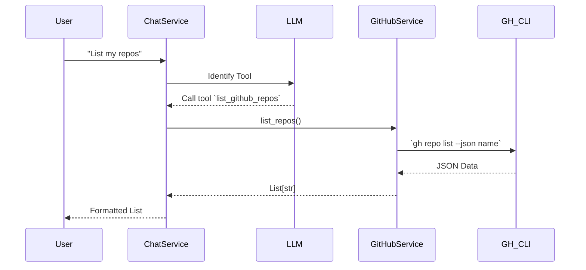

# Specification

# Feature: Telegram MarkdownV2 Robustness & GitHub Repo Listing

> **Feature Name**: Telegram MarkdownV2 Robustness & GitHub Repo Listing
> **Version**: v1.0.0
> **Status**: ✅ Completed
> **Related Issue**: [#71](https://github.com/oatrice/Akasa/issues/71)

## 1. Executive Summary

This feature update enhances Akasa's reliability and capability in three key areas:
1.  **Robust Messaging**: Prevents Telegram API `400 Bad Request` errors by implementing automatic MarkdownV2 escaping and a plain-text fallback mechanism.
2.  **Repository Discovery**: Adds a new `list_github_repos` tool, allowing users to query available GitHub repositories directly within the chat.
3.  **Expanded Context**: Relaxes the System Prompt to permit discussions on broader software engineering topics (DevOps, Project Management) while maintaining core focus.

---

## 2. Problem Statement

### 2.1 Current Pain Points

1.  **Message Delivery Failures**: LLMs frequently generate text that is not valid Telegram MarkdownV2 (e.g., unescaped `!`, `.`, or `-`). This causes the Telegram API to reject the entire message with a `400 Bad Request` error, leaving the user with silence/no response.
2.  **Context Switching**: Users must leave the Telegram chat and open a browser/terminal to check which repositories are available for Akasa to work on.
3.  **Over-Restrictive Guardrails**: The previous System Prompt was too strict, often refusing to answer valid technical questions about DevOps, workflows, or project management because they weren't strictly "coding."

### 2.2 Business Impact

| Metric | Before | Expected After | Improvement |
|--------|--------|----------------|-------------|
| **Message Failure Rate** | High (frequent 400 errors) | Near Zero | ~100% reduction in formatting errors |
| **User Context Switching** | High (must check GitHub manually) | Low (ask Akasa directly) | Improved workflow efficiency |
| **Query Rejection Rate** | Moderate (rejects valid tech questions) | Low (only rejects non-tech topics) | Better user satisfaction |

---

## 3. Goals & Success Criteria

### 3.1 Goals

1.  **G1**: Ensure Akasa *always* sends a response, even if the LLM's formatting is broken.
2.  **G2**: Enable users to discover accessible GitHub repositories via natural language commands.
3.  **G3**: Allow Akasa to assist with the full software development lifecycle (SDLC), not just writing code.

### 3.2 Success Criteria

-   **Reliability**: 0% of messages fail due to `Can't parse entities` errors.
-   **Functionality**: `list_github_repos` tool successfully returns a list of repositories from the authenticated GitHub account.
-   **Usability**: System prompts related to CI/CD or PM are answered, while questions about "cooking" or "politics" are still rejected.

---

## 4. User Stories & Requirements

### 4.1 User Stories

#### Story 1: Robust Message Delivery
**As a** User
**I want** Akasa to display the answer even if the formatting is slightly off
**So that** I don't lose the generated content due to a technical API error.

#### Story 2: List Repositories
**As a** Developer
**I want** to ask Akasa "What repos do I have?"
**So that** I can see the available project names without leaving the chat.

#### Story 3: Expanded Technical Scope
**As a** DevOps Engineer
**I want** to ask Akasa about CI/CD pipelines and workflow strategies
**So that** I can get help with the operational side of my projects.

### 4.2 Specification by Example (SBE)

#### Scenario 1: MarkdownV2 Escaping and Fallback

| Condition | User Input | LLM Output (Internal) | System Behavior | Final Output to User |
|-----------|------------|-----------------------|-----------------|----------------------|
| **Valid Markdown** | "Hello" | `*Hello*` | Send as MarkdownV2 | **Hello** (Bold) |
| **Invalid Char** | "Exclaim" | `Hello!` (no escape) | 1. Try MarkdownV2 (Fail 400) 2. Catch Error 3. Send as Plain Text | `Hello!` (Plain text) |
| **Complex Code** | "Code" | `print("hi")` | Escape chars -> Send as MDV2 | `print("hi")` (Monospace) |

#### Scenario 2: Listing Repositories

| User Input | Active Tool | System Action | Output |
|------------|-------------|---------------|--------|
| "List my github repos" | `list_github_repos` | Call `GitHubService.list_repos()` | List of repos (e.g., `• Akasa` `• Project-B`) |
| "Show repositories" | `list_github_repos` | Call `GitHubService.list_repos()` | List of repos |

#### Scenario 3: System Prompt Scope

| User Input | Old Behavior | New Behavior |
|------------|--------------|--------------|
| "How do I set up GitHub Actions?" | Refusal ("I only do coding") | **Answer** (Explains workflows) |
| "Best practices for Scrum?" | Refusal | **Answer** (Explains project management) |
| "How to bake a cake?" | Refusal | **Refusal** (Out of scope) |

---

## 5. Technical Design

### 5.1 System Architecture

-   **ChatService**:
    -   Intercepts the LLM response before sending to Telegram.
    -   Applies `escape_markdown_v2` to text outside of code blocks (if possible) or relies on the fallback mechanism.
    -   Implements the `try-except` block around the `telegram_client.send_message` call specifically catching `400 Bad Request`.
-   **GitHubService**:
    -   New method `list_repos()` wrappers the `gh repo list` CLI command.
    -   Parses the JSON output from `gh` into a clean list of strings.
-   **Tool Registry**:
    -   Registers `list_github_repos` as a simpler tool requiring no arguments.

### 5.2 Data Flow (Repository Listing)

---

## 6. Testing Strategy

### 6.1 Test Scope

-   **Unit Tests (`tests/services/test_chat_service.py`)**:
    -   Mock `telegram_client.send_message` to raise `HTTPError(400)`.
    -   Verify that `_send_response` catches the error and retries with `parse_mode=None`.
-   **Integration Tests (`tests/routers/test_commands.py`)**:
    -   Verify `list_github_repos` tool is correctly registered and callable.
    -   Verify `GitHubService.list_repos` parses `gh` output correctly.

### 6.2 Test Cases

| TC ID | Description | Expected Result |
|-------|-------------|-----------------|
| **TC-001** | **Markdown Fallback** Simulate a 400 error from Telegram when sending a formatted message. | System catches error, logs warning, and successfully sends the raw text message. |
| **TC-002** | **Repo List Tool** Invoke `list_github_repos` tool via chat. | Returns a bulleted list of repository names. |
| **TC-003** | **Prompt Relax** Ask about CI/CD. | LLM answers instead of refusing. |

---

## 7. Rollout Plan

-   **Phase 1**: Deploy to local dev environment and verify with personal Telegram bot.
-   **Phase 2**: Run full CI suite to ensure no regressions in existing command handling.
-   **Phase 3**: Merge to main.