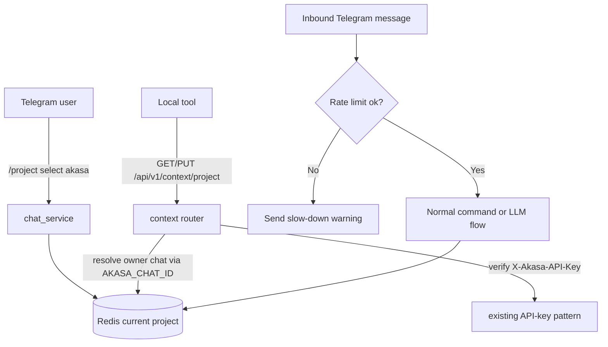

# Analysis

## Feature Information

| Item | Value |
|------|-------|
| Feature Name | Rate Limiting, Error Handling, and Incremental Active Project Context Sync |
| Issue URL | [#10](https://github.com/oatrice/Akasa/issues/10), [#37](https://github.com/oatrice/Akasa/issues/37) |
| Date | 2026-03-19 |
| Analyst | Codex |
| Priority | High |
| Status | Draft |

## 1. Requirement Analysis

### 1.1 Problem Statement

Akasa currently has the building blocks for project-aware Telegram usage and for authenticated local-tool APIs, but they do not yet meet in one consistent contract. The result is:

- Telegram context is still driven by chat-scoped Redis keys only.
- Local tools have API-key-based integration points, but no dedicated project-context sync endpoint.
- Telegram inbound messages are not formally rate limited.
- LLM failures are partially handled, but not yet described or enforced as a single product contract.

This phase should solve the practical workflow problem first: keep Telegram and local tools aligned on the same `active_project`, then harden the Telegram experience with rate limiting and clearer failure handling.

### 1.2 User Stories

| # | As a | I want to | So that |
|---|------|-----------|---------|
| 1 | Developer using Telegram and local tools | switch `active_project` from either side | I do not have to re-establish context manually |
| 2 | Developer using Telegram heavily | get a clear warning when I send messages too quickly | I understand why a message was not processed |
| 3 | Developer relying on the bot | receive friendly fallback errors from LLM failures | the bot does not fail silently or look broken |

### 1.3 Acceptance Criteria

- **AC1:** `GET /api/v1/context/project` returns the owner chat's current `active_project` when called with a valid `X-Akasa-API-Key`.
- **AC2:** `PUT /api/v1/context/project` updates the same project value that Telegram `/project` commands use.
- **AC3:** The only synchronized field in v1 is `active_project`.
- **AC4:** Inbound Telegram messages are rate limited before command handling or LLM processing.
- **AC5:** Timeout, upstream failure, malformed LLM response, and insufficient-credit cases each produce a user-friendly Telegram fallback.
- **AC6:** Full account linking, bearer auth, and multi-user unified identity are deferred and clearly marked as future work.

## 2. Feature Analysis

### 2.1 Why the Incremental V1 Is the Right Fit

The repo already contains:

- API-key-based authentication for local integrations via `X-Akasa-API-Key`,
- local-tool scripts that already send that header,
- Telegram chat handling backed by `user_current_project:{chat_id}`,
- owner-oriented configuration via `AKASA_CHAT_ID`.

Because those pieces already exist, the lowest-risk v1 is to add a focused context-sync API that reads and writes the same project key used by Telegram. This avoids inventing a challenge-based auth subsystem that the repo does not currently support.

### 2.2 Reused Repo Patterns

| Existing Pattern | Current Location | V1 Reuse |
|------------------|------------------|----------|
| API-key auth via `X-Akasa-API-Key` | routers and local-tool scripts | Reused as the sync API auth mechanism |
| `user_current_project:{chat_id}` storage | `app/services/redis_service.py` | Reused as the canonical v1 storage |
| Owner chat configuration | `AKASA_CHAT_ID` in config and scripts | Reused to choose which chat context local tools sync against |
| Telegram `/project` behavior | `app/services/chat_service.py` | Remains the Telegram-side write path |

### 2.3 User Flow

### 2.4 Input and Output Contract

#### Inputs

| Field | Type | Required | Notes |
|-------|------|----------|-------|
| `X-Akasa-API-Key` | string | Yes | Existing local-tool auth header |
| `active_project` | string | PUT only | Non-empty; trimmed and normalized to lowercase |
| Telegram message text | string | Yes | Subject to inbound rate limiting |

#### Outputs

| Output | Type | Description |
|--------|------|-------------|
| `active_project` | string | Current synchronized project |
| 401 error | JSON | Missing or invalid API key |
| 503 error | JSON | Owner chat sync is not configured |
| Telegram warning message | text | Returned when the user exceeds Telegram message rate limits |
| Telegram fallback message | text | Returned when LLM processing fails |

## 3. Impact Analysis

### 3.1 Affected Components

| Component | Impact | Reason |
|-----------|--------|--------|
| `app/services/redis_service.py` | High | Must expose a safe owner-chat-based project sync path without changing the underlying v1 storage model |
| `app/services/chat_service.py` | High | Must enforce inbound Telegram message rate limits and preserve project sync behavior |
| `app/services/llm_service.py` | Medium | Must translate failure modes into a predictable bot-facing contract |
| `app/main.py` | Medium | Must register the new context router |
| `app/routers/context.py` | High | New endpoint surface for project sync |
| `tests/routers/test_context.py` | High | New API verification coverage |
| `tests/services/test_rate_limiter.py` | High | New Telegram rate-limit coverage |

### 3.2 Breaking Changes

- No production data migration is required for v1 because the design intentionally reuses the existing chat-scoped project storage.
- The previous draft documents that mentioned bearer auth, `/sync/state`, `/api/v1/user/state`, or login challenges are superseded by this harmonized v1 contract.

### 3.3 Backward Compatibility Plan

V1 keeps the existing Redis key shape for project context and simply makes the local sync API operate on the owner chat's existing project key. That means:

- no Redis migration is required for project sync,
- Telegram behavior remains backward compatible,
- and local tools can adopt the new sync API without changing how Telegram stores context.

## 4. Feasibility Analysis

### 4.1 Technical Feasibility

| Question | Answer | Notes |
|----------|--------|-------|
| Can the current stack support this? | Yes | FastAPI, Redis, and current auth patterns are already sufficient |
| Does the repo already have reusable pieces? | Yes | API-key auth, project storage, Telegram flow, and local-tool scripts already exist |
| Is a new auth subsystem required? | No | Reusing `X-Akasa-API-Key` is enough for v1 |

### 4.2 Time Feasibility

| Topic | Estimate |
|-------|----------|
| Context router + Redis wrappers | Small |
| Telegram rate limiting | Small to medium |
| LLM error normalization | Medium |
| Tests and manual verification | Medium |

Overall effort is reasonable because v1 avoids full account-linking work.

## 5. Security Analysis

### 5.1 Sensitive Data

| Data | Sensitivity | Protection |
|------|-------------|------------|
| `X-Akasa-API-Key` | High | Existing API-key validation, never expose in Telegram |
| Owner chat identifier | Medium | Server-side config only |
| `active_project` | Medium | Accessible only through Telegram owner flow or authenticated local API |

### 5.2 Attack Vectors

| Vector | Risk | Mitigation |
|--------|------|------------|
| Leaked API key | High | Reuse existing API-key checks and operational key hygiene |
| Telegram spam | Medium | Add inbound message rate limiting before LLM work |
| Misconfigured owner chat | Medium | Fail the sync API clearly instead of writing to an unknown chat context |

### 5.3 Authentication and Authorization

V1 uses existing API-key authorization only. The local sync API trusts callers who present a valid `X-Akasa-API-Key`, then resolves the synchronized context against the configured owner chat. This is intentionally simpler than a full local-profile-to-Telegram account-linking flow and is acceptable only because v1 is scoped to a single-owner deployment model.

## 6. Performance and Scalability

### 6.1 Performance Targets

| Metric | Target |
|--------|--------|
| `GET /api/v1/context/project` latency | < 150 ms |
| `PUT /api/v1/context/project` latency | < 150 ms |
| Telegram rate-limit check overhead | < 10 ms Redis overhead |

### 6.2 Scalability Notes

This phase is not designed for multi-user routing. It is optimized for correctness and low operational risk in the repo's current owner-centric operating model.

## 7. Gap Analysis

| Area | As-Is | To-Be | Gap |
|------|-------|-------|-----|
| Local project sync API | No dedicated endpoint | `GET/PUT /api/v1/context/project` | Add a focused context router |
| Auth contract | API-key auth exists but is fragmented across routers | One documented header contract for context sync | Reuse current pattern and document it consistently |
| Telegram project context | Already stored in Redis by chat | Shared with local tools | Add owner-chat sync path |
| Telegram message rate limiting | Not present | Configurable inbound rate limiting | Add a new limiter before message processing |
| LLM failure contract | Partial and implicit | Explicit user-facing fallback categories | Normalize failure handling behavior |

## 8. Risk Analysis

| Risk | Probability | Impact | Score | Mitigation |
|------|-------------|--------|-------|------------|
| `AKASA_CHAT_ID` is missing or wrong | Medium | High | 6 | Return a clear server misconfiguration error and verify config during rollout |
| Docs drift back to alternate contracts | Medium | Medium | 4 | Keep endpoint, header, and field names identical across all docs and tests |
| Future unified identity work gets conflated with v1 | Medium | Medium | 4 | Keep a dedicated future-evolution section and exclude it from acceptance criteria |
| Telegram warning UX is unclear | Low | Medium | 2 | Use concise, explicit rate-limit and failure messages in SBE and tests |

## 9. Summary and Recommendations

### 9.1 Key Findings

- The repo already has enough infrastructure to ship a practical v1 without inventing a new auth system.
- The most important missing pieces are the context sync router, Telegram inbound rate limiting, and a clearer LLM failure contract.
- Full unified identity is still a valid long-term direction, but it is not the right v1 boundary for this codebase.

### 9.2 Recommendations

1. Ship the incremental `active_project` sync first using the existing API-key model.
2. Treat `AKASA_CHAT_ID` as the v1 owner-context anchor and validate it explicitly.
3. Add Telegram inbound rate limiting before making broader anti-abuse changes elsewhere.
4. Keep future unified identity work documented, but out of the v1 acceptance contract.

## 10. Future Evolution

The following items remain good future directions, but they are explicitly outside this v1:

- one-time login challenge and Telegram-to-local account linking,
- bearer-token auth for local tools,
- a persisted `Unified User ID` separate from chat identity,
- multi-user routing across multiple Telegram users and multiple local machines,
- synchronization of additional state beyond `active_project`.
