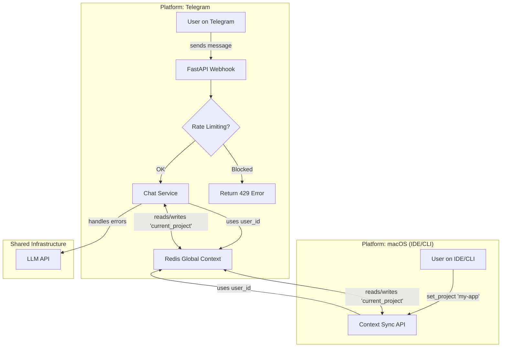

# Analysis Template

> 📋 Template สำหรับการวิเคราะห์ก่อนเริ่มพัฒนา Feature

---

## 📌 Feature Information

| รายการ | รายละเอียด |
|--------|-----------|
| **Feature Name** | Rate Limiting, Error Handling, and Unified Multi-Platform User Session |
| **Issue URL** | [#10](https://github.com/oatrice/Akasa/issues/10), [#37](https://github.com/oatrice/Akasa/issues/37) |
| **Date** | 2026-03-19 |
| **Analyst** | Luma AI (Senior Technical Analyst) |
| **Priority** | 🔴 High |
| **Status** | 📝 Draft |

---

## 1. Requirement Analysis

### 1.1 Problem Statement

> อธิบายปัญหาที่ต้องการแก้ไข

```
ปัจจุบันระบบมีจุดอ่อน 2 ส่วนหลัก: 1) ขาดการป้องกันการใช้งานผิดประเภท (Spam/Abuse) ผ่าน Messaging API และไม่มีการจัดการข้อผิดพลาดจาก LLM ที่ดีพอ ทำให้ระบบขาดความเสถียรเมื่อเจอปัญหา 2) ประสบการณ์ผู้ใช้ไม่ต่อเนื่องระหว่างการใช้งานบน Telegram และบนเครื่องพัฒนา (IDE/CLI) เนื่องจากสถานะ "Active Project" ไม่ได้ซิงค์กัน ทำให้ผู้ใช้ต้องตั้งค่า Context ใหม่ทุกครั้งที่สลับแพลตฟอร์ม
```

### 1.2 User Stories

| # | As a | I want to | So that |
|---|------|-----------|---------|
| 1 | System Administrator | implement rate limiting on APIs and gracefully handle external service errors | the application remains stable, secure, and responsive for all users. |
| 2 | Developer | have my active project context sync automatically between Telegram and my IDE/CLI | I can switch between platforms seamlessly without manually re-establishing my working context. |

### 1.3 Acceptance Criteria

- [ ] **AC1:** API requests originating from a single user that exceed a configured threshold (e.g., 20 requests/minute) are rejected with an HTTP 429 "Too Many Requests" error.
- [ ] **AC2:** Any errors or timeouts from the LLM API are caught, logged, and a user-friendly error message is returned to the user without crashing the session.
- [ ] **AC3:** A secure system is in place to create a "Unified User ID" that links a user's Telegram account to their local machine developer profile.
- [ ] **AC4:** The Redis schema is updated to store user-specific context (like `current_project`) under the Unified User ID, not the transient `chat_id`.
- [ ] **AC5:** A new secure API endpoint (e.g., `GET /api/context/project`) allows an authenticated local tool (IDE/CLI) to retrieve the current active project for the linked user.
- [ ] **AC6:** Another endpoint (e.g., `POST /api/context/project`) allows an authenticated local tool to update the current active project, which is then reflected in subsequent Telegram interactions.

---

## 2. Feature Analysis

### 2.1 User Flow



### 2.2 Screen/Page Requirements

| หน้าจอ | Actions | Components |
|--------|---------|------------|
| **API Endpoint:** `POST /webhook/telegram` | Handles incoming messages | Rate Limiting Middleware, Error Handling Middleware |
| **API Endpoint:** `GET /api/v1/context/project` | Fetches active project for the authenticated user | Bearer Token Authentication, User ID lookup |
| **API Endpoint:** `POST /api/v1/context/project`| Sets the active project for the authenticated user | Bearer Token Authentication, User ID lookup, Request Body Validation |
| **CLI / Local Tool** | `akasa link`: Initiates account linking process. `akasa context set <proj>`: Calls the sync API. | Secure storage for API token. |

### 2.3 Input/Output Specification

#### Inputs

| Field | Type | Required | Validation |
|-------|------|----------|------------|
| `chat_id` (Telegram) | integer | ✅ | N/A |
| `Authorization` (Sync API Header) | string | ✅ | "Bearer [TOKEN]" format |
| `project_id` (Sync API Body) | string | ✅ | Must be a valid project identifier |

#### Outputs

| Field | Type | Description |
|-------|------|-------------|
| `project_id` (on `GET /context`) | string | The identifier of the user's current active project. |
| `status` (on `POST /context`) | string | "success" or "error". |
| `error` (on failure) | object | JSON object containing error code and message (e.g., from rate limiter or LLM). |

---

## 3. Impact Analysis

### 3.1 Affected Components

| Component | Impact Level | Description |
|-----------|--------------|-------------|
| `app/services/redis_service.py` | 🔴 High | Major schema change required. Logic must be updated from `chat_id` keys to Unified User ID keys. |
| `app/routers/telegram.py` | 🔴 High | Middleware for rate limiting needs to be added. Logic must be adapted to use the new user identity service. |
| `app/services/chat_service.py` | 🟡 Medium | Must be updated to fetch context using the new Unified User ID. Needs robust error handling for LLM calls. |
| `app/main.py` | 🟡 Medium | A new API router for the Context Sync endpoints must be added. |
| **New:** `app/services/user_service.py` | 🔴 High | New service to manage user identities, linking, and token generation/validation. |
| **New:** `app/routers/context.py` | 🔴 High | New router to host the `GET` and `POST` endpoints for cross-platform context synchronization. |
| **Local Tools (CLI/IDE)** | 🔴 High | New functionality required to handle authentication token and call the new sync API. |

### 3.2 Breaking Changes

- [x] **BC1:** The Redis data structure for storing user context will change fundamentally. All existing user conversation histories and contexts keyed by `chat_id` will become inaccessible without migration.
- [ ] **BC2:** All interactions will now require a valid Unified User ID. Anonymous or unlinked access may be deprecated.

### 3.3 Backward Compatibility Plan

```
A data migration script is required. This script will iterate through all existing `chat_id:*` keys in Redis. For each, it will create a new Unified User ID, create a mapping (`telegram_id:<id> -> user_id:<uuid>`), and then rename/copy the existing Redis data to new keys based on the `user_id`. During a transition period, the API could be coded to check for the `user_id` key first, and if not found, fall back to checking the old `chat_id` key, perform the migration on-the-fly, and then proceed.
```

---

## 4. Feasibility Analysis

### 4.1 Technical Feasibility

| คำถาม | คำตอบ | หมายเหตุ |
|-------|-------|----------|
| เทคโนโลยีรองรับหรือไม่? | ✅ | FastAPI supports middleware for rate limiting. Redis is already in use. The main challenge is the identity linking logic. |
| ทีมมี Skills เพียงพอหรือไม่? | ✅ | The required skills (Python, FastAPI, Redis, API security) are within the team's capabilities. |
| Infrastructure รองรับหรือไม่? | ✅ | No new infrastructure is needed. The changes can be deployed on the existing setup. |

### 4.2 Time Feasibility

| ประเด็น | รายละเอียด |
|--------|-----------|
| **Estimated Effort** | 3 weeks (1 dev) | Includes design, implementation, testing, and data migration script. |
| **Deadline** | N/A (Phase 5) | |
| **Buffer Time** | 1 week | For potential issues with data migration or security hardening. |
| **Feasible?** | ✅ | The effort is significant but manageable within a single development cycle. |

### 4.3 Budget Feasibility

| รายการ | ค่าใช้จ่าย | หมายเหตุ |
|--------|-----------|----------|
| Development Time | [Internal Cost] | Approx. 3-4 developer-weeks. |
| New Infrastructure | $0 | Utilizes existing infrastructure. |
| **Total** | [Internal Cost] | |

---

## 5. Security Analysis

### 5.1 Sensitive Data

| ข้อมูล | Sensitivity Level | Protection Method |
|--------|------------------|-------------------|
| `API Auth Token` (for local tools) | 🔴 Critical | Store as a hashed value in the DB. Transmit only over HTTPS. Never log. |
| `User ID Mapping` (TID to UUID) | 🔴 Critical | Stored in a secure database table with restricted access. |
| `User Project Context` | 🟡 Sensitive | Access controlled via the Unified User ID and authentication token. |

### 5.2 Attack Vectors

| Vector | Risk Level | Mitigation |
|--------|-----------|------------|
| Credential Stuffing (API Token) | 🔴 High | Implement token expiration, secure token generation (high entropy), and monitoring for anomalous login patterns. |
| API Abuse / Denial of Service | 🟡 Medium | Apply strict rate limiting on all public-facing endpoints, including the new context sync API. |
| Man-in-the-Middle (MITM) | 🟡 Medium | Enforce HTTPS-only communication for all API endpoints. |

### 5.3 Authentication & Authorization

```
The new Context Sync API (`/api/v1/context/*`) will be protected using a Bearer Token authentication scheme.
1.  A user links their account via a CLI command (e.g., `akasa link`).
2.  This command communicates with the backend to generate a long-lived, high-entropy API token associated with their Unified User ID.
3.  The token is stored securely on the user's local machine.
4.  All subsequent requests from the local tool to the sync API must include this token in the `Authorization: Bearer <token>` header.
5.  The backend validates the token and authorizes access to the context data for that specific user.
```

---

## 6. Performance & Scalability Analysis

### 6.1 Performance Targets

| Metric | Target | Current |
|--------|--------|---------|
| Context Sync API Response Time | < 150ms | N/A |
| Rate Limiter Overhead | < 10ms | N/A |
| Throughput | 500 req/s | N/A |
| Error Rate | < 0.05% | N/A |

### 6.2 Scalability Plan

| Scenario | Expected Users | Scaling Strategy |
|----------|---------------|------------------|
| Normal | ~1,000 | The FastAPI app can be run with multiple Uvicorn workers. Redis is fast enough for this load. |
| Peak | ~5,000 | Deploy the FastAPI application behind a load balancer with auto-scaling based on CPU/memory usage. |
| Growth (1yr) | ~25,000 | Consider a managed Redis cluster for higher availability. The user identity service may need its own scalable database if it grows complex. |

---

## 7. Gap Analysis

| ด้าน | As-Is (ปัจจุบัน) | To-Be (ต้องการ) | Gap |
|------|-----------------|-----------------|-----|
| **User Identity** | Context is keyed by `chat_id`, which is specific to one platform (Telegram). | Context is keyed by a global Unified User ID, shared across platforms. | Need to design and implement a user identity service, linking mechanism, and data model. |
| **Data Storage** | Redis schema is simple and siloed per chat. | Redis schema is structured around the Unified User ID. | Requires a full data migration and refactoring of all Redis-related services. |
| **API Surface** | Only a Telegram webhook endpoint exists. | Additional, secure REST API endpoints for context synchronization are available. | Need to design, build, and secure a new set of endpoints for local tools. |
| **Reliability** | No formal rate limiting. Error handling for external services is basic. | Robust rate limiting and graceful error handling are implemented as middleware. | Need to implement and configure middleware for rate limiting and a centralized exception handling system. |

---

## 8. Risk Analysis

| Risk | Probability | Impact | Score | Mitigation Plan |
|------|-------------|--------|-------|-----------------|
| **Data Migration Failure** | 🟡 Medium | 🔴 High | 6 | Develop and thoroughly test a migration script in a staging environment. Backup Redis data before production migration. Implement a fallback read pattern during transition. |
| **Security Flaw in Auth/Sync API** | 🟡 Medium | 🔴 High | 6 | Conduct a security-focused code review. Use proven libraries for authentication. Enforce strong token policies (entropy, expiration). Perform penetration testing. |
| **Poor UX for Account Linking** | 🟡 Medium | 🟡 Medium | 4 | Design a simple flow (e.g., CLI command generates a code, user pastes it to the bot). Provide clear instructions. Beta test with a small user group first. |

> **Risk Score:** Probability × Impact (High=3, Medium=2, Low=1)

---

## 9. Summary & Recommendations

### 9.1 Analysis Summary

| หมวด | Status | Key Findings |
|------|--------|--------------|
| Requirement | ✅ Clear | The problems are well-defined, addressing both system reliability and a critical cross-platform UX gap. |
| Feature | ✅ Defined | The core components (Unified ID, Sync API, Middleware) are identified. |
| Impact | 🔴 High | The feature requires fundamental changes to the data layer (Redis) and authentication model, affecting multiple services. |
| Feasibility | ✅ Feasible | Technically achievable with existing stack, but the effort is non-trivial. |
| Security | ⚠️ Needs Review | Introducing user authentication and an external API significantly increases the attack surface. Requires careful implementation. |
| Performance | ✅ Acceptable | The proposed changes are unlikely to create bottlenecks if implemented correctly. |
| Risk | ⚠️ Some Risks | Data migration and API security are the highest-priority risks that must be managed carefully. |

### 9.2 Recommendations

1.  **Phase the Implementation:** Split the work.
    - **Phase 1: Reliability.** Implement the rate limiting and error handling middleware first. This provides immediate value and is less complex.
    - **Phase 2: Unified Identity.** Design and build the User ID service, migration scripts, and the new Sync API. This is the most complex part.
2.  **Prioritize Security:** The authentication token for local tools is a high-value target. A formal security review of the token generation, storage, and validation logic is essential before deployment.
3.  **Mandate a Staging Environment Test:** The data migration script MUST be successfully run on a staging environment with a realistic data snapshot before being executed on production.

### 9.3 Next Steps

- [ ] Draft a detailed technical design for the Unified User Identity model and the account linking flow.
- [ ] Create OpenAPI/Swagger specifications for the new Context Sync API endpoints.
- [ ] Develop a proof-of-concept for the rate limiting middleware.
- [ ] Write the Redis data migration script and prepare a detailed deployment/rollback plan.

---

## 📎 Appendix

### Related Documents

- [Link to PRD]
- [Link to Design Docs]
- [Link to API Specs]

### Sign-off

| Role | Name | Date | Signature |
|------|------|------|-----------|
| Analyst | Luma AI | 2026-03-19 | ✅ |
| Tech Lead | [Name] | [Date] | ⬜ |
| PM | [Name] | [Date] | ⬜ |