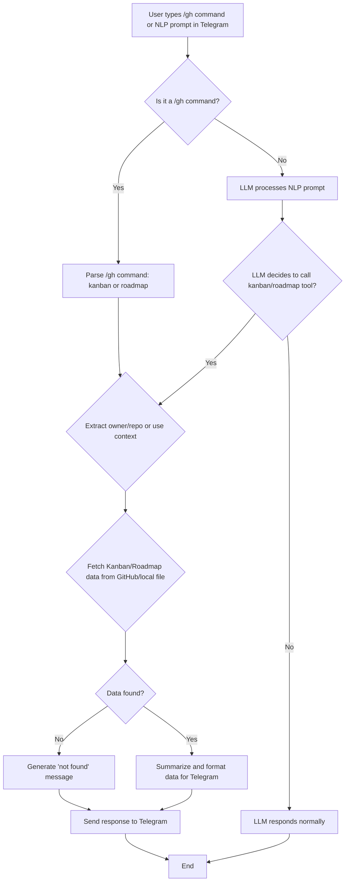

```markdown
# Analysis Template

> 📋 Template สำหรับการวิเคราะห์ก่อนเริ่มพัฒนา Feature

---

## 📌 Feature Information

| รายการ | รายละเอียด |
|--------|-----------|
| **Feature Name** | Feature: check kanban and ROADMAP.md via Telegram (/gh + NLP prompt) |
| **Issue URL** | [#82](https://github.com/oatrice/Akasa/issues/82) |
| **Date** | March 19, 2026 |
| **Analyst** | Luma AI (Senior Technical Analyst) |
| **Priority** | 🔴 High |
| **Status** | 📝 Draft |

---

## 1. Requirement Analysis

### 1.1 Problem Statement

> อธิบายปัญหาที่ต้องการแก้ไข

The current Telegram integration with GitHub allows for basic repository information, issues, and pull requests, but it lacks the capability to provide summaries of a project's kanban board or roadmap. Users need a direct way to access these project management insights via both slash commands and natural language prompts within Telegram. This gap prevents users from getting a quick overview of project status and future plans without leaving the chat interface.

### 1.2 User Stories

| # | As a | I want to | So that |
|---|------|-----------|---------|
| 1 | A Telegram user | check the kanban status of a GitHub repository | I can quickly understand the current work in progress and priorities. |
| 2 | A Telegram user | summarize the roadmap of a GitHub repository | I can get an overview of upcoming features and strategic direction. |
| 3 | A Telegram user | use natural language to query project status | I don't have to remember specific slash commands and can interact more intuitively. |
| 4 | A Telegram user | use a slash command for project status | I can get precise and quick information when I know what I'm looking for. |

### 1.3 Acceptance Criteria

- [x] **AC1:** `/gh kanban <owner/repo>` returns a readable kanban summary in Telegram.
- [x] **AC2:** `/gh roadmap <owner/repo>` returns a readable roadmap summary in Telegram.
- [x] **AC3:** `/gh kanban` and `/gh roadmap` work when the current project resolves cleanly without an explicit repo argument.
- [x] **AC4:** A normal chat message asking for kanban triggers the read-only kanban lookup flow.
- [x] **AC5:** A normal chat message asking for roadmap triggers the roadmap lookup flow.
- [x] **AC6:** Missing repo/project-board/ROADMAP cases return helpful, non-crashing responses.
- [x] **AC7:** Tests cover slash command parsing, repo/path resolution, and NLP tool execution paths.
- [x] **AC8:** `docs/project_commands_cheat_sheet.md` is updated with the new `/gh` commands.

---

## 2. Feature Analysis

### 2.1 User Flow



### 2.2 Screen/Page Requirements

| หน้าจอ | Actions | Components |
|--------|---------|------------|
| Telegram Chat Interface | User input slash commands (`/gh kanban`, `/gh roadmap`) or NLP prompts; Akasa bot sends summary messages with links. | Text input field, message display area, bot-generated markdown messages. |

### 2.3 Input/Output Specification

#### Inputs

| Field | Type | Required | Validation |
|-------|------|----------|------------|
| `command_type` | string | ✅ | "kanban", "roadmap" |
| `owner_repo` | string | ❌ | format: `owner/repo` (e.g., `oatrice/Akasa`), if omitted, resolve from context. |
| `nlp_prompt` | string | ✅ | Any natural language query related to kanban or roadmap. |

#### Outputs

| Field | Type | Description |
|-------|------|-------------|
| `summary_text` | string | A concise, Telegram-friendly markdown summary of the kanban or roadmap. |
| `status_message` | string | Information about success, failure, or missing data (e.g., "Kanban not found"). |
| `external_link` | string | Optional URL to the full GitHub Project board or ROADMAP.md file. |

---

## 3. Impact Analysis

### 3.1 Affected Components

| Component | Impact Level | Description |
|-----------|--------------|-------------|
| `app/routers/telegram.py` | 🟡 Medium | Needs new handlers for `/gh kanban` and `/gh roadmap` subcommands. |
| `app/services/chat_service.py` | 🔴 High | Will need to define new LLM tools for kanban and roadmap lookup, and modify command handling logic to route these. |
| `app/services/github_service.py` | 🔴 High | Requires new methods for fetching and summarizing GitHub Project boards and retrieving `ROADMAP.md` content (potentially via GitHub API or local file system). |
| `app/models/command.py` | 🟢 Low | Potentially new Pydantic models for kanban/roadmap commands if not handled generically. |
| `app/utils/markdown_utils.py` | 🟢 Low | Might need minor adjustments or new helper functions for formatting the summaries for Telegram. |
| `config/command_whitelist.yaml` | 🟢 Low | New commands might need to be whitelisted. |
| `tests/` directory | 🔴 High | New unit and integration tests for command parsing, service logic, and LLM tool invocation. |
| `docs/project_commands_cheat_sheet.md` | 🟢 Low | Update necessary to document new commands. |

### 3.2 Breaking Changes

- [ ] **BC1:** None expected as this is an additive feature.

### 3.3 Backward Compatibility Plan

N/A (New additive feature)

---

## 4. Feasibility Analysis

### 4.1 Technical Feasibility

| คำถาม | คำตอบ | หมายเหตุ |
|-------|-------|----------|
| เทคโนโลยีรองรับหรือไม่? | ✅ | Python/FastAPI, GitHub API, LLM function calling, Telegram API all support the required functionality. |
| ทีมมี Skills เพียงพอหรือไม่? | ✅ | Team has experience with existing GitHub integrations, LLMs, and Telegram bot development. |
| Infrastructure รองรับหรือไม่? | ✅ | Existing Akasa infrastructure (Redis, FastAPI) can handle the load; GitHub API rate limits need to be considered. |

### 4.2 Time Feasibility

| ประเด็น | รายละเอียด |
|--------|-----------|
| **Estimated Effort** | 3-4 weeks (including design, implementation, testing, and documentation) |
| **Deadline** | N/A (Based on project roadmap) |
| **Buffer Time** | 1 week |
| **Feasible?** | ✅ |

### 4.3 Budget Feasibility

| รายการ | ค่าใช้จ่าย | หมายเหตุ |
|--------|-----------|----------|
| Developer Time | [Estimated based on effort] | Internal resource cost. |
| GitHub API Usage | Minimal | Expected to stay within free tier limits for typical usage. |
| LLM API Usage | Low | For NLP prompt parsing, similar to existing chat costs. |
| **Total** | Low to Medium | Primarily developer time. |

---

## 5. Security Analysis

### 5.1 Sensitive Data

| ข้อมูล | Sensitivity Level | Protection Method |
|--------|------------------|-------------------|
| GitHub Access Token | 🔴 Critical | Stored securely as environment variable, used for API calls, access restricted by scope. |
| ROADMAP.md content | 🟢 Normal | Publicly available content, but summarization should not expose private info if repo is private. |
| Kanban Card/Issue Data | 🟡 Sensitive | May contain internal project details; summarization should be concise and not expose PII or confidential data. |

### 5.2 Attack Vectors

| Vector | Risk Level | Mitigation |
|--------|-----------|------------|
| **Unauthorized GitHub Access** | 🔴 High | Ensure GitHub token scopes are minimal (read-only for public repo content, potentially broader for private but with strict access control). |
| **Information Leakage (Private Repos)** | 🟡 Medium | If `ROADMAP.md` or kanban data from private repos is exposed, it could be sensitive. Ensure proper authorization and user context for private repo access. Summarization logic should be careful not to include overly verbose or sensitive details. |
| **Denial of Service (DoS) via API abuse** | 🟡 Medium | Implement rate limiting for GitHub API calls within `github_service` and `chat_service` to prevent abuse. |
| **LLM Prompt Injection** | 🟡 Medium | Ensure LLM tool descriptions are clear and concise. Validate LLM outputs before performing actions if any writes were to be considered (though this feature is read-only). |

### 5.3 Authentication & Authorization

Uses existing Akasa authentication for Telegram users. GitHub API calls will use a configured GitHub token (likely a PAT or GitHub App token). Authorization for accessing private repository information must be handled by the scope of the GitHub token and/or by ensuring the user making the request has appropriate permissions. The Akasa backend should verify if the user has access to the requested `owner/repo` before attempting to fetch private data.

---

## 6. Performance & Scalability Analysis

### 6.1 Performance Targets

| Metric | Target | Current |
|--------|--------|---------|
| Response Time (Kanban/Roadmap lookup) | < 3 seconds | N/A |
| Throughput | 10 requests/second (GitHub API calls) | N/A |
| Error Rate | < 1% (due to external API dependency) | N/A |

### 6.2 Scalability Plan

| Scenario | Expected Users | Scaling Strategy |
|----------|---------------|------------------|
| Normal | 10-50 users | Existing FastAPI backend, Redis caching for GitHub API responses (e.g., project list, ROADMAP.md content for frequently accessed repos) to reduce API calls. |
| Peak | 50-100 users | Increase FastAPI worker count, optimize GitHub API calls, aggressive caching strategy. |
| Growth (1yr) | 200+ users | Implement a dedicated microservice for GitHub interactions with advanced caching and rate limit management. |

---

## 7. Gap Analysis

| ด้าน | As-Is (ปัจจุบัน) | To-Be (ต้องการ) | Gap |
|------|-----------------|-----------------|-----|
| GitHub Integration | Basic repo, issue, PR info via `/github`. | Comprehensive project management insights (kanban, roadmap) via slash commands and NLP. | Lack of high-level project overview functionality. |
| User Interaction | Relies heavily on explicit slash commands for GitHub actions. | Supports natural language queries for project status, reducing cognitive load for users. | Limited intuitive interaction for complex queries. |
| Information Access | Users must leave Telegram to check project kanban or roadmap. | Users can get summaries directly within the chat interface. | Inconvenient access to key project information. |

---

## 8. Risk Analysis

| Risk | Probability | Impact | Score | Mitigation Plan |
|------|-------------|--------|-------|-----------------|
| **GitHub API Rate Limits** | 🟡 Medium | 🔴 High | 6 | Implement robust rate limiting and caching within `github_service`. Use conditional requests if supported. Inform users when limits are hit. |
| **Parsing Complex Kanban/Roadmap Structures** | 🟡 Medium | 🟡 Medium | 4 | Start with basic summarization (columns/issues). Iterate and improve parsing logic as needed. LLMs can assist in summarizing, but human-readable rules are essential. |
| **LLM Misinterpretation of NLP Prompts** | 🟡 Medium | 🟡 Medium | 4 | Refine tool descriptions for LLM. Add guardrails or confirmation steps for critical actions (N/A for read-only here). Monitor LLM performance and adjust prompts/fine-tuning. |
| **External API Downtime (GitHub)** | 🟢 Low | 🔴 High | 3 | Implement graceful degradation, inform users, and retry mechanisms. |

> **Risk Score:** Probability × Impact (High=3, Medium=2, Low=1)

---

## 9. Summary & Recommendations

### 9.1 Analysis Summary

| หมวด | Status | Key Findings |
|------|--------|--------------|
| Requirement | ✅ Clear | User needs clear access to project kanban and roadmap via Telegram. |
| Feature | ✅ Defined | Core functionality includes new `/gh` subcommands and NLP tool integration. |
| Impact | 🔴 High | Significant changes to `chat_service` and `github_service`, requiring new GitHub API interactions. |
| Feasibility | ✅ Feasible | Technical and skill sets are available. Time estimates seem reasonable. |
| Security | ⚠️ Needs Review | Proper handling of GitHub tokens, data exposure from private repos, and rate limiting are crucial. |
| Performance | ✅ Acceptable | Caching and rate limiting will be key for maintaining performance. |
| Risk | ⚠️ Some Risks | Primary risks involve GitHub API rate limits and potential LLM misinterpretations. |

### 9.2 Recommendations

1.  **Prioritize GitHub API Interaction Logic:** Develop robust `github_service` methods for fetching and summarizing kanban boards and `ROADMAP.md` content, including error handling and rate limit management.
2.  **Iterative LLM Tool Definition:** Start with simple, clear tool definitions for the LLM to invoke the new functionalities. Monitor LLM performance and refine tool descriptions.
3.  **Comprehensive Testing:** Ensure thorough unit and integration tests for all new components, especially for command parsing, repo resolution, GitHub API interactions, and LLM tool execution paths.
4.  **Documentation Update:** Keep `docs/project_commands_cheat_sheet.md` up-to-date with new `/gh` commands immediately upon implementation.

### 9.3 Next Steps

- [x] Design detailed API interaction patterns for GitHub Project boards (which API endpoints to use, how to interpret responses).
- [x] Create a detailed plan for integrating new LLM tools into `ChatService`.
- [x] Begin implementation of `github_service` extensions.

---

## 📎 Appendix

### Related Documents

- [Existing GitHub Integration Documentation (if any)]
- [GitHub Project API Documentation](https://docs.github.com/en/rest/projects/projects)
- [GitHub Repositories API Documentation](https://docs.github.com/en/rest/repos/repos)

### Sign-off

| Role | Name | Date | Signature |
|------|------|------|-----------|
| Analyst | Luma AI | March 19, 2026 | ✅ |
| Tech Lead | [Name] | [Date] | ⬜ |
| PM | [Name] | [Date] | ⬜ |
```