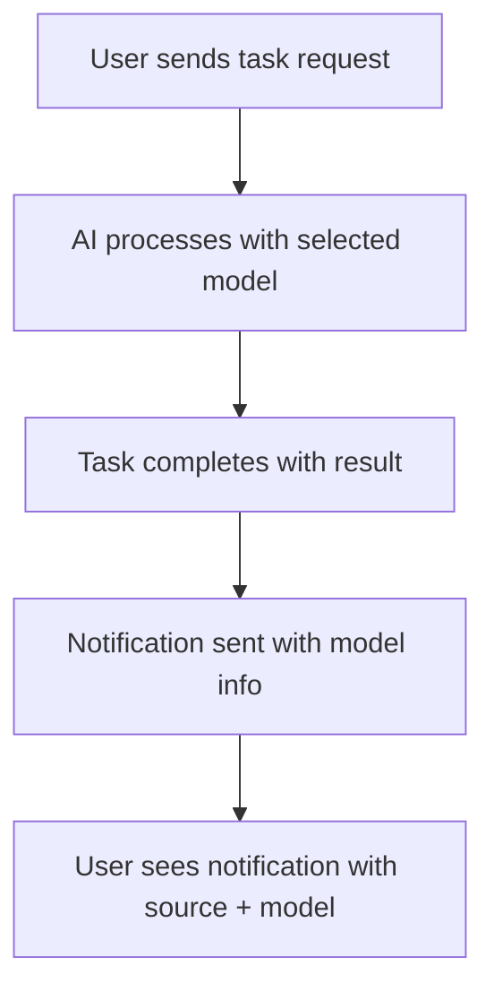

# Analysis Template

> 📋 Template สำหรับการวิเคราะห์ก่อนเริ่มพัฒนา Feature

---

## 📌 Feature Information

| รายการ | รายละเอียด |
|--------|-----------|
| **Feature Name** | Add model field to TaskNotificationRequest and display in notifications |
| **Issue URL** | [#90](https://github.com/oatrice/Akasa/issues/90) |
| **Date** | 2026-04-29 |
| **Analyst** | Kilo AI (Senior Technical Analyst) |
| **Priority** | 🟡 Medium |
| **Status** | 📝 Draft |

---

## 1. Requirement Analysis

### 1.1 Problem Statement

> Users currently receive task notifications showing only the source (e.g., Antigravity, kilo) but cannot see which AI model generated the response. This limits transparency and debugging capabilities when working with multiple AI models.

### 1.2 User Stories

| # | As a | I want to | So that |
|---|---|----------|---------|
| 1 | Developer using Akasa | See which AI model generated my task result in notifications | I can better understand and debug AI responses |
| 2 | User switching between models | Track which model was used for specific tasks | I can correlate model performance with results |
| 3 | System administrator | Monitor model usage patterns in notifications | I can optimize model selection and resource allocation |

### 1.3 Acceptance Criteria

- [ ] **AC1:** TaskNotificationRequest includes optional model field
- [ ] **AC2:** Notifications display model information when available
- [ ] **AC3:** Model data is retrieved from user preferences in Redis
- [ ] **AC4:** Backward compatibility maintained for existing notifications

---

## 2. Feature Analysis

### 2.1 User Flow

### 2.2 Screen/Page Requirements

| หน้าจอ | Actions | Components |
|--------|---------|------------|
| Telegram Notification | Display task result | Source line + Model line (when present) |

### 2.3 Input/Output Specification

#### Inputs

| Field | Type | Required | Validation |
|-------|------|----------|------------|
| model | string | ❌ | max 100 chars, optional |

#### Outputs

| Field | Type | Description |
|-------|------|-------------|
| notification_message | string | Includes "*Model:* {model}" when model present |

---

## 3. Impact Analysis

### 3.1 Affected Components

| Component | Impact Level | Description |
|-----------|--------------|-------------|
| app/models/notification.py | 🔴 High | Add new model field |
| app/services/telegram_service.py | 🟡 Medium | Update notification display logic |
| scripts/akasa_mcp_server.py | 🟡 Medium | Include model in notification payload |

### 3.2 Breaking Changes

- [ ] **BC1:** None - field is optional

### 3.3 Backward Compatibility Plan

Existing notifications will continue to work without model information. The field is optional and defaults to None.

---

## 4. Feasibility Analysis

### 4.1 Technical Feasibility

| คำถาม | คำตอบ | หมายเหตุ |
|-------|-------|----------|
| เทคโนโลยีรองรับหรือไม่? | ✅ | Optional field in Pydantic model |
| ทีมมี Skills เพียงพอหรือไม่? | ✅ | Standard Python development |
| Infrastructure รองรับหรือไม่? | ✅ | Redis already used for preferences |

### 4.2 Time Feasibility

| ประเด็น | รายละเอียด |
|--------|-----------|
| **Estimated Effort** | 2-3 days |
| **Deadline** | N/A |
| **Buffer Time** | 1 day |
| **Feasible?** | ✅ |

### 4.3 Budget Feasibility

| รายการ | ค่าใช้จ่าย | หมายเหตุ |
|--------|-----------|----------|
| Development Time | 16-24 hours | Standard implementation |
| **Total** | 16-24 hours | |

---

## 5. Security Analysis

### 5.1 Sensitive Data

| ข้อมูล | Sensitivity Level | Protection Method |
|--------|------------------|-------------------|
| Model identifier | 🟢 Normal | No special protection needed |

### 5.2 Attack Vectors

| Vector | Risk Level | Mitigation |
|--------|-----------|------------|
| Model field injection | 🟢 Low | Markdown escaping already in place |

### 5.3 Authentication & Authorization

No changes to auth/authz required.

---

## 6. Performance & Scalability Analysis

### 6.1 Performance Targets

| Metric | Target | Current |
|--------|--------|---------|
| Notification latency | < 1s | < 0.5s |
| Memory usage | No increase | N/A |

### 6.2 Scalability Plan

| Scenario | Expected Users | Scaling Strategy |
|----------|---------------|------------------|
| Normal | 100 concurrent | No changes needed |
| Peak | 1000 concurrent | No changes needed |

---

## 7. Gap Analysis

| ด้าน | As-Is (ปัจจุบัน) | To-Be (ต้องการ) | Gap |
|------|-----------------|-----------------|-----|
| Notification content | Source only | Source + Model | Add model display logic |

---

## 8. Risk Analysis

| Risk | Probability | Impact | Score | Mitigation Plan |
|------|-------------|--------|-------|-----------------|
| Model data not available | 🟡 Medium | 🟡 Medium | 4 | Handle gracefully with None checks |
| Redis preference retrieval fails | 🟡 Medium | 🟡 Medium | 4 | Fallback to None |

> **Risk Score:** Probability × Impact (High=3, Medium=2, Low=1)

---

## 9. Summary & Recommendations

### 9.1 Analysis Summary

| หมวด | Status | Key Findings |
|------|--------|--------------|
| Requirement | ✅ Clear | Well-defined feature request |
| Feature | ✅ Defined | Simple optional field addition |
| Impact | 🟡 Medium | Affects notification components |
| Feasibility | ✅ Feasible | Low complexity implementation |
| Security | ✅ Acceptable | No security concerns |
| Performance | ✅ Acceptable | Minimal performance impact |
| Risk | 🟡 Some Risks | Low probability issues |

### 9.2 Recommendations

1. **Implement optional field**: Add model field as optional to maintain backward compatibility
2. **Safe display**: Use existing Markdown escaping for model display
3. **Redis integration**: Leverage existing user preference storage

### 9.3 Next Steps

- [ ] Review and approve this analysis
- [ ] Proceed to implementation planning
- [ ] Begin code changes

---

## 📎 Appendix

### Related Documents

- [GitHub Issue #90](https://github.com/oatrice/Akasa/issues/90)
- [Notification Model Documentation](./app/models/notification.py)

### Sign-off

| Role | Name | Date | Signature |
|------|------|------|-----------|
| Analyst | Kilo AI | 2026-04-29 | ✅ |
| Tech Lead | [Name] | [Date] | ⬜ |
| PM | [Name] | [Date] | ⬜ |