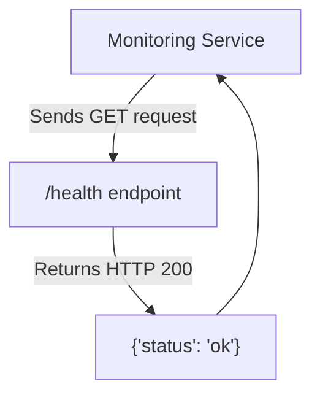

# Analysis Template

> 📋 Template สำหรับการวิเคราะห์ก่อนเริ่มพัฒนา Feature

---

## 📌 Feature Information

| รายการ | รายละเอียด |
|--------|-----------|
| **Feature Name** | [Phase 1] สร้าง FastAPI backend |
| **Issue URL** | [#2](https://github.com/oatrice/Akasa/issues/2) |
| **Date** | 2026-03-07 |
| **Analyst** | Luma AI (Senior Technical Analyst) |
| **Priority** | 🔴 High |
| **Status** | 📝 Draft |

---

## 1. Requirement Analysis

### 1.1 Problem Statement

> อธิบายปัญหาที่ต้องการแก้ไข

```
โปรเจกต์ยังไม่มีแอปพลิเคชันเซิร์ฟเวอร์กลาง (Backend) เพื่อทำหน้าที่รับคำขอ (requests), ประมวลผล logic, และเป็นศูนย์กลางในการเชื่อมต่อกับบริการอื่นๆ เช่น LLM API จำเป็นต้องสร้าง Backend เพื่อเป็นแกนหลักของระบบ Akasa Chatbot
```

### 1.2 User Stories

| # | As a | I want to | So that |
|---|---|---|---|
| 1 | Developer | have a foundational FastAPI application structure | I can begin developing API endpoints and business logic for the chatbot. |
| 2 | System Operator | have a `/health` check endpoint | the application's uptime and availability can be monitored by external services. |

### 1.3 Acceptance Criteria

- [ ] **AC1:** มีการสร้าง directory ใหม่ชื่อ `app` สำหรับเก็บโค้ดของ Backend
- [ ] **AC2:** มีไฟล์ `app/main.py` เป็นจุดเริ่มต้น (entry point) ของแอปพลิเคชัน
- [ ] **AC3:** มี API endpoint `/health` ที่เมื่อเรียกใช้ (GET request) จะต้องตอบกลับด้วย JSON `{"status": "ok"}` และ HTTP status code 200
- [ ] **AC4:** มีการเพิ่ม Dependencies ที่จำเป็น (`fastapi`, `uvicorn`) เข้าไปในไฟล์ `requirements.txt`

---

## 2. Feature Analysis

### 2.1 User Flow

> เนื่องจากเป็นงานโครงสร้าง Backend จึงยังไม่มี User Flow ที่ผู้ใช้ทั่วไปโต้ตอบโดยตรง แต่เป็นการวางรากฐานสำหรับ Flow ในอนาคต Flow ที่เกี่ยวข้องโดยตรงกับ Task นี้คือการตรวจสอบสถานะของระบบ



### 2.2 Screen/Page Requirements

| หน้าจอ | Actions | Components |
|---|---|---|
| N/A | งานนี้เป็นการสร้างโครงสร้าง Backend จึงไม่มีส่วนติดต่อกับผู้ใช้ (UI) | N/A |

### 2.3 Input/Output Specification

#### Inputs
- **Endpoint:** `GET /health`
- **Body:** None
- **Parameters:** None

#### Outputs
- **Status Code:** `200 OK`
- **Body:**
    ```json
    {
      "status": "ok"
    }
    ```

---

## 3. Impact Analysis

### 3.1 Affected Components

| Component | Impact Level | Description |
|---|---|---|
| **New Directory (`app/`)** | 🔴 High | เป็นการสร้างโครงสร้างหลักของแอปพลิเคชันทั้งหมด จะเป็นที่เก็บโค้ด Backend ทั้งหมดในอนาคต |
| **`requirements.txt`** | 🟡 Medium | ต้องเพิ่ม dependencies ใหม่ ซึ่งจะมีผลต่อการติดตั้งและการ deploy ของโปรเจกต์ |
| **CI/CD Pipeline** | 🟢 Low | ไม่มีผลกระทบในทันที แต่ในอนาคตจะต้องมีการปรับปรุง Pipeline เพื่อ build, test, และ deploy Backend |
| **Project Documentation** | 🟢 Low | ต้องอัปเดต `README.md` เพื่อเพิ่มคำสั่งในการรัน Backend |

### 3.2 Breaking Changes

- [ ] **BC1:** ไม่มี Breaking Changes เนื่องจากเป็นการเพิ่มส่วนประกอบใหม่ทั้งหมด ไม่ได้แก้ไขส่วนที่มีอยู่

### 3.3 Backward Compatibility Plan

```
ไม่จำเป็นต้องมีแผน เนื่องจากเป็นฟีเจอร์ใหม่ทั้งหมด
```

---

## 4. Feasibility Analysis

### 4.1 Technical Feasibility

| คำถาม | คำตอบ | หมายเหตุ |
|---|---|---|
| เทคโนโลยีรองรับหรือไม่? | ✅ | FastAPI และ Python เป็นเทคโนโลยีมาตรฐานที่ทีมคุ้นเคยและโปรเจกต์เลือกใช้อยู่แล้ว |
| ทีมมี Skills เพียงพอหรือไม่? | ✅ | ทีมมีความสามารถในการพัฒนาด้วย Python และ FastAPI |
| Infrastructure รองรับหรือไม่? | ✅ | สามารถรันบน Local environment และ deploy บน PaaS/VPS ทั่วไปได้ |

### 4.2 Time Feasibility

| ประเด็น | รายละเอียด |
|---|---|
| **Estimated Effort** | ~0.5-1 day | เป็นงานตั้งค่าพื้นฐาน ไม่มีความซับซ้อนสูง |
| **Deadline** | N/A | |
| **Buffer Time** | N/A | |
| **Feasible?** | ✅ | สามารถทำเสร็จได้ในเวลาอันสั้น |

### 4.3 Budget Feasibility

| รายการ | ค่าใช้จ่าย | หมายเหตุ |
|---|---|---|
| Development Time | $0 | เป็นงานพัฒนาภายใน |
| Software/Tools | $0 | ใช้ Open Source software ทั้งหมด |
| **Total** | **$0** | |

---

## 5. Security Analysis

### 5.1 Sensitive Data

| ข้อมูล | Sensitivity Level | Protection Method |
|---|---|---|
| N/A | 🟢 Normal | ใน Scope ของงานนี้ยังไม่มีการจัดการข้อมูลที่ละเอียดอ่อน |

### 5.2 Attack Vectors

| Vector | Risk Level | Mitigation |
|---|---|---|
| Information Disclosure | 🟢 Low | Endpoint `/health` เปิดเผยข้อมูลน้อยมาก แต่ในอนาคตต้องระวังไม่ให้ endpoint อื่นๆ เปิดเผยข้อมูลที่ไม่จำเป็น |

### 5.3 Authentication & Authorization

```
ไม่จำเป็นต้องมี Authentication/Authorization สำหรับ `/health` endpoint
```

---

## 6. Performance & Scalability Analysis

### 6.1 Performance Targets

| Metric | Target | Current |
|---|---|---|
| Response Time | < 50ms | N/A |
| Throughput | N/A | N/A |
| Error Rate | < 0.01% | N/A |

### 6.2 Scalability Plan

| Scenario | Expected Users | Scaling Strategy |
|---|---|---|
| Normal | N/A | FastAPI เป็น Asynchronous framework ซึ่งรองรับการขยายตัวได้ดี ในอนาคตจะใช้ Uvicorn workers ร่วมกับ Gunicorn/Nginx |

---

## 7. Gap Analysis

| ด้าน | As-Is (ปัจจุบัน) | To-Be (ต้องการ) | Gap |
|---|---|---|---|
| **Application Core** | ไม่มี Backend application, มีเพียงสคริปต์เดี่ยวๆ | มีแอปพลิเคชัน FastAPI ที่มีโครงสร้างชัดเจน | ต้องสร้าง Backend application ทั้งหมดตั้งแต่ต้น |
| **API Endpoints** | ไม่มี | มี endpoint `/health` | ต้องสร้างและ implement endpoint แรกของระบบ |

---

## 8. Risk Analysis

| Risk | Probability | Impact | Score | Mitigation Plan |
|---|---|---|---|---|
| โครงสร้างโปรเจกต์ไม่ดี | 🟡 Medium | 🟡 Medium | 4 | ศึกษาและปฏิบัติตาม Best Practices ของการวางโครงสร้างโปรเจกต์ FastAPI โดยแบ่งเป็น `routers`, `services`, `models` เพื่อให้ง่ายต่อการบำรุงรักษาในอนาคต |

> **Risk Score:** Probability × Impact (High=3, Medium=2, Low=1)

---

## 9. Summary & Recommendations

### 9.1 Analysis Summary

| หมวด | Status | Key Findings |
|---|---|---|
| Requirement | ✅ Clear | Requirement ชัดเจน ومุ่งเน้นการสร้างพื้นฐาน |
| Feature | ✅ Defined | ขอบเขตของงานชัดเจน คือการสร้างโครงสร้างและ health check |
| Impact | 🟡 Medium | มีผลกระทบต่อโครงสร้างไฟล์และ dependencies แต่เป็นไปในทางบวก |
| Feasibility | ✅ Feasible | ทำได้ง่ายและรวดเร็ว ไม่มีความเสี่ยงทางเทคนิค |
| Security | ✅ Acceptable | ความเสี่ยงด้านความปลอดภัยต่ำมากใน scope นี้ |
| Performance | ✅ Acceptable | Health check endpoint ไม่มีผลกระทบด้าน performance |
| Risk | 🟢 Low | ความเสี่ยงหลักคือการวางโครงสร้างไม่ดี แต่แก้ไขได้ |

### 9.2 Recommendations

1.  **สร้างโครงสร้าง Directory:** สร้าง `app/` และวางโครงสร้างย่อยสำหรับอนาคต เช่น `app/routers`, `app/services`, `app/models` เพื่อรองรับการขยายตัว
2.  **Implement Health Check:** สร้าง endpoint `GET /health` ตามข้อกำหนดเพื่อใช้ในการ monitoring
3.  **Update Dependencies:** เพิ่ม `fastapi` และ `uvicorn[standard]` ใน `requirements.txt`
4.  **เพิ่ม Unit Test:** สร้าง Test case สำหรับ `/health` endpoint เพื่อให้แน่ใจว่าทำงานถูกต้อง

### 9.3 Next Steps

- [ ] สร้าง Directory `app/` และไฟล์ `app/main.py`
- [ ] Implement `GET /health` endpoint
- [ ] อัปเดตไฟล์ `requirements.txt`
- [ ] สร้างไฟล์ test `tests/test_main.py` และเพิ่ม test case สำหรับ `/health`

---

## 📎 Appendix

### Related Documents

- [Akasa - Project Analysis](https://github.com/oatrice/Akasa/blob/main/docs/akasa_analysis.md)

### Sign-off

| Role | Name | Date | Signature |
|---|---|---|---|
| Analyst | Luma AI | 2026-03-07 | ✅ |
| Tech Lead | | | ⬜ |
| PM | | | ⬜ |