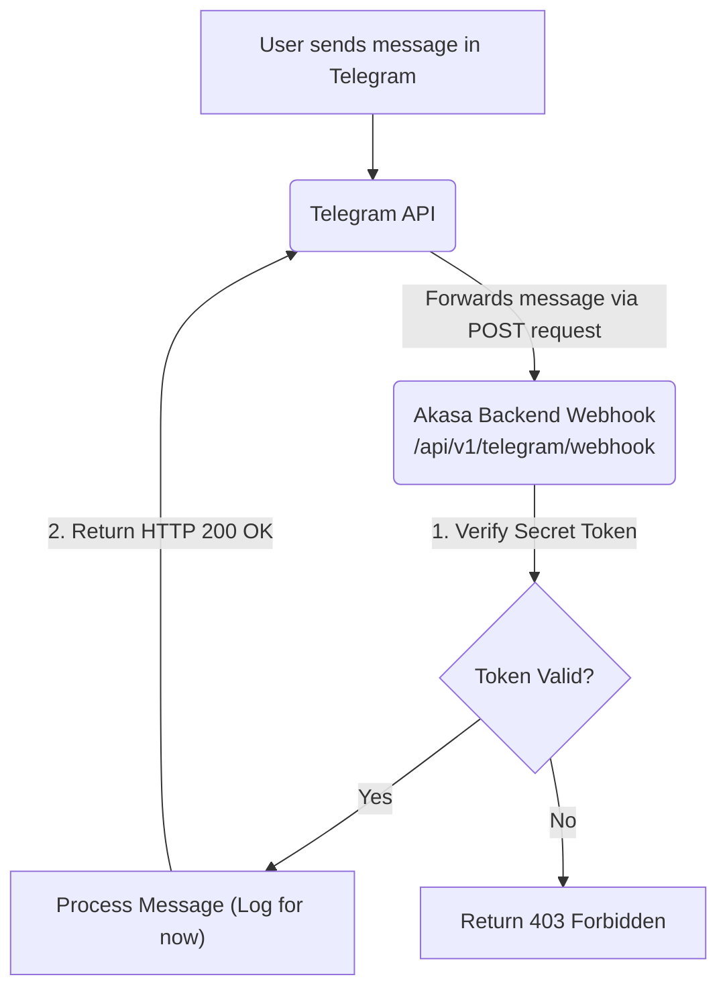

# Analysis Template

> 📋 Template สำหรับการวิเคราะห์ก่อนเริ่มพัฒนา Feature

---

## 📌 Feature Information

| รายการ | รายละเอียด |
|--------|-----------|
| **Feature Name** | [Phase 1] สร้าง Telegram Bot + webhook |
| **Issue URL** | [#3](https://github.com/oatrice/Akasa/issues/3) |
| **Date** | 2026-03-07 |
| **Analyst** | Luma AI (Senior Technical Analyst) |
| **Priority** | 🔴 High |
| **Status** | 📝 Draft |

---

## 1. Requirement Analysis

### 1.1 Problem Statement

> อธิบายปัญหาที่ต้องการแก้ไข

```
Backend application ที่มีอยู่ยังไม่สามารถรับข้อความหรือการโต้ตอบจากผู้ใช้ได้ ทำให้ไม่สามารถทำหน้าที่เป็น Chatbot ได้ จึงจำเป็นต้องสร้างช่องทางการสื่อสาร โดยเชื่อมต่อกับ Messaging Platform (Telegram) เพื่อรับข้อความจากผู้ใช้แบบ Real-time ผ่านกลไก Webhook
```

### 1.2 User Stories

| # | As a | I want to | So that |
|---|---|---|---|
| 1 | Chatbot User | send a message to the Akasa Telegram bot | the backend system receives my message for processing. |
| 2 | Developer | implement a webhook endpoint in the FastAPI app | the system can be notified by Telegram servers whenever a new message is sent to the bot. |

### 1.3 Acceptance Criteria

- [ ] **AC1:** มีการสร้าง Telegram Bot ใหม่ผ่าน BotFather และได้รับ `TELEGRAM_BOT_TOKEN`
- [ ] **AC2:** มีการเพิ่ม `TELEGRAM_BOT_TOKEN` และ `WEBHOOK_SECRET_TOKEN` ในไฟล์ `.env.example`
- [ ] **AC3:** มี API endpoint ใหม่ `POST /api/v1/telegram/webhook` ใน FastAPI application
- [ ] **AC4:** Endpoint Webhook ต้องมีการตรวจสอบ `X-Telegram-Bot-Api-Secret-Token` เพื่อยืนยันว่า Request มาจาก Telegram จริง
- [ ] **AC5:** เมื่อมีข้อความถูกส่งไปยังบอท, endpoint `/api/v1/telegram/webhook` จะต้องถูกเรียกและสามารถรับข้อมูล (payload) จาก Telegram ได้

---

## 2. Feature Analysis

### 2.1 User Flow



### 2.2 Screen/Page Requirements

| หน้าจอ | Actions | Components |
|---|---|---|
| N/A | เป็นการทำงานฝั่ง Backend ทั้งหมด | N/A |

### 2.3 Input/Output Specification

#### Inputs

- **Endpoint**: `POST /api/v1/telegram/webhook`
- **Header**: `X-Telegram-Bot-Api-Secret-Token: <your_secret_token>`
- **Body (Telegram Update object)**:
    ```json
    {
      "update_id": 123456789,
      "message": {
        "message_id": 987,
        "from": {
          "id": 123456,
          "is_bot": false,
          "first_name": "John"
        },
        "chat": {
          "id": 123456,
          "type": "private"
        },
        "date": 1678886400,
        "text": "Hello, bot!"
      }
    }
    ```

#### Outputs

| Condition | Status Code | Body |
|---|---|---|
| Success | `200 OK` | Empty |
| Invalid Secret Token | `403 Forbidden` | `{"detail": "Invalid secret token"}` |

---

## 3. Impact Analysis

### 3.1 Affected Components

| Component | Impact Level | Description |
|---|---|---|
| **`app/routers/`** | 🔴 High | ต้องสร้างไฟล์ใหม่ `app/routers/telegram.py` เพื่อจัดการ Webhook endpoint |
| **`app/main.py`** | 🟡 Medium | ต้อง `include` router ใหม่ที่สร้างขึ้น |
| **`.env.example`** | 🟡 Medium | ต้องเพิ่มตัวแปร `TELEGRAM_BOT_TOKEN` และ `WEBHOOK_SECRET_TOKEN` |
| **Infrastructure** | 🔴 High | **จำเป็นต้องมี Public HTTPS URL** เพื่อให้ Telegram สามารถเรียก Webhook ได้ การพัฒนาใน Local จำเป็นต้องใช้เครื่องมืออย่าง `ngrok` |
| **Pydantic Models (`app/models/`)** | 🟡 Medium | ควรสร้าง Pydantic model สำหรับ Telegram `Update` object เพื่อให้ง่ายต่อการจัดการและ validation |

### 3.2 Breaking Changes

- [ ] **BC1:** ไม่มี Breaking Changes เนื่องจากเป็นการเพิ่มส่วนประกอบใหม่

### 3.3 Backward Compatibility Plan

```
ไม่จำเป็นต้องมีแผน เนื่องจากเป็นฟีเจอร์ใหม่ทั้งหมด
```

---

## 4. Feasibility Analysis

### 4.1 Technical Feasibility

| คำถาม | คำตอบ | หมายเหตุ |
|---|---|---|
| เทคโนโลยีรองรับหรือไม่? | ✅ | FastAPI รองรับการสร้าง API endpoint ได้เป็นอย่างดี |
| ทีมมี Skills เพียงพอหรือไม่? | ✅ | ทีมมีความเข้าใจใน Python, FastAPI, และการทำงานของ Webhook |
| Infrastructure รองรับหรือไม่? | ⚠️ | **Local development ต้องการ `ngrok`** หรือ tool อื่นที่ทำหน้าที่เดียวกัน ส่วน Production ต้อง deploy บน service ที่มี Public URL และ HTTPS |

### 4.2 Time Feasibility

| ประเด็น | รายละเอียด |
|---|---|
| **Estimated Effort** | 1-2 days | รวมเวลาศึกษา, ตั้งค่า `ngrok`, สร้าง bot, และเขียนโค้ด/เทส |
| **Deadline** | N/A | |
| **Buffer Time** | 0.5 day | สำหรับแก้ไขปัญหาการเชื่อมต่อ `ngrok` หรือ network |
| **Feasible?** | ✅ | |

### 4.3 Budget Feasibility

| รายการ | ค่าใช้จ่าย | หมายเหตุ |
|---|---|---|
| Telegram Bot | $0 | ฟรี |
| `ngrok` | $0 | Free tier เพียงพอสำหรับการพัฒนา |
| **Total** | **$0** | |

---

## 5. Security Analysis

### 5.1 Sensitive Data

| ข้อมูล | Sensitivity Level | Protection Method |
|---|---|---|
| **`TELEGRAM_BOT_TOKEN`** | 🔴 Critical | จัดเก็บเป็น Environment Variable, ห้าม commit ลง Git, ใช้ Secrets Management บน CI/CD |
| **`WEBHOOK_SECRET_TOKEN`** | 🔴 Critical | จัดเก็บเป็น Environment Variable, ห้าม commit ลง Git |
| User Message Content | 🟡 Sensitive | จัดการตามนโยบายความเป็นส่วนตัว (ในอนาคต) |

### 5.2 Attack Vectors

| Vector | Risk Level | Mitigation |
|---|---|---|
| **Webhook Spoofing** | 🔴 High | **ต้องบังคับใช้ Secret Token** โดยเปรียบเทียบค่าใน header `X-Telegram-Bot-Api-Secret-Token` กับค่าที่เก็บใน environment variable เพื่อให้แน่ใจว่า request มาจาก Telegram จริงๆ |
| **Replay Attacks** | 🟡 Medium | สามารถทำได้โดยการเก็บ `update_id` ที่เคยประมวลผลไปแล้วใน Redis เพื่อป้องกันการ process ซ้ำ (อยู่นอก Scope งานนี้) |
| **Denial-of-Service (DoS)** | 🟡 Medium | Endpoint จะเป็น Public URL ซึ่งอาจถูกโจมตีได้ Mitigation: ใช้ Rate Limiting, Firewall (อยู่นอก Scope งานนี้) |

### 5.3 Authentication & Authorization

```
การยืนยันตัวตนของ request ที่เข้ามาจะใช้กลไก Secret Token ที่ Telegram ส่งมาใน Header ของ Webhook request
```

---

## 6. Performance & Scalability Analysis

### 6.1 Performance Targets

| Metric | Target | Current |
|---|---|---|
| Webhook Response Time | < 3 seconds | N/A |
| Throughput | N/A | N/A |
| Error Rate | < 0.1% | N/A |

### 6.2 Scalability Plan

| Scenario | Expected Users | Scaling Strategy |
|---|---|---|
| Normal | N/A | Webhook endpoint ต้องตอบกลับ Telegram โดยเร็วที่สุด งานที่ใช้เวลานาน (เช่น การเรียก LLM) ควรถูกส่งไปทำใน Background Task (เช่น FastAPI `BackgroundTasks`) เพื่อไม่ให้ block การตอบกลับ |

---

## 7. Gap Analysis

| ด้าน | As-Is (ปัจจุบัน) | To-Be (ต้องการ) | Gap |
|---|---|---|---|
| **User Interaction** | ไม่มีช่องทางรับข้อความจากผู้ใช้ | สามารถรับข้อความจากผู้ใช้ Telegram ได้แบบ real-time | ต้องสร้าง Telegram Bot, Webhook endpoint, และเปิด Public URL |
| **Security** | มีแค่ `/health` ที่เป็น Public | มี Webhook endpoint ที่ต้องป้องกันการโจมตี | ต้อง implement การตรวจสอบ Secret Token |

---

## 8. Risk Analysis

| Risk | Probability | Impact | Score | Mitigation Plan |
|---|---|---|---|---|
| **`TELEGRAM_BOT_TOKEN` รั่วไหล** | 🟡 Medium | 🔴 High | 6 | บังคับใช้ `.env` และ `.gitignore` อย่างเคร่งครัด, ใช้ Secrets Management ใน CI/CD |
| **Webhook ไม่ทำงาน (URL/SSL ผิดพลาด)** | 🔴 High | 🔴 High | 9 | จัดทำเอกสารและขั้นตอนการใช้ `ngrok` สำหรับ Local Dev, ตรวจสอบการตั้งค่า HTTPS บน Production ให้ถูกต้อง |
| **ไม่ได้ตรวจสอบ Secret Token** | 🔴 High | 🔴 High | 9 | กำหนดให้การตรวจสอบ Secret Token เป็นส่วนหนึ่งของ Acceptance Criteria และบังคับใช้ในการ Code Review |

> **Risk Score:** Probability × Impact (High=3, Medium=2, Low=1)

---

## 9. Summary & Recommendations

### 9.1 Analysis Summary

| หมวด | Status | Key Findings |
|---|---|---|
| Requirement | ✅ Clear | Requirement ชัดเจนและเป็น core feature ของ MVP |
| Feature | ✅ Defined | ขอบเขตชัดเจน คือการรับและยืนยัน webhook |
| Impact | 🔴 High | มีผลกระทบสูงต่อ Infrastructure เนื่องจากต้องมี Public URL |
| Feasibility | ✅ Feasible | ทำได้ แต่ต้องมีเครื่องมือ (`ngrok`) และความรู้เรื่อง network |
| Security | ⚠️ Needs Review | **ความปลอดภัยของ Webhook เป็นเรื่องสำคัญที่สุด** ต้องตรวจสอบ Secret Token |
| Performance | ✅ Acceptable | การตอบสนองที่รวดเร็วเป็นสิ่งสำคัญ, งานหนักต้องทำใน background |
| Risk | 🔴 High | มีความเสี่ยงสูงเรื่อง Security และ Configuration ที่ต้องจัดการให้ถูกต้อง |

### 9.2 Recommendations

1.  **Mandate Secret Token Validation:** การตรวจสอบ `X-Telegram-Bot-Api-Secret-Token` ต้องเป็นสิ่งแรกที่ทำใน webhook endpoint เพื่อความปลอดภัย
2.  **Use Pydantic Models:** สร้าง Model สำหรับ Telegram `Update` object เพื่อให้โค้ดสะอาดและจัดการข้อมูลได้ง่าย
3.  **Document `ngrok` Usage:** สร้างเอกสารสั้นๆ แนะนำวิธีติดตั้งและรัน `ngrok` เพื่อให้ทีมพัฒนาทำงานบน Local ได้
4.  **Isolate Logic:** สร้าง `telegram.py` router แยกต่างหากเพื่อให้โค้ดเป็นสัดส่วน

### 9.3 Next Steps

- [ ] สร้าง Telegram Bot ผ่าน BotFather และเก็บ Token
- [ ] อัปเดต `.env.example` ด้วยตัวแปรใหม่
- [ ] สร้าง `app/routers/telegram.py` และ implement webhook endpoint พร้อมการตรวจสอบ secret token
- [ ] สร้าง Pydantic models ใน `app/models`
- [ ] อัปเดต `app/main.py` เพื่อ include router ใหม่
- [ ] สร้าง Unit Tests สำหรับ Telegram router

---

## 📎 Appendix

### Related Documents

- [Telegram Bot API Documentation](https://core.telegram.org/bots/api)
- [ngrok - Secure Tunnels to Localhost](https://ngrok.com/)

### Sign-off

| Role | Name | Date | Signature |
|---|---|---|---|
| Analyst | Luma AI | 2026-03-07 | ✅ |
| Tech Lead | | | ⬜ |
| PM | | | ⬜ |