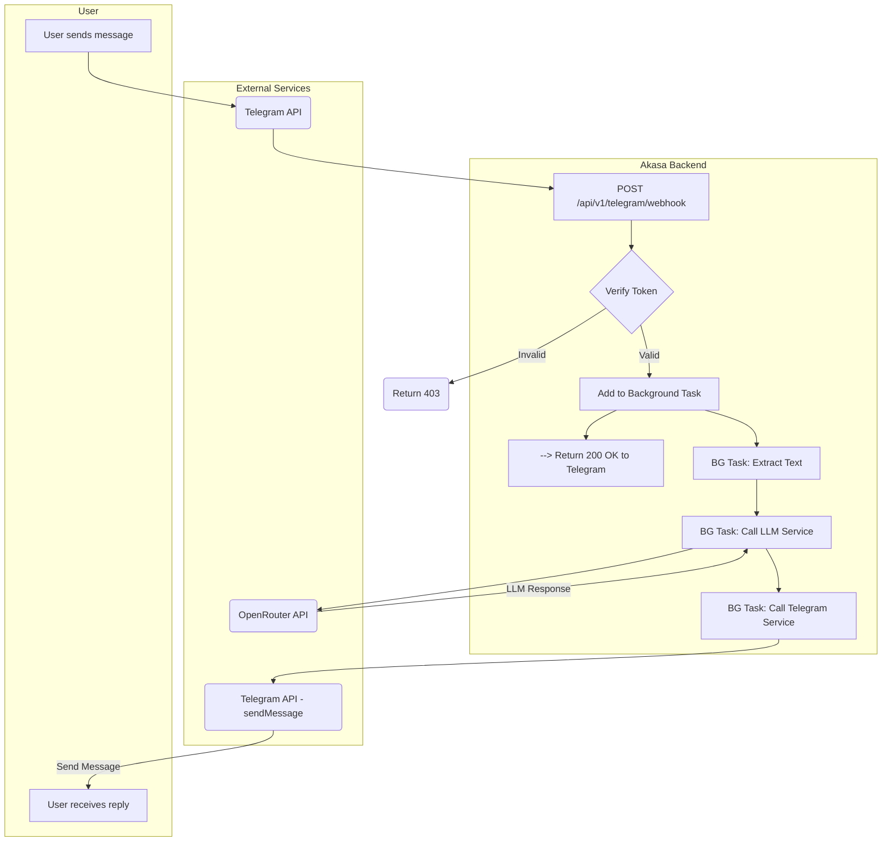

# Analysis Template

> 📋 Template สำหรับการวิเคราะห์ก่อนเริ่มพัฒนา Feature

---

## 📌 Feature Information

| รายการ | รายละเอียด |
|--------|-----------|
| **Feature Name** | [Phase 1] ส่งข้อความ ➡️ LLM ➡️ ตอบกลับ |
| **Issue URL** | [#4](https://github.com/oatrice/Akasa/issues/4) |
| **Date** | 2026-03-07 |
| **Analyst** | Luma AI (Senior Technical Analyst) |
| **Priority** | 🔴 High |
| **Status** | 📝 Draft |

---

## 1. Requirement Analysis

### 1.1 Problem Statement

> อธิบายปัญหาที่ต้องการแก้ไข

```
ปัจจุบันระบบสามารถรับข้อความจาก Telegram ได้ แต่ยังไม่สามารถประมวลผลหรือสร้างคำตอบได้ ทำให้ยังขาดคุณสมบัติหลักของ Chatbot จำเป็นต้องเชื่อมต่อส่วนการรับข้อความ (Webhook) เข้ากับบริการ AI (LLM) และสร้างกลไกการส่งคำตอบกลับไปยังผู้ใช้ เพื่อให้เกิดเป็นวงจรการสนทนาที่สมบูรณ์
```

### 1.2 User Stories

| # | As a | I want to | So that |
|---|---|---|---|
| 1 | Chatbot User | send a message to the bot and get a relevant, AI-generated reply | I can have a useful conversation and get help with my coding questions. |
| 2 | Developer | orchestrate the flow of taking user text, getting a response from an LLM, and sending it back to the user | I can complete the core "chat loop" functionality of the MVP. |

### 1.3 Acceptance Criteria

- [ ] **AC1:** เมื่อมีข้อความ (text) ถูกส่งมายัง Telegram webhook, เนื้อหาของข้อความนั้นจะต้องถูกส่งไปประมวลผลที่ OpenRouter API
- [ ] **AC2:** คำตอบที่สร้างโดย LLM จาก OpenRouter จะต้องถูกดึงออกมา
- [ ] **AC3:** คำตอบนั้นจะต้องถูกส่งกลับไปยังผู้ใช้ในห้องแชทเดิมของ Telegram
- [ ] **AC4:** ต้องมีการจัดการข้อผิดพลาด (Error Handling) จากทั้งฝั่ง OpenRouter API (เช่น API down) และฝั่ง Telegram API (เช่น ส่งข้อความไม่สำเร็จ)

---

## 2. Feature Analysis

### 2.1 User Flow



### 2.2 Screen/Page Requirements

| หน้าจอ | Actions | Components |
|---|---|---|
| N/A | เป็นการทำงานฝั่ง Backend ทั้งหมด | N/A |

### 2.3 Input/Output Specification

#### Inputs

- Telegram `Update` object ที่ได้รับจาก Webhook (มี `message.text` และ `chat.id`)

#### Outputs

- API call ไปยัง `https://api.telegram.org/bot<token>/sendMessage` ด้วย JSON body ดังนี้:
    ```json
    {
      "chat_id": "<chat_id_from_input>",
      "text": "<text_generated_by_llm>"
    }
    ```

---

## 3. Impact Analysis

### 3.1 Affected Components

| Component | Impact Level | Description |
|---|---|---|
| **`app/routers/telegram.py`** | 🔴 High | ต้องแก้ไข Webhook endpoint เพื่อเรียกใช้ Service Layer และจัดการ Background Task แทนการ log ข้อมูลเฉยๆ |
| **`app/services/`** | 🔴 High | ต้องสร้าง Service Layer ใหม่เพื่อแยกส่วนการทำงาน: `llm_service.py` (จัดการ OpenRouter), `telegram_service.py` (จัดการการส่งข้อความกลับ), และ `chat_service.py` (ควบคุม flow ทั้งหมด) |
| **`app/config.py`** | 🟡 Medium | อาจต้องเพิ่มการตั้งค่าสำหรับ LLM เช่น ชื่อโมเดลเริ่มต้น, system prompt |
| **Error Handling** | 🟡 Medium | ต้องมีการสร้าง Exceptionกลาง และจัดการข้อผิดพลาดจาก External API |

### 3.2 Breaking Changes

- [ ] **BC1:** ไม่มี Breaking Changes แต่เป็นการเปลี่ยนแปลง logic ภายในของ Webhook endpoint ที่มีอยู่

### 3.3 Backward Compatibility Plan

```
ไม่จำเป็น
```

---

## 4. Feasibility Analysis

### 4.1 Technical Feasibility

| คำถาม | คำตอบ | หมายเหตุ |
|---|---|---|
| เทคโนโลยีรองรับหรือไม่? | ✅ | FastAPI มี `BackgroundTasks` ที่เหมาะสมกับงานนี้ และ `httpx` (ที่ติดตั้งมากับ `fastapi.testclient`) สามารถใช้ยิง API ได้ |
| ทีมมี Skills เพียงพอหรือไม่? | ✅ | ทีมมีความเข้าใจในการทำ Asynchronous task และการเชื่อมต่อกับ REST API |
| Infrastructure รองรับหรือไม่? | ✅ | ไม่ต้องการ Infrastructure ใหม่เพิ่มเติม |

### 4.2 Time Feasibility

| ประเด็น | รายละเอียด |
|---|---|
| **Estimated Effort** | 1-2 days | การสร้าง Service Layer และการจัดการ Background Task มีความซับซ้อนกว่างานก่อนหน้า |
| **Deadline** | N/A | |
| **Buffer Time** | 1 day | สำหรับ Debug ปัญหาที่เกิดจาก Asynchronous task และการเชื่อมต่อ API |
| **Feasible?** | ✅ | |

### 4.3 Budget Feasibility

| รายการ | ค่าใช้จ่าย | หมายเหตุ |
|---|---|---|
| OpenRouter API | $0 | ใช้ Free-tier models |
| **Total** | **$0** | |

---

## 5. Security Analysis

### 5.1 Sensitive Data

| ข้อมูล | Sensitivity Level | Protection Method |
|---|---|---|
| **`OPENROUTER_API_KEY`** | 🔴 Critical | จัดเก็บเป็น Environment Variable และใช้ผ่าน `pydantic-settings` |
| **User chat content** | 🟡 Sensitive | ข้อมูลจะถูกส่งต่อไปยัง OpenRouter, ต้องระบุใน Privacy Policy ในอนาคต |

### 5.2 Attack Vectors

| Vector | Risk Level | Mitigation |
|---|---|---|
| **Prompt Injection** | 🟡 Medium | User อาจพยายามส่ง prompt ที่เป็นอันตรายเพื่อควบคุม LLM Mitigation: ออกแบบ System Prompt ให้รัดกุม (อยู่นอก scope งานนี้) |
| **API Key Leakage in Logs** | 🟡 Medium | หาก Error handling ไม่ดีพอ, API key อาจหลุดไปใน logs ได้ Mitigation: ตรวจสอบ Log message ให้ดี, อย่า log header ของ request ตรงๆ |

### 5.3 Authentication & Authorization

```
ใช้ `OPENROUTER_API_KEY` สำหรับการเรียก OpenRouter และ `TELEGRAM_BOT_TOKEN` สำหรับการส่งข้อความกลับ ทั้งสองอย่างต้องถูกเก็บเป็น secrets
```

---

## 6. Performance & Scalability Analysis

### 6.1 Performance Targets

| Metric | Target | Current |
|---|---|---|
| Webhook initial response time | < 100ms | N/A |
| End-to-end response time | < 5 seconds | N/A |

### 6.2 Scalability Plan

| Scenario | Expected Users | Scaling Strategy |
|---|---|---|
| **Webhook Blocking** | N/A | **ต้องใช้ `BackgroundTasks` ของ FastAPI** เพื่อรับ webhook, ตอบ `200 OK` ทันที, แล้วจึงประมวลผล (เรียก LLM, ส่งข้อความกลับ) ใน background เพื่อป้องกัน Telegram timeout และ retries |

---

## 7. Gap Analysis

| ด้าน | As-Is (ปัจจุบัน) | To-Be (ต้องการ) | Gap |
|---|---|---|---|
| **Chat Logic** | รับและ log ข้อความ | รับข้อความ, ประมวลผลด้วย AI, และตอบกลับ | ขาด Service Layer ทั้งหมดสำหรับจัดการ flow, เรียก LLM, และส่งข้อความ |
| **Responsiveness** | ตอบ 200 OK ทันที | ต้องตอบ 200 OK ทันที **และ** ประมวลผลงานที่ใช้เวลานานใน background | ขาดการนำ `BackgroundTasks` มาใช้ |

---

## 8. Risk Analysis

| Risk | Probability | Impact | Score | Mitigation Plan |
|---|---|---|---|---|
| **LLM API is slow or unavailable** | 🔴 High | 🔴 High | 9 | Implement try-except, timeout สำหรับ API call, และส่งข้อความแจ้งผู้ใช้ว่า "ขออภัย บอทกำลังมีปัญหา" |
| **Blocking Webhook Endpoint** | 🔴 High | 🔴 High | 9 | **บังคับใช้ `BackgroundTasks`** เพื่อแยกส่วนประมวลผลที่ช้าออกจาก request-response cycle หลัก |
| **Telegram sendMessage API Fails** | 🟡 Medium | 🟡 Medium | 4 | Implement try-except และ log error ไว้เพื่อตรวจสอบปัญหา |

> **Risk Score:** Probability × Impact (High=3, Medium=2, Low=1)

---

## 9. Summary & Recommendations

### 9.1 Analysis Summary

| หมวด | Status | Key Findings |
|---|---|---|
| Requirement | ✅ Clear | เป็น core feature ของ MVP ที่เชื่อมทุกส่วนเข้าด้วยกัน |
| Feature | ✅ Defined | ขอบเขตชัดเจน คือการสร้าง chat loop ให้สมบูรณ์ |
| Impact | 🔴 High | มีผลกระทบสูงต่อโครงสร้างโค้ด โดยการเพิ่ม Service Layer |
| Feasibility | ✅ Feasible | ทำได้ด้วยเครื่องมือและ skill ที่มีอยู่ |
| Security | ⚠️ Needs Review | ต้องระมัดระวังเรื่องการจัดการ API keys และข้อมูลผู้ใช้ |
| Performance | ⚠️ Needs Review | **Performance ของ webhook เป็นเรื่องสำคัญที่สุด ต้องใช้ Background Task** |
| Risk | 🔴 High | มีความเสี่ยงสูงที่เกี่ยวข้องกับ External API และ performance |

### 9.2 Recommendations

1.  **Mandate `BackgroundTasks`:** การประมวลผลทั้งหมด (LLM call, sending reply) **ต้อง** ถูกใส่ไว้ใน `BackgroundTasks` เพื่อให้ webhook ตอบกลับ Telegram ได้ทันที
2.  **Create a Service Layer:** แบ่งโค้ดออกเป็น 3 services เพื่อความเป็นระเบียบและง่ายต่อการเทส:
    *   `llm_service.py`: สำหรับเชื่อมต่อ OpenRouter
    *   `telegram_service.py`: สำหรับส่งข้อความกลับไปหาผู้ใช้
    *   `chat_service.py`: สำหรับควบคุม flow ทั้งหมด (orchestration)
3.  **Implement Robust Error Handling:** ครอบทุก external API call ด้วย `try...except` และ log error อย่างเหมาะสม
4.  **Develop Incrementally:** อาจเริ่มจากการทำ "Echo Bot" ก่อน (ส่งข้อความที่ได้รับกลับไปเลย) เพื่อทดสอบกลไกการส่งข้อความกลับ แล้วจึงค่อยเพิ่มการเรียก LLM เข้าไป

### 9.3 Next Steps

- [ ] สร้าง Service Layer (`services/chat.py`, `services/llm.py`, `services/telegram.py`)
- [ ] แก้ไข `app/routers/telegram.py` เพื่อใช้ `BackgroundTasks` และเรียก `ChatService`
- [ ] Implement logic การเรียก OpenRouter API ใน `LLMService`
- [ ] Implement logic การส่งข้อความกลับใน `TelegramService`
- [ ] สร้าง Unit/Integration Tests สำหรับ Service ใหม่ๆ

---

## 📎 Appendix

### Related Documents

- [FastAPI BackgroundTasks](https://fastapi.tiangolo.com/tutorial/background-tasks/)
- [OpenRouter API Documentation](https://openrouter.ai/docs)
- [Telegram Bot API - sendMessage](https://core.telegram.org/bots/api#sendmessage)

### Sign-off

| Role | Name | Date | Signature |
|---|---|---|---|
| Analyst | Luma AI | 2026-03-07 | ✅ |
| Tech Lead | | | ⬜ |
| PM | | | ⬜ |