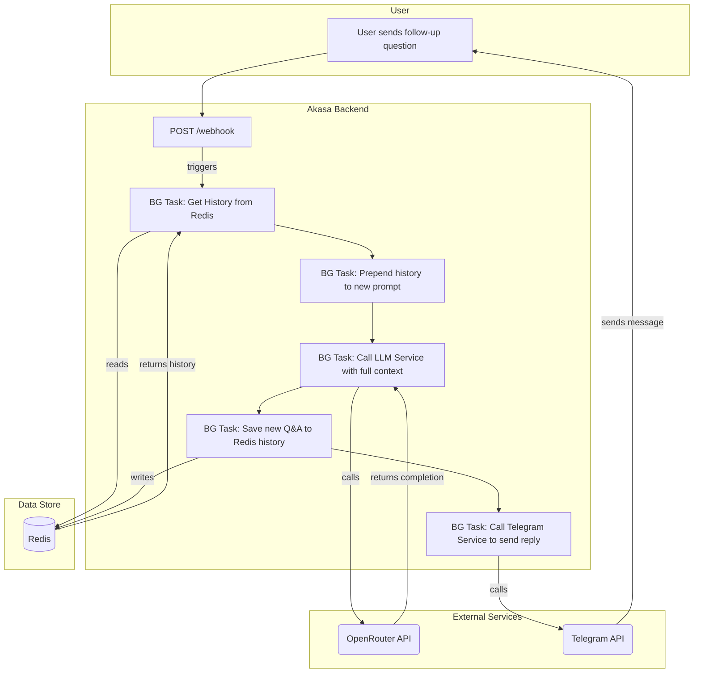

# Analysis Template

> 📋 Template สำหรับการวิเคราะห์ก่อนเริ่มพัฒนา Feature

---

## 📌 Feature Information

| รายการ | รายละเอียด |
|--------|-----------|
| **Feature Name** | [Phase 2] Conversation history (Redis) |
| **Issue URL** | [#6](https://github.com/oatrice/Akasa/issues/6) |
| **Date** | 2026-03-07 |
| **Analyst** | Luma AI (Senior Technical Analyst) |
| **Priority** | 🔴 High |
| **Status** | 📝 Draft |

---

## 1. Requirement Analysis

### 1.1 Problem Statement

> อธิบายปัญหาที่ต้องการแก้ไข

```
ปัจจุบัน Akasa Chatbot เป็นแบบ Stateless คือไม่สามารถจดจำสิ่งที่เคยสนทนาก่อนหน้าได้ ทำให้ผู้ใช้ไม่สามารถถามคำถามต่อเนื่อง (follow-up questions) หรืออ้างอิงถึงบริบทเก่าๆ ได้ ซึ่งจำกัดประโยชน์ของ Chatbot อย่างมาก การสนทนาจึงไม่เป็นธรรมชาติและไม่มีประสิทธิภาพ
```

### 1.2 User Stories

| # | As a | I want to | So that |
|---|---|---|---|
| 1 | Chatbot User | have the bot remember my previous messages in our conversation | I can ask follow-up questions and get answers that are contextually relevant. |
| 2 | Developer | provide the LLM with a history of the recent conversation | the LLM can generate more accurate, helpful, and human-like responses. |

### 1.3 Acceptance Criteria

- [ ] **AC1:** ก่อนที่จะเรียก LLM, `ChatService` จะต้องดึงประวัติการสนทนาล่าสุด (เช่น 10 ข้อความหลังสุด) ของ `chat_id` นั้นๆ จาก Redis
- [ ] **AC2:** ประวัติการสนทนาที่ดึงมาจะต้องถูกจัดรูปแบบให้ถูกต้องและส่งไปพร้อมกับ prompt ใหม่ของผู้ใช้ไปยัง `LLMService`
- [ ] **AC3:** หลังจากได้รับคำตอบจาก LLM, ข้อความใหม่ของผู้ใช้ (user's prompt) และคำตอบของบอท (AI's reply) จะต้องถูกบันทึกกลับเข้าไปในประวัติการสนทนาใน Redis
- [ ] **AC4:** ประวัติการสนทนาใน Redis จะต้องถูกจำกัดขนาด (capped) เพื่อป้องกันไม่ให้ context ยาวเกินไป (เช่น ใช้ `LTRIM` เพื่อเก็บเฉพาะ 10 ข้อความล่าสุด)

---

## 2. Feature Analysis

### 2.1 User Flow



### 2.2 Screen/Page Requirements

| หน้าจอ | Actions | Components |
|---|---|---|
| N/A | เป็นการทำงานฝั่ง Backend ทั้งหมด | N/A |

### 2.3 Input/Output Specification

#### Inputs

- Telegram `Update` object (เหมือนเดิม)

#### Outputs

- Telegram `sendMessage` API call (เหมือนเดิม)

#### Data Store Interaction (Redis)

- **Key:** `chat_history:<chat_id>` (e.g., `chat_history:12345`)
- **Type:** `LIST`
- **Value:** JSON strings representing each message in the conversation.
    - `{"role": "user", "content": "What is Python?"}`
    - `{"role": "assistant", "content": "It's a programming language."}`

---

## 3. Impact Analysis

### 3.1 Affected Components

| Component | Impact Level | Description |
|---|---|---|
| **`app/services/chat_service.py`** | 🔴 High | ต้องแก้ไข logic หลักเพื่อดึงและบันทึกประวัติการสนทนาจาก Redis |
| **`app/services/llm_service.py`** | 🟡 Medium | ต้องแก้ไข function `get_llm_reply` ให้รับ list ของ messages แทนที่จะเป็น string เดียว |
| **`app/config.py`** | 🟡 Medium | ต้องเพิ่ม `REDIS_URL` และการตั้งค่าอื่นๆ ที่เกี่ยวกับ Redis |
| **`requirements.txt`** | 🟡 Medium | ต้องเพิ่ม dependency `redis` |
| **New Component (`app/services/redis_service.py`)** | 🔴 High | ควรสร้าง service ใหม่เพื่อจัดการการเชื่อมต่อและตรรกะทั้งหมดที่เกี่ยวกับ Redis โดยเฉพาะ |
| **Infrastructure** | 🔴 High | **ต้องมี Redis instance ที่ทำงานอยู่** สำหรับทั้ง local development (แนะนำ Docker) และ production |

### 3.2 Breaking Changes

- [ ] **BC1:** Signature ของฟังก์ชัน `llm_service.get_llm_reply` จะเปลี่ยนจาก `(prompt: str)` ไปเป็น `(messages: List[Dict])` ซึ่งจะกระทบ `chat_service` ที่เป็นผู้เรียกใช้

### 3.3 Backward Compatibility Plan

```
การเปลี่ยนแปลงเป็นแบบ internal ภายใน service layer จึงไม่กระทบกับ external API ของระบบ ไม่จำเป็นต้องมีแผน
```

---

## 4. Feasibility Analysis

### 4.1 Technical Feasibility

| คำถาม | คำตอบ | หมายเหตุ |
|---|---|---|
| เทคโนโลยีรองรับหรือไม่? | ✅ | ไลบรารี `redis-py` เป็นมาตรฐานและรองรับ `asyncio` ซึ่งเข้ากันได้ดีกับ FastAPI |
| ทีมมี Skills เพียงพอหรือไม่? | ✅ | Redis เป็นเทคโนโลยีพื้นฐานที่ทีมมีความคุ้นเคย |
| Infrastructure รองรับหรือไม่? | ⚠️ | **ต้องติดตั้งและตั้งค่า Redis เพิ่มเติม** ทั้งใน local dev และ production ซึ่งเป็น new dependency |

### 4.2 Time Feasibility

| ประเด็น | รายละเอียด |
|---|---|
| **Estimated Effort** | 1-2 days | รวมเวลาตั้งค่า Redis บน Docker, เขียน service, และแก้ไข test |
| **Deadline** | N/A | |
| **Buffer Time** | 1 day | สำหรับ debug ปัญหาการเชื่อมต่อ Redis หรือ logic การจัดการ history |
| **Feasible?** | ✅ | |

### 4.3 Budget Feasibility

| รายการ | ค่าใช้จ่าย | หมายเหตุ |
|---|---|---|
| Local Redis | $0 | ใช้ Docker container |
| Production Redis | $0 - $5/month | สามารถเริ่มจาก Free tier ของบริการ managed Redis เช่น Upstash หรือ Aiven |
| **Total** | **~$0-5/month** | |

---

## 5. Security Analysis

### 5.1 Sensitive Data

| ข้อมูล | Sensitivity Level | Protection Method |
|---|---|---|
| **Conversation History** | 🟡 Sensitive | ข้อมูลการสนทนาของผู้ใช้อาจมีข้อมูลส่วนตัวได้ ควรเก็บใน Redis ที่มีการป้องกันด้วยรหัสผ่าน และจำกัดการเข้าถึงผ่าน network |
| **`REDIS_URL`** | 🔴 Critical | ต้องมีรหัสผ่านและจัดเก็บเป็น Environment Variable, ห้าม commit ลง Git |

### 5.2 Attack Vectors

| Vector | Risk Level | Mitigation |
|---|---|---|
| **Data Exposure** | 🟡 Medium | หาก Redis instance ไม่มีรหัสผ่านและถูกเปิดเป็น public, ประวัติการสนทนาทั้งหมดอาจรั่วไหลได้ Mitigation: **บังคับใช้รหัสผ่านสำหรับ Redis** และตั้งค่า Firewall/VPC ให้เข้าถึงได้เฉพาะจาก application server |

### 5.3 Authentication & Authorization

```
การเชื่อมต่อกับ Redis ควรใช้ URL ที่มีรหัสผ่าน (เช่น redis://:password@host:port) ซึ่งจะถูกอ่านมาจาก Environment Variable
```

---

## 6. Performance & Scalability Analysis

### 6.1 Performance Targets

| Metric | Target | Current |
|---|---|---|
| Redis R/W Latency | < 5ms | N/A |
| End-to-end response time | < 5 seconds | ~5 seconds |

### 6.2 Scalability Plan

| Scenario | Expected Users | Scaling Strategy |
|---|---|---|
| **High Traffic** | N/A | Redis มีประสิทธิภาพสูงมากสำหรับการดำเนินการ `LPUSH`, `LRANGE`, `LTRIM` และไม่น่าจะเป็นคอขวดของระบบ คอขวดหลักยังคงเป็น LLM API |

---

## 7. Gap Analysis

| ด้าน | As-Is (ปัจจุบัน) | To-Be (ต้องการ) | Gap |
|---|---|---|---|
| **State Management** | Stateless | Stateful (per user) | ขาดกลไกการจัดเก็บและดึงข้อมูลสถานะ (state) ของการสนทนา |
| **LLM Context** | รับ prompt เป็น string เดียว | รับ prompt เป็น list ของ messages (ประวัติ) | ต้องปรับโครงสร้างข้อมูลที่ส่งให้ LLM |

---

## 8. Risk Analysis

| Risk | Probability | Impact | Score | Mitigation Plan |
|---|---|---|---|---|
| **Redis is unavailable** | 🟡 Medium | 🔴 High | 6 | `ChatService` ต้องมี `try-except` ครอบการเรียกใช้ Redis และ **gracefully degrade** ไปเป็นโหมด stateless (ไม่จำ context) หากเชื่อมต่อ Redis ไม่ได้ พร้อม log error ไว้ |
| **History grows indefinitely** | 🟡 Medium | 🟡 Medium | 4 | บังคับใช้ `LTRIM` ในโค้ดอย่างเคร่งครัดเพื่อจำกัดขนาดของ list ใน Redis และเขียน Unit Test เพื่อทดสอบ logic นี้โดยเฉพาะ |
| **Redis connection pool exhaustion** | 🟢 Low | 🟡 Medium | 2 | ใช้ connection pool ที่จัดการโดย library `redis-py` และตรวจสอบให้แน่ใจว่ามีการคืน connection อย่างถูกต้อง (library จัดการให้ส่วนใหญ่) |

> **Risk Score:** Probability × Impact (High=3, Medium=2, Low=1)

---

## 9. Summary & Recommendations

### 9.1 Analysis Summary

| หมวด | Status | Key Findings |
|---|---|---|
| Requirement | ✅ Clear | การเพิ่ม memory เป็นขั้นตอนที่จำเป็นสำหรับ chatbot |
| Feature | ✅ Defined | ขอบเขตชัดเจน คือการใช้ Redis จัดการ history |
| Impact | 🔴 High | กระทบหลาย service และต้องการ infra ใหม่ (Redis) |
| Feasibility | ✅ Feasible | ทำได้ด้วยเทคโนโลยีและ skill ที่มีอยู่ |
| Security | ⚠️ Needs Review | ต้องจัดการการเชื่อมต่อ Redis และข้อมูล history อย่างปลอดภัย |
| Performance | ✅ Acceptable | Redis เร็วพอและจะไม่เป็นคอขวด |
| Risk | 🟡 Medium | ความเสี่ยงหลักคือการจัดการเมื่อ Redis ล่ม |

### 9.2 Recommendations

1.  **Isolate Redis Logic:** สร้าง `redis_service.py` เพื่อรวมตรรกะทั้งหมดที่เกี่ยวข้องกับ Redis ไว้ในที่เดียว (e.g., `get_history`, `add_to_history`)
2.  **Use Efficient Redis Commands:** ใช้ `LPUSH` เพื่อเพิ่มข้อความใหม่, `LRANGE` เพื่อดึงประวัติ, และ `LTRIM` เพื่อจำกัดขนาดของ list ซึ่งเป็นวิธีที่มีประสิทธิภาพ
3.  **Graceful Degradation:** `ChatService` ต้องถูกออกแบบมาให้ทำงานต่อได้ (ในโหมด stateless) แม้ว่าจะเชื่อมต่อ Redis ไม่สำเร็จ
4.  **Local Development Setup:** อัปเดตเอกสาร `README.md` และอาจสร้าง `docker-compose.yml` เพื่อให้ง่ายต่อการรัน Redis สำหรับการพัฒนาในเครื่อง

### 9.3 Next Steps

- [ ] เพิ่ม `redis` ใน `requirements.txt`
- [ ] เพิ่ม `REDIS_URL` ใน `.env.example` และ `app/config.py`
- [ ] สร้าง `app/services/redis_service.py`
- [ ] แก้ไข `app/services/llm_service.py` ให้รับ list ของ messages
- [ ] แก้ไข `app/services/chat_service.py` ให้เรียกใช้ `redis_service`
- [ ] เพิ่ม Unit Tests สำหรับ `redis_service` และแก้ไข test ของ `chat_service`

---

## 📎 Appendix

### Related Documents

- [redis-py Documentation](https://redis-py.readthedocs.io/)
- [Redis LIST commands](https://redis.io/commands/?group=list)

### Sign-off

| Role | Name | Date | Signature |
|---|---|---|---|
| Analyst | Luma AI | 2026-03-07 | ✅ |
| Tech Lead | | | ⬜ |
| PM | | | ⬜ |