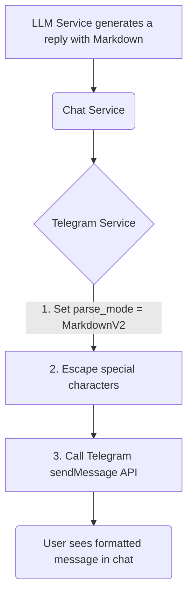

# Analysis Template

> 📋 Template สำหรับการวิเคราะห์ก่อนเริ่มพัฒนา Feature

---

## 📌 Feature Information

| รายการ | รายละเอียด |
|--------|-----------|
| **Feature Name** | [Phase 2] Code formatting ใน chat |
| **Issue URL** | [#7](https://github.com/oatrice/Akasa/issues/7) |
| **Date** | 2026-03-07 |
| **Analyst** | Luma AI (Senior Technical Analyst) |
| **Priority** | 🟡 Medium |
| **Status** | 📝 Draft |

---

## 1. Requirement Analysis

### 1.1 Problem Statement

> อธิบายปัญหาที่ต้องการแก้ไข

```
ปัจจุบัน Code snippet ที่บอทส่งกลับมาเป็นเพียงข้อความธรรมดา (Plain Text) ทำให้ผู้ใช้อ่านได้ยากบนหน้าจอมือถือ ไม่สามารถแยกแยะระหว่างโค้ดกับข้อความปกติได้ และไม่มีการเน้นสีของ Syntax (Syntax Highlighting) ซึ่งลดทอนประสบการณ์การใช้งานที่ดี
```

### 1.2 User Stories

| # | As a | I want to | So that |
|---|---|---|---|
| 1 | Chatbot User | receive code snippets formatted as distinct code blocks | I can easily identify, read, and copy the code. |
| 2 | Chatbot User | see syntax highlighting within the code blocks | I can understand the code structure and keywords more quickly at a glance. |

### 1.3 Acceptance Criteria

- [ ] **AC1:** เมื่อ LLM ตอบกลับมาพร้อม Markdown code block (เช่น ```python...```), ข้อความที่ส่งกลับไปให้ผู้ใช้ใน Telegram จะต้องแสดงผลเป็น code block ที่จัดรูปแบบสวยงาม
- [ ] **AC2:** ในการเรียก Telegram `sendMessage` API, จะต้องมีการระบุ `parse_mode='MarkdownV2'`
- [ ] **AC3:** อักขระพิเศษต่างๆ ที่ขัดกับ синтаксисของ `MarkdownV2` (เช่น `_`, `*`, `[`, `]`, `(`, `)`, `~`, `` ` ``, `>`, `#`, `+`, `-`, `=`, `|`, `{`, `}`, `.`, `!`) จะต้องถูก escape อย่างถูกต้องก่อนส่ง เพื่อป้องกันไม่ให้ Telegram API คืนค่า Error

---

## 2. Feature Analysis

### 2.1 User Flow



### 2.2 Screen/Page Requirements

| หน้าจอ | Actions | Components |
|---|---|---|
| N/A | เป็นการปรับปรุงการแสดงผลใน Chat Client (Telegram) ไม่มีการเปลี่ยนแปลง UI ของระบบ | N/A |

### 2.3 Input/Output Specification

#### Inputs

- **LLM Response**: String ที่อาจมี Markdown code blocks (e.g., `Here is the code:\n\`\`\`python\nprint("Hello")\n\`\`\``)

#### Outputs

- **Telegram `sendMessage` API Call**:
    - **`text`**: ข้อความที่ผ่านการ escape อักขระพิเศษสำหรับ `MarkdownV2`
    - **`parse_mode`**: `"MarkdownV2"`

---

## 3. Impact Analysis

### 3.1 Affected Components

| Component | Impact Level | Description |
|---|---|---|
| **`app/services/telegram_service.py`** | 🔴 High | ต้องแก้ไขฟังก์ชัน `send_message` เพื่อเพิ่ม logic ในการ escape ข้อความและเพิ่มพารามิเตอร์ `parse_mode` |
| **Unit Tests for `telegram_service`** | 🟡 Medium | ต้องสร้าง test cases ใหม่เพื่อทดสอบ logic การ escape โดยเฉพาะ |
| **`app/services/chat_service.py`** | 🟢 Low | ไม่มีการเปลี่ยนแปลง Chat Service จะส่งข้อความดิบจาก LLM ไปให้ Telegram Service จัดการต่อเอง |

### 3.2 Breaking Changes

- [ ] **BC1:** ไม่มี Breaking Changes เป็นการปรับปรุงภายใน

### 3.3 Backward Compatibility Plan

```
ไม่จำเป็น
```

---

## 4. Feasibility Analysis

### 4.1 Technical Feasibility

| คำถาม | คำตอบ | หมายเหตุ |
|---|---|---|
| เทคโนโลยีรองรับหรือไม่? | ✅ | Telegram Bot API รองรับ `MarkdownV2` อย่างเป็นทางการ |
| ทีมมี Skills เพียงพอหรือไม่? | ✅ | ทีมมีความเข้าใจในการจัดการ String และการเรียก API |
| Infrastructure รองรับหรือไม่? | ✅ | ไม่ต้องการ Infrastructure เพิ่มเติม |

### 4.2 Time Feasibility

| ประเด็น | รายละเอียด |
|---|---|
| **Estimated Effort** | ~0.5 day | เป็นงานที่ไม่ซับซ้อน แต่ต้องใช้เวลาในการเขียน test case ให้ครอบคลุมทุกอักขระพิเศษ |
| **Deadline** | N/A | |
| **Buffer Time** | N/A | |
| **Feasible?** | ✅ | |

### 4.3 Budget Feasibility

| รายการ | ค่าใช้จ่าย | หมายเหตุ |
|---|---|---|
| N/A | $0 | เป็นการปรับปรุงโค้ดภายใน ไม่เสียค่าใช้จ่าย |
| **Total** | **$0** | |

---

## 5. Security Analysis

### 5.1 Sensitive Data

| ข้อมูล | Sensitivity Level | Protection Method |
|---|---|---|
| N/A | 🟢 Normal | ไม่มีการจัดการข้อมูลละเอียดอ่อนเพิ่มเติม |

### 5.2 Attack Vectors

| Vector | Risk Level | Mitigation |
|---|---|---|
| **Formatting Injection** | 🟢 Low | ผู้ใช้อาจพยายามส่งข้อความที่มี синтаксис Markdown เพื่อทำให้การแสดงผลของบอทผิดเพี้ยน อย่างไรก็ตาม Telegram client จะแสดงผลตามที่ได้รับเท่านั้น ไม่มีความเสี่ยงด้านความปลอดภัย |

### 5.3 Authentication & Authorization

```
ไม่เกี่ยวข้องกับ Scope นี้
```

---

## 6. Performance & Scalability Analysis

### 6.1 Performance Targets

| Metric | Target | Current |
|---|---|---|
| Escaping Logic Overhead | < 1ms | N/A |

### 6.2 Scalability Plan

| Scenario | Expected Users | Scaling Strategy |
|---|---|---|
| N/A | N/A | การ escape string เป็น operation ที่เร็วมากและไม่ส่งผลกระทบต่อ performance โดยรวม |

---

## 7. Gap Analysis

| ด้าน | As-Is (ปัจจุบัน) | To-Be (ต้องการ) | Gap |
|---|---|---|---|
| **Message Formatting** | ส่งเป็น Plain Text | ส่งเป็น `MarkdownV2` | ขาด logic ในการ escape อักขระพิเศษและตั้งค่า `parse_mode` |
| **User Experience** | โค้ดอ่านยากบนมือถือ | โค้ดอ่านง่ายและมี syntax highlighting | ต้อง implement การจัดรูปแบบข้อความ |

---

## 8. Risk Analysis

| Risk | Probability | Impact | Score | Mitigation Plan |
|---|---|---|---|---|
| **Escape ไม่สมบูรณ์** | 🟡 Medium | 🟡 Medium | 4 | หาก escape อักขระพิเศษไม่ครบถ้วน, Telegram API จะ reject request ด้วย `400 Bad Request` ทำให้บอทส่งข้อความนั้นไม่ได้เลย **Mitigation:** สร้าง Unit Test ที่ครอบคลุมทุกอักขระพิเศษตามที่ระบุในเอกสารของ Telegram |

> **Risk Score:** Probability × Impact (High=3, Medium=2, Low=1)

---

## 9. Summary & Recommendations

### 9.1 Analysis Summary

| หมวด | Status | Key Findings |
|---|---|---|
| Requirement | ✅ Clear | เป็นการปรับปรุง UX ที่สำคัญและชัดเจน |
| Feature | ✅ Defined | ขอบเขตงานเล็กและจำกัดอยู่ที่ `telegram_service` |
| Impact | 🟡 Medium | มีผลกระทบต่อ `telegram_service` เป็นหลัก |
| Feasibility | ✅ Feasible | ทำได้ง่ายและไม่มีข้อจำกัดทางเทคนิค |
| Security | ✅ Acceptable | ไม่มีความเสี่ยงด้านความปลอดภัย |
| Performance | ✅ Acceptable | Performance impact น้อยมาก |
| Risk | 🟡 Medium | ความเสี่ยงหลักคือการส่งข้อความล้มเหลวหาก escape ไม่ถูกต้อง |

### 9.2 Recommendations

1.  **Centralize Escaping Logic:** สร้างฟังก์ชัน helper ใหม่ (เช่น `escape_markdown_v2`) ภายใน `telegram_service` หรือใน `utils` เพื่อรวมตรรกะการ escape ไว้ที่เดียวและให้ง่ายต่อการทดสอบ
2.  **Add `parse_mode` to `send_message`:** แก้ไขฟังก์ชัน `send_message` ใน `telegram_service` ให้ส่งพารามิเตอร์ `parse_mode="MarkdownV2"` ไปกับ API call
3.  **Comprehensive Unit Testing:** เขียน Unit Test สำหรับฟังก์ชัน `escape_markdown_v2` โดยเฉพาะ โดยทดสอบกับ String ที่มีอักขระพิเศษทุกตัวที่ Telegram กำหนดไว้

### 9.3 Next Steps

- [ ] สร้างฟังก์ชัน `escape_markdown_v2`
- [ ] แก้ไข `telegram_service.send_message` ให้เรียกใช้ฟังก์ชัน escape และเพิ่ม `parse_mode`
- [ ] สร้าง Unit Test สำหรับฟังก์ชัน escape
- [ ] แก้ไข Unit Test ของ `telegram_service` ให้สอดคล้องกับการเปลี่ยนแปลง

---

## 📎 Appendix

### Related Documents

- [Telegram Bot API: Formatting options](https://core.telegram.org/bots/api#formatting-options)

### Sign-off

| Role | Name | Date | Signature |
|---|---|---|---|
| Analyst | Luma AI | 2026-03-07 | ✅ |
| Tech Lead | | | ⬜ |
| PM | | | ⬜ |