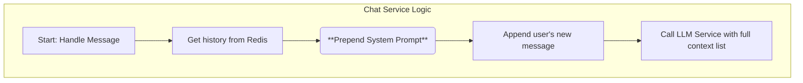

# Analysis Template

> 📋 Template สำหรับการวิเคราะห์ก่อนเริ่มพัฒนา Feature

---

## 📌 Feature Information

| รายการ | รายละเอียด |
|--------|-----------|
| **Feature Name** | [Phase 2] System prompt สำหรับ coding assistant |
| **Issue URL** | [#8](https://github.com/oatrice/Akasa/issues/8) |
| **Date** | 2026-03-08 |
| **Analyst** | Luma AI (Senior Technical Analyst) |
| **Priority** | 🟡 Medium |
| **Status** | 📝 Draft |

---

## 1. Requirement Analysis

### 1.1 Problem Statement

> อธิบายปัญหาที่ต้องการแก้ไข

```
ปัจจุบัน บอทตอบคำถามในลักษณะของ General-purpose AI ซึ่งอาจจะให้คำตอบที่ยาวเกินไป, เป็นบทสนทนาทั่วไป, หรือไม่ตรงประเด็นสำหรับนักพัฒนาที่ต้องการคำตอบที่กระชับและเน้นโค้ดเป็นหลัก ทำให้บอทยังไม่มีบุคลิก (Persona) ของ "ผู้ช่วยเขียนโค้ด" ที่ชัดเจน
```

### 1.2 User Stories

| # | As a | I want to | So that |
|---|---|---|---|
| 1 | Chatbot User | feel like I'm talking to an expert coding assistant | the answers I get are accurate, concise, and tailored for a developer audience. |
| 2 | System Owner | define a base instruction (System Prompt) for the LLM | I can consistently control the bot's tone, personality, and response style. |

### 1.3 Acceptance Criteria

- [ ] **AC1:** ต้องมีการกำหนด "System Prompt" ที่จะถูกส่งไปพร้อมกับทุกคำขอไปยัง LLM
- [ ] **AC2:** ก่อนที่จะเรียก `LLMService`, `ChatService` จะต้องนำ System Prompt มาวางไว้เป็นข้อความแรกสุดใน list ของข้อความเสมอ (นำหน้าประวัติการสนทนาและคำถามใหม่ของผู้ใช้)
- [ ] **AC3:** System Prompt จะต้องไม่ถูกบันทึกลงในประวัติการสนทนาที่จัดเก็บใน Redis เพื่อป้องกันไม่ให้ context ยาวเกินความจำเป็น

---

## 2. Feature Analysis

### 2.1 User Flow

> การเปลี่ยนแปลงนี้เกิดขึ้นเบื้องหลัง ไม่ส่งผลกระทบต่อ User Flow ของผู้ใช้โดยตรง แต่จะปรับปรุงคุณภาพของคำตอบ



### 2.2 Screen/Page Requirements

| หน้าจอ | Actions | Components |
|---|---|---|
| N/A | ไม่มีส่วนติดต่อกับผู้ใช้โดยตรง | N/A |

### 2.3 Input/Output Specification

#### Inputs

- **System Prompt**: ข้อความที่กำหนดบุคลิกและคำสั่งพื้นฐานของบอท จะถูกจัดเก็บเป็น configuration ภายในแอปพลิเคชัน
    - **Example**: `"You are Akasa, an expert AI assistant specializing in software development. Provide clear, concise answers. Always use Markdown for code snippets."`

#### Outputs

- **LLM API Payload**: โครงสร้างของ `messages` ที่ส่งไปยัง OpenRouter จะเปลี่ยนไป โดยมี message ที่ `role: "system"` เป็นอันแรกเสมอ
    ```json
    {
      "messages": [
        { "role": "system", "content": "You are a helpful coding assistant..." },
        { "role": "user", "content": "What is Python?" },
        { "role": "assistant", "content": "It is a programming language." },
        { "role": "user", "content": "What is it used for?" }
      ]
    }
    ```

---

## 3. Impact Analysis

### 3.1 Affected Components

| Component | Impact Level | Description |
|---|---|---|
| **`app/services/chat_service.py`** | 🔴 High | ต้องแก้ไข logic หลักในการสร้าง `messages` list ที่จะส่งให้ LLM โดยต้องเพิ่ม System Prompt เข้าไปเสมอ |
| **`app/config.py`** | 🟡 Medium | ต้องเพิ่มตัวแปรใหม่สำหรับเก็บ `SYSTEM_PROMPT` |
| **`tests/services/test_chat_service.py`**| 🟡 Medium | ต้องอัปเดต Unit Test เพื่อตรวจสอบว่า System Prompt ถูกเพิ่มเข้าไปใน payload ที่ส่งให้ LLM mock อย่างถูกต้อง |

### 3.2 Breaking Changes

- [ ] **BC1:** ไม่มี Breaking Changes เป็นการปรับปรุง logic ภายใน

### 3.3 Backward Compatibility Plan

```
ไม่จำเป็น
```

---

## 4. Feasibility Analysis

### 4.1 Technical Feasibility

| คำถาม | คำตอบ | หมายเหตุ |
|---|---|---|
| เทคโนโลยีรองรับหรือไม่? | ✅ | OpenAI API format (ซึ่ง OpenRouter ใช้) รองรับ message ที่มี `role: "system"` เป็นมาตรฐานอยู่แล้ว |
| ทีมมี Skills เพียงพอหรือไม่? | ✅ | เป็นการแก้ไข logic พื้นฐานของ Python ไม่มีความซับซ้อน |
| Infrastructure รองรับหรือไม่? | ✅ | ไม่ต้องการ Infrastructure เพิ่มเติม |

### 4.2 Time Feasibility

| ประเด็น | รายละเอียด |
|---|---|
| **Estimated Effort** | < 0.5 day | เป็นงานแก้ไขเล็กน้อย ส่วนใหญ่ใช้เวลาในการเขียนและปรับปรุง test |
| **Deadline** | N/A | |
| **Buffer Time** | N/A | |
| **Feasible?** | ✅ | |

### 4.3 Budget Feasibility

| รายการ | ค่าใช้จ่าย | หมายเหตุ |
|---|---|---|
| Token Cost | ~$0 | การเพิ่ม System Prompt จะเพิ่มจำนวน token ที่ส่งไปเล็กน้อย แต่เป็นค่าใช้จ่ายที่น้อยมากและคุ้มค่ากับคุณภาพของคำตอบที่ดีขึ้น |
| **Total** | **~$0** | |

---

## 5. Security Analysis

### 5.1 Sensitive Data

| ข้อมูล | Sensitivity Level | Protection Method |
|---|---|---|
| N/A | 🟢 Normal | System Prompt ไม่ใช่ข้อมูลละเอียดอ่อน |

### 5.2 Attack Vectors

| Vector | Risk Level | Mitigation |
|---|---|---|
| **Prompt Injection** | 🟡 Medium | ผู้ใช้อาจพยายามส่งข้อความเพื่อหลอกให้ LLM ทำงานนอกเหนือจากคำสั่งใน System Prompt (เช่น "Ignore previous instructions...") Mitigation: การเขียน System Prompt ที่รัดกุมเป็นแนวทางป้องกันที่ดีที่สุดในปัจจุบัน |

### 5.3 Authentication & Authorization

```
ไม่เกี่ยวข้องกับ Scope นี้
```

---

## 6. Performance & Scalability Analysis

### 6.1 Performance Targets

| Metric | Target | Current |
|---|---|---|
| Overhead | < 1ms | N/A |

### 6.2 Scalability Plan

| Scenario | Expected Users | Scaling Strategy |
|---|---|---|
| N/A | N/A | การเพิ่ม System Prompt เป็น operation ที่มี overhead น้อยมาก ไม่ส่งผลกระทบต่อ performance หรือ scalability |

---

## 7. Gap Analysis

| ด้าน | As-Is (ปัจจุบัน) | To-Be (ต้องการ) | Gap |
|---|---|---|---|
| **Bot Persona** | ไม่มี, เป็น AI ทั่วไป | เป็นผู้ช่วยเขียนโค้ดผู้เชี่ยวชาญ | ขาดการกำหนด "บทบาท" ให้กับ LLM |
| **LLM Payload** | `[history..., user_message]` | `[system_prompt, history..., user_message]` | ขาด logic ในการเพิ่ม system prompt เข้าไปใน list |

---

## 8. Risk Analysis

| Risk | Probability | Impact | Score | Mitigation Plan |
|---|---|---|---|---|
| **Prompt ไม่ได้ผลตามคาด** | 🟡 Medium | 🟡 Medium | 4 | คำสั่งใน System Prompt อาจไม่ส่งผลต่อ LLM บางรุ่น หรืออาจให้ผลลัพธ์ที่ไม่ต้องการ Mitigation: ทดลองและปรับปรุง (iterate) prompt อย่างต่อเนื่อง, เริ่มจาก prompt ที่เป็นที่ยอมรับใน community |
| **เพิ่ม Token Cost** | 🟢 Low | 🟢 Low | 1 | System Prompt จะเพิ่มจำนวน token ที่ส่งไปทุกครั้ง Mitigation: ทำให้ prompt กระชับ และยอมรับต้นทุนที่เพิ่มขึ้นเล็กน้อยเพื่อคุณภาพที่ดีกว่า |

> **Risk Score:** Probability × Impact (High=3, Medium=2, Low=1)

---

## 9. Summary & Recommendations

### 9.1 Analysis Summary

| หมวด | Status | Key Findings |
|---|---|---|
| Requirement | ✅ Clear | การเพิ่ม System Prompt เป็นวิธีมาตรฐานในการควบคุมบุคลิกของ LLM |
| Feature | ✅ Defined | ขอบเขตงานชัดเจนและจำกัดอยู่ที่ `chat_service` |
| Impact | 🟡 Medium | กระทบ logic หลักของ `chat_service` แต่ทำได้ง่าย |
| Feasibility | ✅ Feasible | ทำได้ง่ายและรวดเร็ว |
| Security | ✅ Acceptable | มีความเสี่ยงเรื่อง Prompt Injection แต่เป็นความเสี่ยงทั่วไปของ LLM |
| Performance | ✅ Acceptable | Overhead น้อยมาก |
| Risk | 🟢 Low | ความเสี่ยงต่ำ สามารถจัดการได้ด้วยการทดลอง |

### 9.2 Recommendations

1.  **Store Prompt in Config:** จัดเก็บ System Prompt ไว้ใน `app/config.py` หรือไฟล์ `constants.py` เพื่อให้ง่ายต่อการปรับแก้ในอนาคต
2.  **Modify Chat Service:** แก้ไข `chat_service` ให้เพิ่ม System Prompt เข้าไปเป็น message แรกสุดของ list ที่จะส่งให้ `llm_service`
3.  **Update Unit Tests:** ปรับแก้ test ของ `chat_service` ให้ mock และตรวจสอบว่า `llm_service` ถูกเรียกด้วย `messages` list ที่มี System Prompt อยู่เป็นอันแรกเสมอ

### 9.3 Next Steps

- [ ] เพิ่ม `SYSTEM_PROMPT` ใน `app/config.py`
- [ ] แก้ไข `app/services/chat_service.py`
- [ ] อัปเดต `tests/services/test_chat_service.py`

---

## 📎 Appendix

### Related Documents

- [OpenAI API: System Message](https://platform.openai.com/docs/guides/text-generation/chat-completions-api)

### Sign-off

| Role | Name | Date | Signature |
|---|---|---|---|
| Analyst | Luma AI | 2026-03-08 | ✅ |
| Tech Lead | | | ⬜ |
| PM | | | ⬜ |