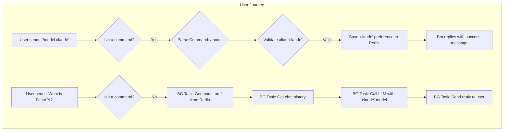

# Analysis Template

> 📋 Template สำหรับการวิเคราะห์ก่อนเริ่มพัฒนา Feature

---

## 📌 Feature Information

| รายการ | รายละเอียด |
|--------|-----------|
| **Feature Name** | [Phase 4] Multi-model selection |
| **Issue URL** | [#13](https://github.com/oatrice/Akasa/issues/13) |
| **Date** | 2026-03-08 |
| **Analyst** | Luma AI (Senior Technical Analyst) |
| **Priority** | 🟡 Medium |
| **Status** | 📝 Draft |

---

## 1. Requirement Analysis

### 1.1 Problem Statement

> อธิบายปัญหาที่ต้องการแก้ไข

```
ปัจจุบัน Akasa bot ใช้ LLM เพียงโมเดลเดียวที่ถูกกำหนดไว้ใน configuration ทำให้ผู้ใช้ไม่สามารถเลือกใช้โมเดลอื่นที่มีจุดเด่นแตกต่างกันได้ (เช่น Claude สำหรับการเขียนโค้ด, Gemini Flash สำหรับความเร็ว) ซึ่งเป็นการจำกัดความสามารถและความยืดหยุ่นของบอท
```

### 1.2 User Stories

| # | As a | I want to | So that |
|---|---|---|---|
| 1 | Chatbot User | switch the active LLM using a simple chat command (e.g., `/model claude`) | I can choose the best model for my specific task or preference. |
| 2 | Chatbot User | have the bot remember my model selection across sessions | I don't have to repeatedly set my preferred model every time I use the bot. |

### 1.3 Acceptance Criteria

- [ ] **AC1:** ผู้ใช้สามารถส่งคำสั่ง `/model <alias>` เพื่อเปลี่ยน LLM ที่ใช้งานได้ (เช่น `/model gemini`, `/model claude`).
- [ ] **AC2:** เมื่อได้รับคำสั่ง, ระบบต้องตรวจสอบว่า `alias` ที่ผู้ใช้ส่งมาถูกต้องและมีอยู่ในรายการที่กำหนดไว้หรือไม่ หากไม่ถูกต้อง ให้ตอบกลับข้อความแสดงข้อผิดพลาดพร้อมรายชื่อโมเดลที่เลือกได้
- [ ] **AC3:** การตั้งค่าโมเดลของผู้ใช้จะต้องถูกบันทึกไว้ใน Redis โดยใช้ `chat_id` เป็น key เพื่อให้การตั้งค่าคงอยู่ในการสนทนาครั้งถัดไป
- [ ] **AC4:** เมื่อผู้ใช้ส่งข้อความปกติ, `ChatService` จะต้องดึงค่าโมเดลที่ผู้ใช้ตั้งค่าไว้จาก Redis เพื่อนำไปใช้เรียก `LLMService`
- [ ] **AC5:** หากผู้ใช้ไม่ได้ตั้งค่าโมเดลไว้ หรือไม่สามารถเชื่อมต่อ Redis ได้, ระบบจะต้องใช้โมเดลเริ่มต้น (default) ที่กำหนดไว้ใน `settings`
- [ ] **AC6:** ผู้ใช้สามารถส่งคำสั่ง `/model` (โดยไม่มี argument) เพื่อดูโมเดルที่ใช้งานอยู่ปัจจุบัน และรายการโมเดลทั้งหมดที่สามารถเลือกได้

---

## 2. Feature Analysis

### 2.1 User Flow



### 2.2 Screen/Page Requirements

| หน้าจอ | Actions | Components |
|---|---|---|
| N/A | เป็นการทำงานผ่าน Chat Interface ทั้งหมด | N/A |

### 2.3 Input/Output Specification

#### Inputs

- **User Command**: `/model <alias>` (e.g., `/model gemini-pro`)
- **User Message**: Any text message.

#### Outputs

- **Confirmation Message**: "✅ Model selection updated to: Google Gemini Pro."
- **Error Message**: "❌ Invalid model. Available models: `claude`, `gemini-pro`, `gpt4`."
- **LLM Response**: AI-generated text based on the user's selected model.

#### Data Store Interaction (Redis)

- **Key**: `user_model_pref:<chat_id>` (e.g., `user_model_pref:12345`)
- **Type**: `STRING`
- **Value**: The full model identifier string (e.g., `google/gemini-pro`).

---

## 3. Impact Analysis

### 3.1 Affected Components

| Component | Impact Level | Description |
|---|---|---|
| **`app/services/chat_service.py`** | 🔴 High | ต้องเพิ่ม logic การจัดการ command, ตรวจสอบข้อความที่ขึ้นต้นด้วย `/`, และดึง/จัดการการตั้งค่าโมเดลจาก Redis ก่อนเรียก LLM |
| **`app/services/redis_service.py`** | 🟡 Medium | ต้องเพิ่มฟังก์ชันใหม่สำหรับ `get_user_model_preference` และ `set_user_model_preference` |
| **`app/services/llm_service.py`** | 🟡 Medium | ต้องแก้ไขฟังก์ชัน `get_llm_reply` ให้รับ `model` เป็นพารามิเตอร์ เพื่อ override ค่า default จาก settings |
| **`app/config.py`** | 🟡 Medium | ต้องเพิ่มโครงสร้างข้อมูลใหม่ (เช่น Dictionary) เพื่อ map ระหว่าง alias ที่ผู้ใช้พิมพ์ (`claude`) กับ model identifier เต็ม (`anthropic/claude-3.5-sonnet`) |

### 3.2 Breaking Changes

- [ ] **BC1:** Signature ของฟังก์ชัน `llm_service.get_llm_reply` จะเปลี่ยนไป ซึ่งกระทบเฉพาะ `chat_service` ที่เรียกใช้ ไม่ใช่ external breaking change

### 3.3 Backward Compatibility Plan

```
ไม่จำเป็น
```

---

## 4. Feasibility Analysis

### 4.1 Technical Feasibility

| คำถาม | คำตอบ | หมายเหตุ |
|---|---|---|
| เทคโนโลยีรองรับหรือไม่? | ✅ | ระบบใช้ OpenRouter อยู่แล้วซึ่งรองรับการสลับโมเดลได้ง่าย, Redis ก็ถูกติดตั้งไว้แล้ว |
| ทีมมี Skills เพียงพอหรือไม่? | ✅ | เป็นการแก้ไข logic พื้นฐานของ Python, FastAPI, และ Redis ที่ทีมมีความคุ้นเคย |
| Infrastructure รองรับหรือไม่? | ✅ | ไม่ต้องการ Infrastructure ใหม่เพิ่มเติม |

### 4.2 Time Feasibility

| ประเด็น | รายละเอียด |
|---|---|
| **Estimated Effort** | 1-2 days | รวมเวลาในการสร้าง command parser, แก้ไข service, และเขียน unit tests |
| **Deadline** | N/A | |
| **Buffer Time** | 0.5 days | สำหรับทดสอบการทำงานร่วมกันของ các service |
| **Feasible?** | ✅ | |

### 4.3 Budget Feasibility

| รายการ | ค่าใช้จ่าย | หมายเหตุ |
|---|---|---|
| API Usage Cost | ~$0 | ต้นทุน API จะแปรผันตามโมเดลที่ผู้ใช้เลือก แต่ไม่มีต้นทุนด้านการพัฒนาโดยตรง |
| **Total** | **~$0** | |

---

## 5. Security Analysis

### 5.1 Sensitive Data

| ข้อมูล | Sensitivity Level | Protection Method |
|---|---|---|
| N/A | 🟢 Normal | การตั้งค่าโมเดลของผู้ใช้ไม่ใช่ข้อมูลละเอียดอ่อน |

### 5.2 Attack Vectors

| Vector | Risk Level | Mitigation |
|---|---|---|
| **Command Spamming** | 🟢 Low | ผู้ใช้อาจ spam คำสั่ง `/model` เพื่อสร้าง load บน Redis แต่เป็นความเสี่ยงที่ต่ำมาก สามารถเพิ่ม Rate Limiting ได้หากเป็นปัญหา |

### 5.3 Authentication & Authorization

```
ไม่เกี่ยวข้องกับ Scope นี้
```

---

## 6. Performance & Scalability Analysis

### 6.1 Performance Targets

| Metric | Target | Current |
|---|---|---|
| `/model` command response time | < 200ms | N/A |
| Overhead of reading model pref from Redis | < 5ms | N/A |

### 6.2 Scalability Plan

| Scenario | Expected Users | Scaling Strategy |
|---|---|---|
| High Traffic | N/A | การอ่าน-เขียนค่า string ง่ายๆ ใน Redis มีประสิทธิภาพสูงมากและสามารถสเกลได้ดี |

---

## 7. Gap Analysis

| ด้าน | As-Is (ปัจจุบัน) | To-Be (ต้องการ) | Gap |
|---|---|---|---|
| **User Commands** | ระบบไม่เข้าใจข้อความที่ขึ้นต้นด้วย `/` | ระบบต้องสามารถแยกแยะและประมวลผล command ได้ | ขาด Command Parsing Logic |
| **User Preferences** | ไม่มีที่จัดเก็บการตั้งค่าส่วนตัวของผู้ใช้ | ต้องมีที่จัดเก็บการตั้งค่าโมเดลแยกตาม `chat_id` | ต้องเพิ่มฟังก์ชันใน `redis_service` และ logic ใน `chat_service` |
| **LLM Flexibility** | `llm_service` ใช้โมเดลที่ hardcode จาก config | `llm_service` ต้องสามารถรับชื่อโมเดลแบบไดนามิกได้ | ต้องแก้ไข Signature ของ `get_llm_reply` |

---

## 8. Risk Analysis

| Risk | Probability | Impact | Score | Mitigation Plan |
|---|---|---|---|---|
| **User requests an unsupported model** | 🔴 High | 🟡 Medium | 6 | ระบบต้องมี list ของ model alias ที่รองรับ และตอบกลับด้วยข้อความ error ที่เป็นประโยชน์พร้อมแสดงตัวเลือกที่ถูกต้อง |
| **Redis is unavailable** | 🟡 Medium | 🟡 Medium | 4 | `chat_service` ต้องดักจับ `ConnectionError` และ **gracefully degrade** โดยกลับไปใช้ default model จาก `settings` แทน |
| **Selected model is deprecated by OpenRouter** | 🟢 Low | 🟡 Medium | 2 | `llm_service` ต้องดักจับ `404 Not Found` จาก OpenRouter และ `chat_service` ควรแจ้งผู้ใช้ว่าโมเดลที่เลือกไว้ไม่สามารถใช้งานได้ |

> **Risk Score:** Probability × Impact (High=3, Medium=2, Low=1)

---

## 9. Summary & Recommendations

### 9.1 Analysis Summary

| หมวด | Status | Key Findings |
|---|---|---|
| Requirement | ✅ Clear | เป็นฟีเจอร์ที่เพิ่มความยืดหยุ่นให้ผู้ใช้อย่างมาก |
| Feature | ✅ Defined | ขอบเขตงานชัดเจน: เพิ่ม command parser และจัดการ state ใน Redis |
| Impact | 🟡 Medium | กระทบหลาย service แต่เป็นไปในทางบวก |
| Feasibility | ✅ Feasible | ทำได้ง่ายด้วยเครื่องมือและโครงสร้างที่มีอยู่ |
| Security | ✅ Acceptable | ไม่มีความเสี่ยงด้านความปลอดภัยที่น่ากังวล |
| Performance | ✅ Acceptable | Overhead ที่เพิ่มขึ้นน้อยมาก |
| Risk | 🟡 Medium | ความเสี่ยงหลักคือการจัดการเมื่อผู้ใช้เลือกโมเดลผิด หรือ Redis ล่ม |

### 9.2 Recommendations

1.  **Implement Command Handler:** ใน `chat_service`, เพิ่ม logic เพื่อตรวจสอบว่าข้อความขึ้นต้นด้วย `/` หรือไม่ หากใช่ ให้ส่งต่อไปยัง command handler แทนที่จะเป็น chat handler ปกติ
2.  **Create Model Alias Map:** ใน `app/config.py`, สร้าง Dictionary สำหรับ map alias (`claude`) ไปยัง model identifier เต็ม (`anthropic/claude-3.5-sonnet`) เพื่อให้ง่ายต่อการจัดการ
3.  **Parameterize `LLMService`:** แก้ไข `llm_service.get_llm_reply` ให้รับพารามิเตอร์ `model: str` เพื่อให้ `chat_service` สามารถระบุโมเดลที่จะใช้ได้
4.  **Graceful Degradation:** ตรวจสอบให้แน่ใจว่ามีการใช้ `try-except` ครอบการเรียก Redis และมี logic fallback ไปใช้ default model หากเกิดข้อผิดพลาด

### 9.3 Next Steps

- [ ] เพิ่ม `AVAILABLE_MODELS` dictionary ใน `app/config.py`
- [ ] เพิ่ม `get/set_user_model_preference` ใน `app/services/redis_service.py`
- [ ] แก้ไข `app/services/llm_service.py` ให้รับ `model` parameter
- [ ] Implement command parsing logic ใน `app/services/chat_service.py`
- [ ] สร้าง Unit Tests สำหรับ command handler และ logic การดึง/ตั้งค่า model

---

## 📎 Appendix

### Related Documents

- [OpenRouter Models](https://openrouter.ai/models)

### Sign-off

| Role | Name | Date | Signature |
|---|---|---|---|
| Analyst | Luma AI | 2026-03-08 | ✅ |
| Tech Lead | | | ⬜ |
| PM | | | ⬜ |